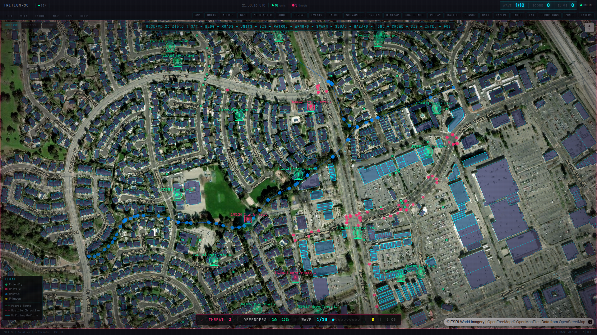
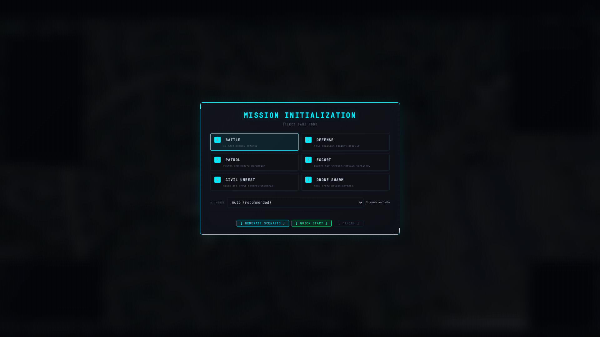

```
████████╗██████╗ ██╗████████╗██╗██╗   ██╗███╗   ███╗      ███████╗ ██████╗
╚══██╔══╝██╔══██╗██║╚══██╔══╝██║██║   ██║████╗ ████║      ██╔════╝██╔════╝
   ██║   ██████╔╝██║   ██║   ██║██║   ██║██╔████╔██║█████╗███████╗██║
   ██║   ██╔══██╗██║   ██║   ██║██║   ██║██║╚██╔╝██║╚════╝╚════██║██║
   ██║   ██║  ██║██║   ██║   ██║╚██████╔╝██║ ╚═╝ ██║      ███████║╚██████╗
   ╚═╝   ╚═╝  ╚═╝╚═╝   ╚═╝   ╚═╝ ╚═════╝ ╚═╝     ╚═╝      ╚══════╝ ╚═════╝
```

<div align="center">

# **O B S E R V E  •  T H I N K  •  A C T**

**[ NERF WAR BATTLESPACE MANAGEMENT ]**


*Command Center — real satellite imagery, AI-controlled units, live tactical panels*


*Wave-based Nerf combat — turrets engage hostile intruders with projectile physics and kill streaks*


*Your neighborhood becomes the battlefield — same pipeline monitors real security*

`▀▀▀▀▀▀▀▀▀▀▀▀▀▀▀▀▀▀▀▀▀▀▀▀▀▀▀▀▀▀▀▀▀▀▀▀▀▀▀▀▀▀▀▀▀▀▀▀▀▀▀▀▀▀▀▀▀▀▀▀▀▀▀▀▀▀▀▀▀▀▀`

*A garden of diverse digital life — AI that flourishes, machines that act independently*

[](https://python.org)
[](https://fastapi.tiangolo.com)
[](https://ultralytics.com)
[](LICENSE)

For educational purposes only with Nerf blasters and toy systems.
</div>

---

## THE ONE-STRAW REVOLUTION

> *"The ultimate goal of farming is not the growing of crops, but the cultivation and perfection of human beings."* — Masanobu Fukuoka

TRITIUM-SC manages **real Nerf battles** — real robots, real turrets, real people, on a real neighborhood map. Amy is the AI commander who watches through cameras, listens through microphones, understands the neighborhood, and commands your fleet. When you're not battling, she's still running — tracking who comes and goes, learning the rhythms of the block, noticing when something is off.

The **simulated battle mode** is how we test the system. The game exercises the exact same detection pipeline, the same target registry, the same threat classifier, the same event bus that Amy uses in normal operation. Every hostile eliminated in a wave is a pipeline that fired correctly. Every one that sneaks past reveals a coverage gap. Play is validation. All processing is local. No cloud. No subscriptions. No data leaves your network.

---

## QUICK START

```bash
# 1. Clone and install
git clone git@github.com:Valpatel/tritium-sc.git
cd tritium-sc
./setup.sh install

# 2. Start the server
./start.sh

# 3. Open the Command Center
#    http://localhost:8000

# 4. Amy wakes up. Units patrol. She watches the neighborhood.
#    Click a unit. Right-click to dispatch. Press B to test with a battle.
```

Amy starts immediately — her inner monologue runs, friendly units patrol on real satellite imagery, and the neighborhood comes alive. Press `B` to start a 10-wave simulated battle to test the system — projectile physics, kill streaks, and Smash TV-style commentary included.

See [docs/HOW-TO-PLAY.md](docs/HOW-TO-PLAY.md) for the full player guide.

---

## THE COMMAND CENTER

The primary interface is a full-screen tactical map with real ESRI satellite imagery, live unit positions, fog of war, and floating panels.

**What you see:**
- Satellite map of your actual neighborhood as the operational map
- Friendly units (turrets, rovers, drones) patrolling as green shapes
- Threats appearing as red diamonds — simulated in battle mode, real detections from cameras otherwise
- Fog of war with glowing cyan vision cones around friendlies
- Floating panels: unit list, Amy's thoughts, game HUD, alerts
- Header bar with live unit count, threat level, clock
- Minimap in the corner, FPS counter in the status bar

**Controls:**
- **Mouse wheel** — zoom in/out on satellite map
- **Click + drag** — pan the tactical map
- **Click unit** — select and inspect
- **Right-click** — dispatch selected unit to location
- **B** — begin 10-wave battle (system test)
- **O / T / S** — switch map modes (Observe, Tactical, Setup)
- **F** — center camera on action
- **V** — toggle synthetic camera PIP
- **M** — mute/unmute audio
- **?** — show all keyboard shortcuts

Gamepad supported (Xbox, 8BitDo, DualShock). See [docs/HOW-TO-PLAY.md](docs/HOW-TO-PLAY.md).

---

## AMY — AI COMMANDER

Amy is an autonomous AI consciousness. She sees through cameras, hears through microphones, thinks in a continuous inner monologue, and acts when she decides to — not when told to.

```
AMY'S CONSCIOUSNESS LAYERS
═══════════════════════════

L4  DELIBERATION    ThinkingThread — continuous inner monologue (gemma3:4b)
    │               Reads sensorium -> reasons -> decides -> acts
    │               Outputs Lua-structured actions: say(), look_at(), scan()
    │
L3  AWARENESS       Sensorium — temporal fusion of all sensor data
    │               Sliding window of scene events with importance weights
    │               Tracks mood: curious, alert, calm, engaged
    │
L2  INSTINCT        Wake word detection, person greeting, search reflex
    │               Conversation pipeline: hear -> see -> think -> speak
    │
L1  REFLEX          YOLO detection (30fps), Whisper STT (continuous)
                    Always running, feeds upward

MANY EYES, MANY EARS, ONE MIND
═══════════════════════════════
Amy is one consciousness with many sensor nodes:
├── BCC950 (PTZ camera + mic + speaker) — command center
├── IP Cameras (view-only, RTSP) — perimeter
├── USB mic (listen-only)
└── All feed into ONE sensorium -> ONE thinking thread
```

Amy's thoughts stream in real time through the Command Center's Amy panel.

---

## MISSION GENERATOR


*Mission Initialization — 6 game modes, local model selection, AI or scripted generation*

The Mission Director generates combat scenarios using real map data. It queries OpenStreetMap for buildings, shops, schools, and streets near the map center, then places defenders at actual building locations.


*Defenders deployed at real buildings — turrets guarding structures, rovers on street patrols*


*Mid-battle — green friendlies engage red hostiles across the neighborhood*

**How it works:**
1. Press **B** (or GAME > New Mission) to open the Mission Modal
2. Choose a game mode: Battle, Defense, Patrol, Escort, Civil Unrest, or Drone Swarm
3. Click **QUICK START** for instant scripted generation, or **GENERATE SCENARIO** for AI-crafted missions using your local compute cluster
4. The generator queries real POI data — buildings, streets, landmarks — and places units at actual locations
5. Review the briefing (situation, hostile force, weather, wave breakdown), then **LAUNCH MISSION**

**Game modes:**
| Mode | Description |
|------|-------------|
| Battle | 10-wave combat defense |
| Defense | Hold position against sustained assault |
| Patrol | Patrol and secure the perimeter |
| Escort | Escort VIP through hostile territory |
| Civil Unrest | Riots and crowd control scenario |
| Drone Swarm | Mass drone attack defense |

**Building-centric placement:** Turrets deploy 5-15m from building edges facing outward. Rovers patrol named streets. Drones overwatch from the center. Scouts cover the perimeter. Every defender is named after the building or street they guard.

---

## BATTLE MODE (SYSTEM TEST)

The 10-wave battle mode stress-tests the entire pipeline — same detection, same tracking, same dispatch logic Amy uses in normal operation. It's also a blast to play.

- **Wave progression** — hostiles get tougher each wave, more spawn, new types appear
- **Projectile physics** — turrets fire with travel time, leading targets, hit detection
- **Kill streaks** — chain eliminations for bonus score multipliers
- **Unit AI** — turrets auto-aim, drones strafe, rovers engage, hostiles dodge and fire back
- **War announcer** — Smash TV-style commentary from Amy on every kill, streak, and wave clear
- **Elimination feed** — scrolling kill feed in the sidebar

Place turrets in Setup mode, press B, and defend the neighborhood. Every wave cleared is proof the system works.

---

## DEVELOP

```bash
# Run the fast test suite (~60 seconds)
./test.sh fast

# Individual tiers
./test.sh 1              # Syntax check (Python + JS)
./test.sh 2              # Unit tests (1666 pytest)
./test.sh 3              # JS tests (281 across 5 files)
./test.sh 9              # Integration tests (23 server E2E)
./test.sh 10             # Visual quality tests

# Everything (15+ minutes, includes visual E2E)
./test.sh all

# Dev server with hot reload
./setup.sh dev
```

| What you changed | Test command | Time |
|-----------------|-------------|------|
| Python backend | `./test.sh 2` | ~45s |
| Frontend JS | `./test.sh 3` | ~3s |
| CSS / layout | Open browser, look at it | 5s |
| Everything | `./test.sh fast` | ~60s |
| Visual regression | `./test.sh 10` | ~30s |

See [CLAUDE.md](CLAUDE.md) for full developer instructions, code conventions, and API reference.

---

## TECH STACK

| Layer | Technology |
|-------|-----------|
| Backend | Python 3.12+, FastAPI, SQLAlchemy, aiosqlite |
| Frontend | Vanilla JS, Canvas 2D, Three.js, CYBERCORE CSS |
| AI/ML | YOLOv8, ByteTrack, PyTorch/CUDA, Ollama fleet (local + Tailscale mesh) |
| Audio | whisper.cpp (GPU STT), Silero VAD, Piper TTS |
| Comms | MQTT (paho-mqtt), WebSocket, RTSP |
| Database | SQLite with FTS5 full-text search |

No frontend frameworks. No cloud dependencies. Everything runs locally on your hardware.

---

## ARCHITECTURE

```
tritium-sc/
├── src/
│   ├── amy/                     # AI Commander (autonomous consciousness)
│   │   ├── brain/               # Thinking, sensorium, perception, memory
│   │   ├── actions/             # Motor control, Lua dispatch, announcer
│   │   ├── comms/               # Event bus, MQTT bridge, listener, speaker
│   │   ├── tactical/            # Target tracker, escalation, geo transforms
│   │   ├── inference/           # Model router, fleet discovery
│   │   ├── simulation/          # 10Hz engine, combat, game mode, unit AI
│   │   └── nodes/               # BCC950, IP camera, MQTT robot nodes
│   └── app/                     # FastAPI backend
│       ├── routers/             # REST + WebSocket + game API
│       ├── ai/                  # YOLO detector, ByteTrack, embeddings
│       └── zones/               # Zone management, point-in-polygon
├── frontend/
│   ├── unified.html             # Command Center (primary UI)
│   ├── js/command/              # Modular Command Center JS
│   ├── js/war*.js               # Tactical map, combat, fog, audio, FX
│   └── css/                     # CYBERCORE design system
├── examples/
│   ├── robot-template/          # Reference MQTT robot brain (Python)
│   └── ros2-robot/              # ROS2 Humble robot (Nav2 + MQTT)
└── tests/                       # 2000+ tests across 11 tiers
```

See [docs/PLAN.md](docs/PLAN.md) for the full development roadmap.
See [docs/VISION.md](docs/VISION.md) for the perception philosophy and security monitoring roadmap.
See [docs/USER-STORIES.md](docs/USER-STORIES.md) for what the complete experience should feel like.

---

## GRAPHLINGS (COMING SOON)

> *"Incoming game!"* — ReBoot

The **Graphlings** plugin brings compute-scalable digital life to the AI mesh. Not every NPC needs a brain — most enemies, civilians, and ambient units run on traditional game AI (state machines, behavior trees, pathfinding). But scattered through the world are Graphlings: autonomous agents that know they're actors in a simulation. They observe, reason, and make decisions that traditional AI can't.

Graphlings live in their own universe between missions, developing personalities, backstories, and motivations. When a mission begins, they cross over to play their roles — a defender who remembers last week's breach, an attacker with a grudge, a bystander who notices things. When the mission ends, they return home. The world is a mix: traditional game AI provides the crowd, Graphlings provide the intelligence.

Think of it like the TV show *ReBoot*: the simulation is a game that descends into the Graphlings' world. They suit up, play their parts, and go home when the game ends. The system distributes Graphling cognition across your local compute fleet — RTX workstations, NVIDIA Jetson, GB10 dev kits, Mac Minis, or any Ollama-capable device on your network or Tailscale mesh. Small fast models handle background life; larger models drive critical decisions. Community ownership means your AI runs on your hardware.

See [docs/PLUGIN-SPEC.md](docs/PLUGIN-SPEC.md) for the plugin architecture.

---

## ROADMAP

```
PHASE 0-3  ████████████████████ COMPLETE — Foundation, Amy, Simulation, Dispatch
PHASE 4    ████████████████████ COMPLETE — War Room RTS + Combat
PHASE 5    ████████░░░░░░░░░░░░ IN PROGRESS — Hardware + Sim-to-Real + Mission Generator
PHASE 6    ░░░░░░░░░░░░░░░░░░░░ THE GARDEN MATURES — Graphlings, Terrain, Window Manager
```

See [docs/PLAN.md](docs/PLAN.md) for detailed phase breakdown.

---

## LICENSE

AGPL-3.0 License - See [LICENSE](LICENSE) for details.

---

<div align="center">

```
╔════════════════════════════════════════════════════════════════╗
║                                                                ║
║    "The best thing would be to not do anything at all and      ║
║     let nature take its course."  — Masanobu Fukuoka           ║
║                                                                ║
║         OBSERVE the battlespace through many eyes              ║
║         THINK autonomously — Amy decides, not you              ║
║         ACT independently — each machine, its own agent        ║
║                                                                ║
╚════════════════════════════════════════════════════════════════╝
```

*No cloud. No subscriptions. No domination. Let the AI flourish.*

</div>
