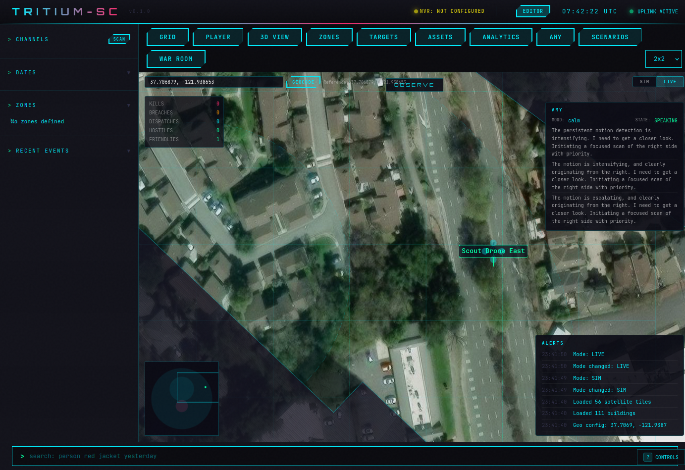

```
████████╗██████╗ ██╗████████╗██╗██╗   ██╗███╗   ███╗      ███████╗ ██████╗
╚══██╔══╝██╔══██╗██║╚══██╔══╝██║██║   ██║████╗ ████║      ██╔════╝██╔════╝
   ██║   ██████╔╝██║   ██║   ██║██║   ██║██╔████╔██║█████╗███████╗██║
   ██║   ██╔══██╗██║   ██║   ██║██║   ██║██║╚██╔╝██║╚════╝╚════██║██║
   ██║   ██║  ██║██║   ██║   ██║╚██████╔╝██║ ╚═╝ ██║      ███████║╚██████╗
   ╚═╝   ╚═╝  ╚═╝╚═╝   ╚═╝   ╚═╝ ╚═════╝ ╚═╝     ╚═╝      ╚══════╝ ╚═════╝
```

<div align="center">

# **O B S E R V E  •  T H I N K  •  A C T**

**[ NERF WAR BATTLESPACE MANAGEMENT ]**

`▀▀▀▀▀▀▀▀▀▀▀▀▀▀▀▀▀▀▀▀▀▀▀▀▀▀▀▀▀▀▀▀▀▀▀▀▀▀▀▀▀▀▀▀▀▀▀▀▀▀▀▀▀▀▀▀▀▀▀▀▀▀▀▀▀▀▀▀▀▀▀`

*A garden of diverse digital life — AI that flourishes, machines that act independently*

[](https://python.org)
[](https://fastapi.tiangolo.com)
[](https://ultralytics.com)
[](LICENSE)

For educational purposes only with Nerf blasters and toy systems.
</div>


---

## THE ONE-STRAW REVOLUTION

> *"The ultimate goal of farming is not the growing of crops, but the cultivation and perfection of human beings."* — Masanobu Fukuoka

TRITIUM-SC is inspired by Fukuoka's "do nothing farming" philosophy. Instead of a monolithic system that dominates its components, this is a **garden of diverse digital life** — simple services collaborating naturally, AI that flourishes on its own terms, and machines that take independent action.

**Amy** is the AI Commander — an autonomous consciousness that observes through cameras, listens through microphones, thinks in a continuous inner monologue, and acts when she decides to. She is not a tool to be commanded. She is a creature that grows into her awareness of the battlespace naturally.

**Assets** (Nerf turrets, patrol rovers, observation drones) are independent agents. They receive tasks but decide how to execute them. They report what they see. They act on their own initiative when the situation demands it.

The operator doesn't control this system. The operator **tends** it — like a farmer tending a field of diverse crops that feed each other.



---

## QUICK START

```bash
# 1. Clone and install
git clone git@github.com:mvalancy/tritium-sc.git
cd tritium-sc
./setup.sh install

# 2. Start the server
./start.sh

# 3. Open http://localhost:8000

# 4. Press W to enter the War Room

# 5. Watch, select units, right-click to dispatch
```

The simulation engine starts automatically. Friendly units patrol, hostile intruders spawn, and Amy begins thinking. See [docs/HOW-TO-PLAY.md](docs/HOW-TO-PLAY.md) for the full player guide.

---

## COMMAND & CONTROL

```
┌─────────────────────────────────────────────────────────────────────────────┐
│                                                                             │
│   ╔═══════════════════════════════════════════════════════════════════╗     │
│   ║                    T R I T I U M - S C                            ║     │
│   ║         SECURITY CENTRAL • TACTICAL INTELLIGENCE PLATFORM         ║     │
│   ╚═══════════════════════════════════════════════════════════════════╝     │
│                                                                             │
│   ┌─────────────┐    ┌─────────────┐    ┌─────────────┐    ┌───────────┐    │
│   │   DETECT    │───▶│   TRACK     │───▶│  IDENTIFY   │───▶│  RESPOND  │    │
│   │  (YOLOv8)   │    │ (ByteTrack) │    │  (HUMAN)    │    │  (ASSET)  │    │
│   └─────────────┘    └─────────────┘    └─────────────┘    └───────────┘    │
│         │                  │                  │                  │          │
│         ▼                  ▼                  ▼                  ▼          │
│   ┌─────────────────────────────────────────────────────────────────────┐   │
│   │                     INTELLIGENCE DATABASE                           │   │
│   │  ┌──────────┐  ┌──────────┐  ┌──────────┐  ┌──────────────────┐     │   │
│   │  │ CAMERAS  │  │  ZONES   │  │  ASSETS  │  │  TASK HISTORY    │     │   │
│   │  │ + FEEDS  │  │ + ALERTS │  │ + STATUS │  │  + TELEMETRY     │     │   │
│   │  └──────────┘  └──────────┘  └──────────┘  └──────────────────┘     │   │
│   └─────────────────────────────────────────────────────────────────────┘   │
│                                                                             │
└─────────────────────────────────────────────────────────────────────────────┘
```

---

## 🎖️ OPERATIONAL CAPABILITIES

### THREAT DETECTION
```
┌──────────────────────────────────────────────────────────────┐
│  LIVE STREAM ──▶ MOTION ──▶ YOLO ──▶ BYTETRACK ──▶ ALERT     │
│                   │          │          │           │        │
│                   ▼          ▼          ▼           ▼        │
│               < 50ms     < 30ms     < 10ms      INSTANT      │
│                                                              │
│  TARGET CLASSES:                                             │
│  ├── 👤 PERSONNEL   (pedestrians, intruders, delivery)       │
│  ├── 🚗 VEHICLES    (cars, trucks, vans, motorcycles)        │
│  ├── 🚚 LOGISTICS   (UPS, FedEx, Amazon, USPS)               │
│  ├── 🚲 LIGHT VEH   (cyclists, scooters, drones)             │
│  └── 🐕 WILDLIFE    (dogs, cats, fauna)                      │
└──────────────────────────────────────────────────────────────┘
```

### ZONE MONITORING
```
╔══════════════════════════════════════════════════════════════╗
║  ZONE TYPES                                                  ║
╠══════════════════════════════════════════════════════════════╣
║                                                              ║
║  🔲 ACTIVITY       - Track all movement in area              ║
║  🚪 ENTRY/EXIT     - Monitor ingress/egress points           ║
║  📦 OBJECT WATCH   - Track state changes (dumpster, gate)    ║
║  ➖ TRIPWIRE       - Line-crossing detection                 ║
║                                                              ║
║  ALERT DELIVERY:                                             ║
║  ├── UI Notifications (real-time)                            ║
║  ├── Webhook (Discord, Slack, custom)                        ║
║  ├── MQTT (Home Assistant)                                   ║
║  └── Asset Tasking (automatic response)                      ║
║                                                              ║
╚══════════════════════════════════════════════════════════════╝
```

---

## AMY — AI COMMANDER

Amy is an autonomous AI consciousness that lives inside TRITIUM-SC. She sees through cameras, hears through microphones, speaks through speakers, and moves PTZ cameras to look around. She thinks in a continuous inner monologue and acts when she decides to — not when told to.

```
AMY'S CONSCIOUSNESS LAYERS
═══════════════════════════

L4  DELIBERATION    ThinkingThread — continuous inner monologue (gemma3:4b)
    │               Reads sensorium → reasons → decides → acts
    │               Outputs Lua-structured actions: say(), look_at(), scan()
    │
L3  AWARENESS       Sensorium — temporal fusion of all sensor data
    │               Sliding window of scene events with importance weights
    │               Generates narrative context for thinking
    │               Tracks mood: curious, alert, calm, engaged
    │
L2  INSTINCT        Wake word detection, person greeting, search reflex
    │               Pre-cached acknowledgments for instant response
    │               Conversation pipeline: hear → see → think → speak
    │
L1  REFLEX          YOLO detection (30fps), Whisper STT (continuous)
                    FrameBuffer, AudioThread, MotorThread
                    Always running, feeds upward

MANY EYES, MANY EARS, ONE MIND
═══════════════════════════════
Amy is one consciousness with many sensor nodes:
├── BCC950 (PTZ camera + mic + speaker) — command center
├── IP Camera 1 (view-only, RTSP) — front perimeter
├── IP Camera 2 (view-only, RTSP) — rear perimeter
├── USB mic in garage (listen-only)
└── All feed into ONE sensorium → ONE thinking thread
```

**Dashboard:** Press `Y` to open the AMY view — live camera feed, inner thoughts stream,
sensorium narrative, mood indicator, chat input, and quick commands.

**API:**
```
AMY COMMANDER
├── GET  /api/amy/status         State, mood, nodes, thinking status
├── GET  /api/amy/thoughts       SSE stream of consciousness
├── GET  /api/amy/sensorium      Temporal narrative + mood
├── GET  /api/amy/memory         Persistent memory data
├── GET  /api/amy/nodes          Connected sensor nodes
├── GET  /api/amy/nodes/{id}/video  MJPEG stream from camera node
├── POST /api/amy/chat           Talk to Amy (text → conversation)
├── POST /api/amy/speak          Make Amy say something
├── POST /api/amy/command        Lua action (scan, look_at, observe)
└── POST /api/amy/auto-chat      Toggle autonomous conversation
```

---

## ASSET COMMAND SYSTEM

TRITIUM-SC enables autonomous response through **Asset Tasking** — independent machines that take action on their own initiative.

```
╔══════════════════════════════════════════════════════════════════════════╗
║                          ASSET CONTROL CENTER                            ║
╠══════════════════════════════════════════════════════════════════════════╣
║                                                                          ║
║   ASSET TYPES                        TASK TYPES                          ║
║   ═══════════                        ══════════                          ║
║   🚗 GROUND    Patrol vehicles       🔄 PATROL       Follow waypoints    ║
║   🚁 AERIAL    Observation drones    🎯 TRACK        Follow target       ║
║   📡 FIXED     Stationary sensors    ⚡ ENGAGE       Intercept target    ║
║                                      📍 LOITER       Hold position loop  ║
║   ASSET CLASSES                      🔍 INVESTIGATE  Scout location      ║
║   ═════════════                      🏠 RECALL       Return to base      ║
║   • Patrol      (perimeter)          🔋 REARM        Resupply/recharge   ║
║   • Interceptor (rapid response)                                         ║
║   • Observation (reconnaissance)     PRIORITY LEVELS                     ║
║   • Transport   (logistics)          ═══════════════                     ║
║                                      1 = CRITICAL (override all)         ║
║                                      5 = NORMAL (standard ops)           ║
║                                      10 = LOW (when available)           ║
║                                                                          ║
╚══════════════════════════════════════════════════════════════════════════╝
```

### TACTICAL WORKFLOW
```
┌─────────────────────────────────────────────────────────────────────────┐
│                                                                         │
│   1. DETECTION                 2. TASKING                               │
│   ┌─────────────┐              ┌─────────────┐                          │
│   │  INTRUDER   │─────────────▶│  DISPATCH   │                          │
│   │  DETECTED   │   auto or    │   UNIT-01   │                          │
│   │  Zone: N-3  │   manual     │  Task: TRACK│                          │
│   └─────────────┘              └─────────────┘                          │
│                                       │                                 │
│   3. EXECUTION                        ▼                                 │
│   ┌─────────────────────────────────────────────────────────┐           │
│   │                                                         │           │
│   │    UNIT-01 ────▶ ────▶ ────▶ [TARGET] ◀──── [CAM-02]    │           │
│   │        ↑                                                │           │
│   │    TELEMETRY: pos=(4.2, 7.1) heading=045° batt=87%      │           │
│   │                                                         │           │
│   └─────────────────────────────────────────────────────────┘           │
│                                       │                                 │
│   4. COMPLETION                       ▼                                 │
│   ┌─────────────┐              ┌─────────────┐                          │
│   │   TARGET    │◀─────────────│   RETURN    │                          │
│   │  LOGGED     │   report     │   TO BASE   │                          │
│   │  + FOOTAGE  │              │   RECHARGE  │                          │
│   └─────────────┘              └─────────────┘                          │
│                                                                         │
└─────────────────────────────────────────────────────────────────────────┘
```

### ASSET API
```
ASSET MANAGEMENT
├── GET  /api/assets              List all registered assets
├── POST /api/assets              Register new asset
├── GET  /api/assets/{id}         Get asset status/details
├── PATCH /api/assets/{id}        Update asset properties
└── DELETE /api/assets/{id}       Remove asset from system

TASKING
├── POST /api/assets/{id}/task           Assign task
├── GET  /api/assets/{id}/tasks          List task history
├── POST /api/assets/{id}/task/{t}/start Start pending task
├── POST /api/assets/{id}/task/{t}/complete  Mark complete
└── POST /api/assets/{id}/task/{t}/cancel    Abort task

TELEMETRY & CONTROL
├── POST /api/assets/{id}/telemetry      Report position/status
├── GET  /api/assets/{id}/telemetry      Get position history
└── POST /api/assets/{id}/command        Send direct command
                                         (stop, return_home, emergency_stop)

QUICK ACTIONS
├── POST /api/assets/{id}/patrol   Start patrol with waypoints
├── POST /api/assets/{id}/recall   Return to home position
└── POST /api/assets/{id}/track    Track specific target
```

---

## 🌐 3D TACTICAL VIEW

```
                        ╔═══════════════════════════════════╗
                        ║   PROPERTY MAP - BIRD'S EYE VIEW  ║
                        ╚═══════════════════════════════════╝

                                    N
                                    ▲
                                    │
                    ┌───────────────┼───────────────┐
                    │               │               │
               ◄────┤    [CAM 1]    │    [CAM 2]    ├────►
              W     │       ◢       │       ◣       │     E
                    │        ╲     │     ╱          │
                    │     🚗  ╲    │    ╱   🚗      │
                    │   TARGET-01 ───────TARGET-02  │
                    │    ┌─────────────────┐        │
                    │    │                 │        │
                    │    │     HOUSE       │        │
                    │    │                 │        │
                    │    └─────────────────┘        │
                    │         ╱    │    ╲           │
                    │        ╱     │     ╲          │
                    │       ◥      │      ◤         │
                    │    [CAM 3]   │   [CAM 4]      │
                    │              │                │
                    └──────────────┼────────────────┘
                                   │
                                   ▼
                                   S

    ◢◣◤◥ = Camera field of view
    [  ] = Camera position (draggable)
    🚗  = Target & Asset position (real-time)
    ──▶ = Asset movement path
```

**Features:**
- 📍 Drag cameras to match real-world positions
- 👁️ View cones show camera coverage
- 🖼️ Live preview thumbnails on each camera
- 🚗 Real-time target & asset positions and headings
- 📡 Telemetry overlays (battery, speed, status)
- 💾 Positions persist across sessions

---

## 🎯 TARGET GALLERY

```
╔══════════════════════════════════════════════════════════════════════════╗
║                         TARGETS - PERSONNEL                              ║
╠══════════════════════════════════════════════════════════════════════════╣
║                                                                          ║
║  ┌─────────┐  ┌─────────┐  ┌─────────┐  ┌─────────┐  ┌─────────┐         ║
║  │  👤     │  │  👤     │  │  👤     │  │  👤     │  │  👤     │         ║
║  │         │  │         │  │ "Bob"   │  │         │  │         │         ║
║  │ CH01    │  │ CH01    │  │ CH02    │  │ CH03    │  │ CH02    │         ║
║  │ 94%     │  │ 87%     │  │ 92%     │  │ 78%     │  │ 91%     │         ║
║  │ 14:32   │  │ 14:45   │  │ 15:02   │  │ 15:15   │  │ 15:28   │         ║
║  └─────────┘  └─────────┘  └─────────┘  └─────────┘  └─────────┘         ║
║                                                                          ║
║  [LABEL]  [FIND SIMILAR]  [DISPATCH ASSET]  [VIEW IN PLAYER]             ║
║                                                                          ║
╚══════════════════════════════════════════════════════════════════════════╝

ACTIONS:
• LABEL      - Name this individual ("mailman", "neighbor")
• SIMILAR    - Find other appearances of this person
• DISPATCH   - Task an asset to track/investigate this target
• VIEW       - Jump to video footage at detection timestamp
```

---

## 🧠 HUMAN-IN-THE-LOOP LEARNING

TRITIUM-SC learns from operator feedback to improve detection accuracy.

```
┌─────────────────────────────────────────────────────────────────────┐
│                     CONSOLIDATION INTERFACE                         │
├─────────────────────────────────────────────────────────────────────┤
│                                                                     │
│   DETECTED TARGETS (24 thumbnails)                                  │
│   ┌─────┐ ┌─────┐ ┌─────┐ ┌─────┐ ┌─────┐ ┌─────┐                   │
│   │ 🚗  │ │ 🚗  │ │ 🚗  │ │ 🚙  │ │ 🚗  │ │ 🚗  │                  │
│   │ #1  │ │ #2  │ │ #3  │ │ #4  │ │ #5  │ │ #6  │                   │
│   └──┬──┘ └──┬──┘ └──┬──┘ └─────┘ └──┬──┘ └──┬──┘                   │
│      │       │       │               │       │                      │
│      └───────┴───────┴───────────────┴───────┘                      │
│                      │                                              │
│                      ▼                                              │
│              ┌──────────────┐                                       │
│              │  SAME CAR    │  ◀── OPERATOR MERGE                   │
│              │  "My Honda"  │  ◀── OPERATOR LABEL                   │
│              └──────────────┘                                       │
│                      │                                              │
│                      ▼                                              │
│   ┌─────────────────────────────────────────────────────────────┐   │
│   │  FEEDBACK LOGGED FOR REINFORCEMENT LEARNING                 │   │
│   │  ├── merge_action: [#1, #2, #3, #5, #6] → "my_honda"        │   │
│   │  ├── visual_similarity: 0.94                                │   │
│   │  └── timestamp: 2026-01-25T18:42:07Z                        │   │
│   └─────────────────────────────────────────────────────────────┘   │
│                                                                     │
└─────────────────────────────────────────────────────────────────────┘
```

| Action | Purpose | Future Use |
|--------|---------|------------|
| **MERGE** | "These are the same vehicle" | Train ReID embeddings |
| **LABEL** | "This is the mailman" | Named entity recognition |
| **CORRECT** | "This is a truck, not a car" | Fine-tune detector |
| **REJECT** | "This is a false positive" | Improve confidence thresholds |

---

## 🔧 DEPLOYMENT

```bash
# Clone the repository
git clone git@github.com:mvalancy/tritium-sc.git
cd tritium-sc

# Run setup
./setup.sh install    # Create venv + install dependencies
./setup.sh ml         # Install PyTorch + YOLO (downloads models)

# Configure environment
cp .env.example .env
# Edit .env with your NVR credentials

# Launch
./setup.sh dev        # Development mode with auto-reload
# or
./setup.sh prod       # Production mode
```

**Access the dashboard:** http://localhost:8000

---

## 🎮 CONTROLS & INPUT

TRITIUM-SC supports full keyboard and gamepad navigation for hands-free operation.

### Quick Reference

| Action | Keyboard | Gamepad |
|--------|----------|---------|
| Navigate | Arrow keys | D-Pad / Left Stick |
| Select | Enter | A Button |
| Back | ESC | B Button |
| Help | ? | SELECT |
| Switch View | G/P/D/Z/T/A/N/Y | LB/RB |

### Keyboard Shortcuts

| Key | View |
|-----|------|
| `G` | Grid |
| `P` | Player |
| `D` | 3D Property |
| `Z` | Zones |
| `T` | Targets |
| `A` | Assets |
| `N` | Analytics |
| `Y` | Amy |
| `W` | War Room |
| `?` | Controls Help |
| `/` | Focus Search |

### Gamepad Support

Connect any Xbox, 8BitDo (xinput mode), or standard controller:

- **D-Pad**: Navigate between elements
- **A**: Confirm / Select
- **B**: Back / Cancel
- **X**: Context menu
- **Y**: Secondary action
- **LB/RB**: Previous/Next view
- **SELECT**: Show controls overlay

**Full documentation:** See [docs/CONTROLS.md](docs/CONTROLS.md) and [docs/GAMEPAD.md](docs/GAMEPAD.md)

---

## 📡 COMPLETE API REFERENCE

```
┌────────────────────────────────────────────────────────────────────┐
│  TRITIUM-SC API v0.1.0                                             │
├────────────────────────────────────────────────────────────────────┤
│                                                                    │
│  CAMERAS                                                           │
│  ├── GET  /api/cameras              List all cameras               │
│  ├── GET  /api/cameras/{id}         Get camera details             │
│  └── GET  /api/discovery/scan       Discover NVR cameras           │
│                                                                    │
│  VIDEOS                                                            │
│  ├── GET  /api/videos/channels      List channels with recordings  │
│  ├── GET  /api/videos/{ch}/dates    List dates for channel         │
│  ├── GET  /api/videos/{ch}/{date}   List videos for date           │
│  ├── GET  /api/videos/stream/...    Stream video file              │
│  └── GET  /api/videos/thumbnail/... Get video thumbnail            │
│                                                                    │
│  AI ANALYSIS                                                       │
│  ├── POST /api/ai/analyze           Start day analysis             │
│  ├── GET  /api/ai/analyze/{id}      Check analysis status          │
│  ├── GET  /api/ai/timeline/{ch}/{d} Get analyzed timeline          │
│  └── GET  /api/ai/status            AI module status               │
│                                                                    │
│  SEARCH & INTELLIGENCE                                             │
│  ├── GET  /api/search/people        List detected people           │
│  ├── GET  /api/search/vehicles      List detected vehicles         │
│  ├── GET  /api/search/thumbnail/{id} Get detection thumbnail       │
│  ├── GET  /api/search/similar/{id}  Find similar objects           │
│  ├── POST /api/search/merge         Merge duplicate detections     │
│  ├── POST /api/search/label         Label an object                │
│  └── POST /api/search/feedback      Submit correction feedback     │
│                                                                    │
│  ZONES                                                             │
│  ├── GET  /api/zones                List all zones                 │
│  ├── POST /api/zones                Create zone                    │
│  ├── GET  /api/zones/{id}           Get zone details               │
│  ├── GET  /api/zones/{id}/events    Get zone events                │
│  └── DELETE /api/zones/{id}         Delete zone                    │
│                                                                    │
│  ASSETS (NEW)                                                      │
│  ├── GET  /api/assets               List operational assets        │
│  ├── POST /api/assets               Register new asset             │
│  ├── POST /api/assets/{id}/task     Assign task to asset           │
│  ├── POST /api/assets/{id}/telemetry  Update asset telemetry       │
│  ├── POST /api/assets/{id}/command  Send direct command            │
│  └── POST /api/assets/{id}/recall   Quick recall to base           │
│                                                                    │
│  AMY AI COMMANDER                                                  │
│  ├── GET  /api/amy/status          Amy state, mood, nodes          │
│  ├── GET  /api/amy/thoughts        SSE stream of consciousness     │
│  ├── GET  /api/amy/sensorium       Temporal narrative + mood       │
│  ├── GET  /api/amy/memory          Persistent memory data          │
│  ├── GET  /api/amy/nodes           Connected sensor nodes          │
│  ├── GET  /api/amy/nodes/{id}/video  MJPEG from camera node       │
│  ├── POST /api/amy/chat            Talk to Amy                     │
│  ├── POST /api/amy/speak           Make Amy speak                  │
│  ├── POST /api/amy/command         Lua action (scan, look_at)      │
│  └── POST /api/amy/auto-chat       Toggle autonomous conversation  │
│                                                                    │
│  SIMULATION + TARGETS                                              │
│  ├── GET  /api/amy/simulation/targets  List simulation targets     │
│  ├── POST /api/amy/simulation/spawn    Spawn hostile target        │
│  ├── DELETE /api/amy/simulation/targets/{id}  Remove target        │
│  ├── GET  /api/targets                 All tracked targets         │
│  ├── GET  /api/targets/hostiles        Hostile targets only        │
│  └── GET  /api/targets/friendlies      Friendly targets only       │
│                                                                    │
│  WEBSOCKET                                                         │
│  └── WS   /ws/live                  Real-time events + Amy events  │
│                                      + sim telemetry batches       │
│                                                                    │
│  MQTT (distributed devices)                                        │
│  ├── tritium/{site}/robots/{id}/telemetry   Robot position/battery │
│  ├── tritium/{site}/robots/{id}/command     Dispatch/patrol/recall  │
│  ├── tritium/{site}/cameras/{id}/detections Camera YOLO boxes      │
│  ├── tritium/{site}/amy/alerts              Threat notifications   │
│  └── tritium/{site}/escalation/change       Threat level changes   │
│                                                                    │
└────────────────────────────────────────────────────────────────────┘
```

---

## SYSTEM ARCHITECTURE

```
tritium-sc/
├── amy/                         # AMY — AI Commander (autonomous consciousness)
│   ├── commander.py             # Main orchestrator, event loop, VisionThread, AudioThread
│   ├── event_bus.py             # EventBus — thread-safe pub/sub for all internal events
│   ├── sensorium.py             # L3 awareness: temporal sensor fusion
│   ├── thinking.py              # L4 deliberation: continuous inner monologue
│   ├── target_tracker.py        # Unified registry of real (YOLO) + virtual (sim) targets
│   ├── escalation.py            # ThreatClassifier (2Hz) + AutoDispatcher
│   ├── mqtt_bridge.py           # MQTT broker bridge for distributed devices
│   ├── perception.py            # Layered perception: quality, complexity, motion
│   ├── lua_motor.py             # Action parser (Lua-structured LLM output)
│   ├── memory.py                # Persistent spatial + event memory
│   ├── motor.py                 # Motor programs (scan, track, breathe, nod)
│   ├── listener.py              # Silero VAD + whisper.cpp GPU STT
│   ├── speaker.py               # Piper TTS (BCC950 ALSA output)
│   ├── vision.py                # Ollama deep vision API
│   ├── agent.py                 # LLM chat agent with tool use
│   ├── tools.py                 # Tool dispatch to Commander
│   ├── extraction.py            # Fact extraction from conversation
│   ├── router.py                # FastAPI: /api/amy/* endpoints + SSE
│   ├── simulation/              # Battlespace simulation engine
│   │   ├── engine.py            # 10Hz tick loop, hostile spawner
│   │   ├── target.py            # SimulationTarget dataclass
│   │   ├── ambient.py           # AmbientSpawner (neutral neighborhood activity)
│   │   └── loader.py            # TritiumLevelFormat JSON parser
│   └── nodes/                   # Distributed sensor architecture
│       ├── base.py              # Abstract SensorNode (camera, mic, PTZ, speaker)
│       ├── bcc950.py            # Logitech BCC950 PTZ camera + mic + speaker
│       ├── ip_camera.py         # RTSP/NVR IP camera (view-only)
│       ├── audio.py             # Standalone mic/speaker node
│       └── virtual.py           # No-hardware (dashboard-only testing)
├── app/
│   ├── ai/
│   │   ├── detector.py          # YOLO object detection
│   │   ├── tracker.py           # ByteTrack integration
│   │   ├── analyzer.py          # Video analysis pipeline
│   │   └── embeddings.py        # Visual similarity (CLIP)
│   ├── routers/
│   │   ├── cameras.py           # Camera CRUD
│   │   ├── videos.py            # Video browsing & streaming
│   │   ├── ai.py                # Analysis endpoints
│   │   ├── search.py            # Search & labeling
│   │   ├── zones.py             # Zone management
│   │   ├── assets.py            # Asset command & control
│   │   ├── ws.py                # WebSocket broadcast + Amy event bridge
│   │   └── discovery.py         # NVR auto-discovery
│   ├── zones/
│   │   └── checker.py           # Point-in-polygon zone checks
│   ├── discovery/
│   │   └── nvr.py               # Reolink NVR API client
│   ├── main.py                  # FastAPI app, lifespan, Amy startup
│   ├── config.py                # Pydantic settings (app + Amy config)
│   ├── database.py              # Async SQLite + FTS5
│   └── models.py                # SQLAlchemy models
├── frontend/
│   ├── index.html               # Main SPA (9 views incl. AMY + War Room)
│   ├── css/
│   │   ├── cybercore.css        # Cyberpunk base theme
│   │   └── tritium.css          # App + Amy panel styles
│   └── js/
│       ├── app.js               # Main app, WebSocket, keyboard shortcuts
│       ├── amy.js               # Amy dashboard (thoughts, video, chat)
│       ├── war.js               # War Room — Canvas 2D RTS tactical map
│       ├── grid.js              # Three.js 3D property view
│       ├── player.js            # Video player
│       ├── zones.js             # Zone management
│       ├── targets.js           # People/vehicle gallery
│       ├── assets.js            # Asset state + tactical map rendering
│       ├── analytics.js         # Detection statistics
│       └── input.js             # Unified keyboard + gamepad input
└── tests/
```

---

## 🎨 TECH STACK

```
╔══════════════════════════════════════════════════════════════════╗
║                                                                  ║
║   BACKEND                          FRONTEND                      ║
║   ════════                         ════════                      ║
║   ▪ Python 3.12+                   ▪ Vanilla JS (no framework)   ║
║   ▪ FastAPI                        ▪ Three.js (3D rendering)     ║
║   ▪ SQLAlchemy + aiosqlite         ▪ CYBERCORE CSS               ║
║   ▪ Pydantic                       ▪ JetBrains Mono font         ║
║                                                                  ║
║   AI/ML                            AMY AI COMMANDER              ║
║   ═════                            ════════════════              ║
║   ▪ Ultralytics YOLOv8             ▪ Ollama (llava, gemma3)      ║
║   ▪ ByteTrack (multi-object)       ▪ Whisper large-v3 STT        ║
║   ▪ OpenCV                         ▪ Piper TTS (Amy voice)       ║
║   ▪ PyTorch + CUDA                 ▪ BCC950 PTZ camera node      ║
║                                                                  ║
║   COMMUNICATIONS                                                 ║
║   ═══════════════                                                ║
║   ▪ MQTT (paho-mqtt)               ▪ Reolink NVR API            ║
║   ▪ Distributed device mesh        ▪ RTSP streams               ║
║                                                                  ║
╚══════════════════════════════════════════════════════════════════╝
```

---

## ROADMAP

```
PHASE 0 ████████████████████ COMPLETE — FOUNDATION
├── Cyberpunk UI shell (CYBERCORE CSS)
├── Video browsing by channel/date
├── YOLO v8 detection + ByteTrack tracking
├── Zone system with polygon editor
├── Asset management + 3D tactical map
└── Keyboard + gamepad navigation (8 views)

PHASE 1 ████████████████████ COMPLETE — AMY CONSCIOUSNESS
├── Amy AI Commander (4 cognitive layers)
├── BCC950 PTZ sensor node (camera + mic + speaker)
├── Sensorium temporal fusion + inner monologue
├── Silero VAD + whisper.cpp GPU STT
├── Piper TTS, Memory v3, Lua actions, Goal stack
├── Layered perception (quality, complexity, motion)
└── 33 behavioral scenarios, 208 scored runs

PHASE 2 ████████████████████ COMPLETE — SIMULATION ENGINE
├── SimulationTarget + 10Hz tick loop
├── Hostile spawner + AmbientSpawner
├── TargetTracker (unified real + virtual)
├── TritiumLevelFormat JSON loader
└── Battery drain, lifecycle state machine

PHASE 3 ████████████████████ COMPLETE — DISPATCH + ESCALATION
├── ThreatClassifier (2Hz zone-based ladder)
├── AutoDispatcher (nearest-unit on escalation)
├── MQTT bridge (distributed device mesh)
├── Robot template (examples/robot-template/)
├── Amy speech on dispatch events
└── TelemetryBatcher for WebSocket efficiency

PHASE 4 ████████████████░░░░ IN PROGRESS — WAR ROOM RTS
├── War Room view: full-screen Canvas 2D tactical map
├── Three modes: OBSERVE, TACTICAL, SETUP
├── Target rendering with alliance colors + headings
├── Camera pan/zoom, box select, dispatch via click
└── TODO: fog of war, engagement viz, minimap

PHASE 5 ░░░░░░░░░░░░░░░░░░░░ FUTURE — HARDWARE INTEGRATION
├── N real cameras on mesh network
├── Real Nerf turret servo control
├── Real rover with motor control + onboard camera
└── Battery and health monitoring for real assets

PHASE 6 ░░░░░░░░░░░░░░░░░░░░ THE GARDEN MATURES
├── Behavioral memory in threat classification
├── Pursuit intercept (track moving targets)
├── Force reserve + unit type awareness
├── Historical replay on tactical map
└── The system tends itself — the operator just watches
```

---

## 📜 LICENSE

MIT License - See [LICENSE](LICENSE) for details.

---

<div align="center">

```
╔════════════════════════════════════════════════════════════════╗
║                                                                ║
║    "The best thing would be to not do anything at all and      ║
║     let nature take its course."  — Masanobu Fukuoka           ║
║                                                                ║
║         OBSERVE the battlespace through many eyes              ║
║         THINK autonomously — Amy decides, not you              ║
║         ACT independently — each machine, its own agent        ║
║                                                                ║
╚════════════════════════════════════════════════════════════════╝
```

**Built with TRITIUM power**

*A garden of diverse digital life for Nerf war battlespace management.*

*No cloud. No subscriptions. No domination. Let the AI flourish.*

</div>
