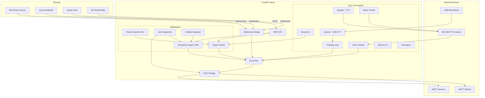

# TRITIUM-SC System Architecture

## Overview

TRITIUM-SC is a three-layer system: a **browser frontend** renders the tactical picture, a **FastAPI server** hosts Amy's consciousness and the battlespace engine, and **external devices** (cameras, robots, sensors) connect via MQTT or direct USB.

Real sensors and simulated units coexist on the same event bus, same APIs, same tactical map. Amy does not distinguish between them.

## Boot Sequence

The FastAPI lifespan handler in `app/main.py` orchestrates startup:

### Commander Boot (`_boot()`)

Amy's Commander initializes subsystems in order:

1. **Sensor nodes** -- start BCC950 or virtual nodes
2. **Speaker** -- Piper TTS, pre-cache acknowledgment WAVs
3. **Listener** -- Silero VAD + whisper.cpp GPU STT
4. **YOLO** -- VisionThread with model warmup
5. **Chat agent** -- Ollama LLM (gemma3:4b)
6. **Deep vision** -- Ollama multimodal (llava:7b)
7. **Thinking thread** -- continuous inner monologue
8. **Background threads** -- motor, audio, curiosity timer

After boot, Amy delivers a context-aware greeting, then starts the event loop.

## Event Flow

### Target Lifecycle: Spawn to Render

### Escalation Sequence

## Data Formats

Position data flows through several representations:

| Layer | Format | Example |
|-------|--------|---------|
| SimulationTarget | `tuple[float, float]` | `(5.2, -3.1)` |
| SimulationTarget.to_dict() | `{"x": float, "y": float}` | `{"x": 5.2, "y": -3.1}` |
| TrackedTarget | `tuple[float, float]` | `(5.2, -3.1)` |
| TrackedTarget.to_dict() | `{"x": float, "y": float}` | `{"x": 5.2, "y": -3.1}` |
| MQTT telemetry | `{"x": float, "y": float}` | `{"x": 5.2, "y": -3.1}` |
| WebSocket to frontend | `{"x": float, "y": float}` | `{"x": 5.2, "y": -3.1}` |
| War Room canvas | pixel coordinates | `worldToScreen(5.2, -3.1)` |
| TritiumLevelFormat JSON | `{"x": float, "z": float}` | `{"x": 5.2, "z": -3.1}` |

Note: The level format uses `z` for the horizontal plane (3D convention where `y` is height). The simulation and tracker use `y` internally.

## Thread Architecture

Amy runs multiple daemon threads coordinated through the EventBus:

| Thread | Rate | Purpose |
|--------|------|---------|
| `amy` (Commander.run) | event-driven | Main event loop |
| `sim-tick` | 10 Hz | Advance all simulation targets |
| `sim-spawner` | 30-120s | Spawn hostile intruders |
| `ambient-spawner` | 15-45s | Spawn neutral neighborhood activity |
| `sim-bridge` | event-driven | Feed sim telemetry to TargetTracker |
| `threat-classifier` | 2 Hz | Classify threats against zones |
| `auto-dispatcher` | event-driven | Dispatch units to intercept threats |
| `thinking` | 8s interval | Amy's inner monologue (LLM) |
| `vision` (VisionThread) | 3 Hz | YOLO detection + perception |
| `audio` (AudioThread) | continuous | VAD speech detection |
| `motor` (MotorThread) | continuous | PTZ camera control |
| `curiosity` | 45-90s | Trigger deep visual observation |
| `amy-ws-bridge` | event-driven | Forward EventBus to WebSocket |
| `telemetry-batcher` | 100ms | Batch sim_telemetry for WebSocket |
| `mqtt` (paho loop) | continuous | MQTT broker communication |

## Key Files

| File | Purpose |
|------|---------|
| `app/main.py` | FastAPI lifespan, boot sequence |
| `amy/commander.py` | Commander, VisionThread, AudioThread |
| `amy/event_bus.py` | EventBus — thread-safe pub/sub for all internal events |
| `amy/thinking.py` | ThinkingThread, GoalStack |
| `amy/sensorium.py` | Temporal sensor fusion, narrative |
| `amy/target_tracker.py` | Unified real+virtual target registry |
| `amy/escalation.py` | ThreatClassifier, AutoDispatcher |
| `amy/mqtt_bridge.py` | MQTT broker bridge |
| `amy/simulation/engine.py` | SimulationEngine (10Hz tick loop) |
| `amy/simulation/target.py` | SimulationTarget dataclass |
| `amy/simulation/ambient.py` | AmbientSpawner (neutral targets) |
| `amy/simulation/loader.py` | TritiumLevelFormat parser |
| `app/routers/ws.py` | WebSocket bridge + TelemetryBatcher |
| `frontend/js/war.js` | War Room canvas renderer |
| `frontend/js/assets.js` | Target state + tactical map |

## Related Documentation

- [PLAN.md](PLAN.md) -- Development roadmap and phase status
- [ESCALATION.md](ESCALATION.md) -- Threat escalation system
- [MQTT.md](MQTT.md) -- MQTT communication protocol
- [SIMULATION.md](SIMULATION.md) -- Simulation engine internals
