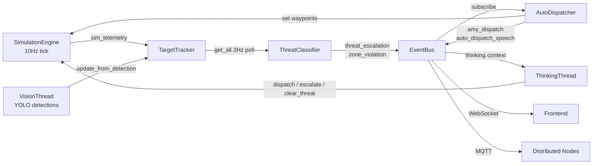
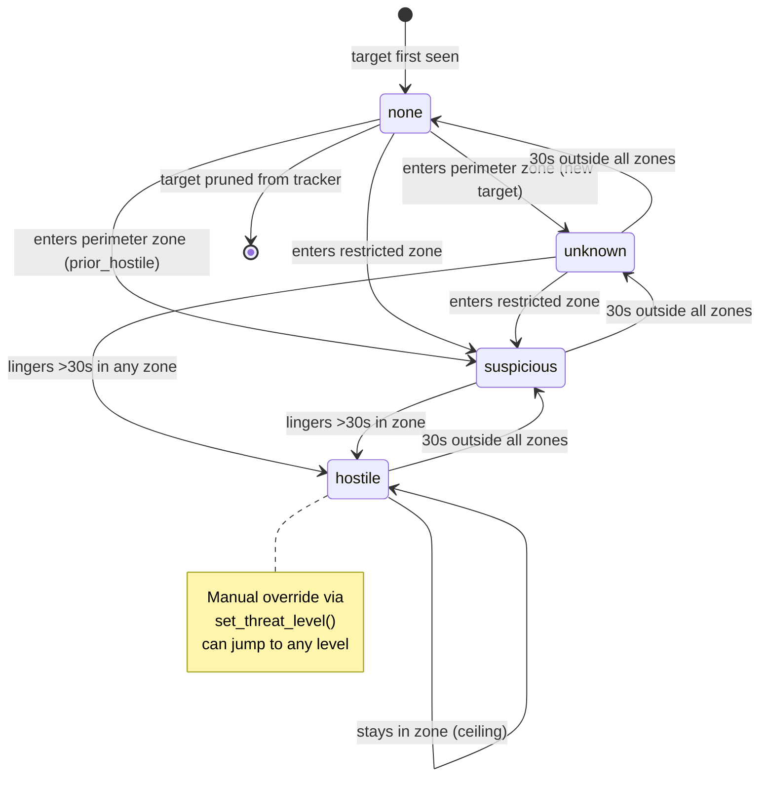
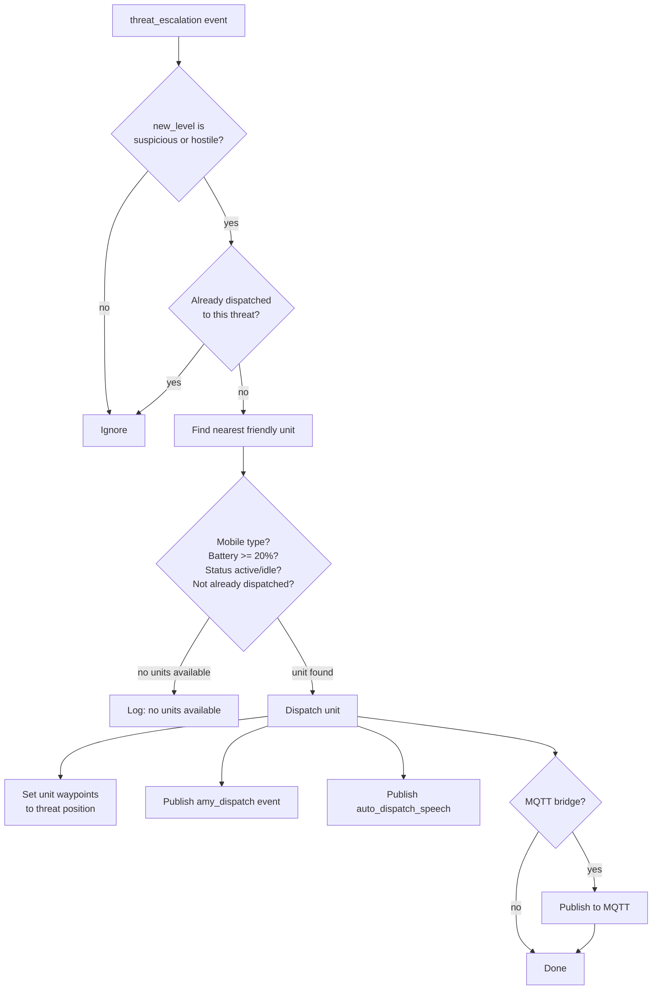
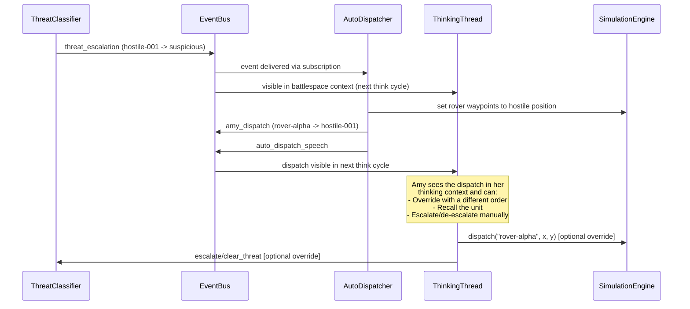

# Escalation Architecture

This document describes the threat escalation and autonomous dispatch system
in TRITIUM-SC. It covers the current design, its limitations, and the
reasoning behind its architecture.

## Overview

The escalation system bridges the gap between *detecting* a target and
*responding* to it. It sits between the TargetTracker (which knows *where*
everything is) and Amy's thinking loop (which decides *what matters*).

Two components work together:

- **ThreatClassifier** -- monitors all non-friendly, non-neutral targets
  against zone definitions, assigning threat levels on a discrete ladder.
  Targets previously classified as hostile are flagged (`prior_hostile`)
  and re-escalate faster on re-entry (skip `unknown`, go to `suspicious`).
- **AutoDispatcher** -- listens for escalation events and dispatches the
  nearest available mobile friendly unit (rovers, drones, vehicles -- not
  turrets) to intercept.  Stale dispatches are automatically cleaned up
  when the threat disappears or the dispatched unit is destroyed/arrived.

Amy's thinking loop can also dispatch units independently, creating a
two-layer response: fast automatic reactions plus strategic AI decisions.

## System Flow

## Threat State Machine

### Threat Levels

| Level | Meaning | Trigger |
|-------|---------|---------|
| `none` | No threat detected | Default; or 30s outside all zones |
| `unknown` | Unidentified target in monitored area | Enters any non-restricted zone |
| `suspicious` | Possible threat requiring investigation | Enters a restricted zone |
| `hostile` | Confirmed threat requiring response | Lingers >30s in any zone; or manual override |

### De-escalation

De-escalation follows the same ladder in reverse, one step at a time, with
a 30-second cooldown between steps. When a target leaves all zones, the
exit time is recorded. After 30s outside, the level drops one step and the
timer resets. This means:

- `hostile` takes 90s of continuous absence to return to `none`
- Re-entering a zone clears the de-escalation timer

## Dispatch Decision Tree

## Amy / AutoDispatcher Interaction

### Doctrine

1. **AutoDispatcher** handles **immediate tactical response** to confirmed
   hostiles (`hostile` level only).  Suspicious targets are left for Amy.
2. **Amy** handles **strategic awareness and judgment** -- she sees suspicious
   targets in her thinking context and decides: dispatch, observe, or clear.
   This gives her meaningful decision authority over tactical responses.
3. **No priority arbitration** -- both can move units. Amy's orders overwrite
   AutoDispatcher's waypoints since they both write to the same SimulationTarget.
4. **Amy can clear threats** via `clear_threat()`, which also clears the
   active dispatch record.
5. **Post-engagement recall** -- after neutralization, the interceptor is
   automatically returned to idle status and made available for future dispatch.
6. **Tactical narration** -- dispatch and neutralization events trigger Amy's
   TTS with tactical callouts (bearing, grid position, unit names).

## Current Architectural Issues

### ~~1. Neutral Targets Trigger False Escalations~~ (RESOLVED)

**Fixed**: The ThreatClassifier now skips both `friendly` and `neutral`
alliance targets.  Neutral entities (neighbors, cars, animals from
AmbientSpawner) no longer trigger zone violations or escalations.

### 2. Polling vs Event-Driven Classification

**Problem**: ThreatClassifier polls all targets at 2Hz. With 100 targets,
that is 100 zone-containment checks every 0.5s.

**Why polling was chosen**: The TargetTracker does not publish position-change
events. It is a passive registry updated by the SimulationEngine bridge loop
and YOLO detections. Making it event-driven would require the tracker to
publish deltas, which adds complexity for a system that currently handles
<50 targets comfortably at 2Hz.

**When to change**: If target count exceeds ~200, or if latency below 0.5s
becomes critical, switch to event-driven with spatial indexing (quadtree or
grid cells).

### 3. Circle-Only Zones

**Problem**: Zones are circles (center + radius). Real neighborhoods have
irregular shapes -- fences, building footprints, property lines.

**Current state**: The `app/zones/models.py` Zone class already supports
polygons with ray-casting point-in-polygon tests. The escalation system uses
a *separate* zone format (dict with position + radius) loaded from the
TritiumLevelFormat JSON.

**Fix needed**: Unify the zone models. The escalation classifier should use
the same Zone class as the rest of the system, which already supports
polygons, zone types, linger thresholds, and time-based properties.

### 4. No Velocity-Based Escalation

**Problem**: A target running at high speed toward a restricted area is
treated identically to one standing still at the perimeter boundary. Both
start at `unknown`. There is no "approach velocity" factor.

**Ideal model**: A numeric threat score (0.0-1.0) with weighted inputs:
zone proximity, approach velocity, linger time, behavioral patterns (circling,
repeated approach). The discrete ladder (`none/unknown/suspicious/hostile`)
would become thresholds on this continuous score.

### ~~5. No Behavioral Memory~~ (PARTIALLY RESOLVED)

**Fixed**: ThreatRecord now tracks `prior_hostile: bool`.  When a target
reaches hostile (by linger or manual override), the flag is set and persists
through de-escalation.  On re-entry to a perimeter zone, prior hostiles
skip `unknown` and go directly to `suspicious` (hysteresis).

**Remaining**: Entry count, approach velocity, and behavioral patterns
(circling, repeated approach-retreat) are not yet tracked.  A full
continuous suspicion score (0.0-1.0) with slow decay would be the ideal
end state, but the `prior_hostile` flag covers the most important case.

### ~~6. Dispatch Is Fire-and-Forget~~ (PARTIALLY RESOLVED)

**Fixed**: Post-engagement recall.  When a hostile is neutralized, the
`target_neutralized` event triggers:
1. Tactical TTS announcement ("Threat neutralized. Rover Alpha intercepted...")
2. Interceptor returned to `idle` status (available for future dispatch)
3. Active dispatch record cleared

**Remaining**: Dispatches still target the hostile's position at dispatch
time.  If the hostile moves, the interceptor goes to where the hostile
*was*, not where it *is*.  Pursuit mode and intercept-point calculation
are future improvements.

### ~~7. No Unit Type Consideration~~ (RESOLVED)

**Fixed**: AutoDispatcher now filters by `MOBILE_TYPES = {"rover", "drone",
"vehicle"}`.  Only units with a mobile asset_type are eligible for dispatch.
Turrets, persons, and other stationary/non-combat types are excluded.

**Remaining**: No distinction between unit capabilities (e.g., drones for
recon vs rovers for interdiction).  All mobile types are treated equally.
This is fine for the current game model but could be enriched later.

### 8. No Force Reserve

**Problem**: AutoDispatcher will commit every available unit to intercepts.
With 3 hostiles and 3 rovers, all rovers are dispatched, leaving nothing
in reserve for a 4th threat or for area defense.

**Ideal model**: Reserve ratio (e.g., always keep 1/3 of force uncommitted)
configurable per operational posture.

## File Organization

Canonical location: `src/amy/tactical/escalation.py` containing both
ThreatClassifier and AutoDispatcher.

The two classes are tightly coupled (the dispatcher exists only because the
classifier exists), the file is ~500 lines, and splitting into a package
adds import complexity without meaningful separation of concerns. If a third
component is added (e.g., behavioral analyzer), split into
`tracking/escalation/` package.

## Configuration

| Setting | Default | Description |
|---------|---------|-------------|
| `simulation_layout` | None | Path to TritiumLevelFormat JSON with zone definitions |
| Default perimeter radius | 25.0 | Outer monitoring ring when no layout loaded |
| Default restricted radius | 12.0 | Inner restricted zone when no layout loaded |
| `TICK_INTERVAL` | 0.5s | Classifier evaluation frequency |
| `LINGER_THRESHOLD` | 30.0s | Time in zone before escalation to hostile |
| `DEESCALATION_TIME` | 30.0s | Time outside zones before one-step de-escalation |
| `MIN_BATTERY` | 0.20 | Minimum battery for dispatch eligibility |

## Test Coverage

- `tests/amy/test_escalation.py` -- 120 unit tests covering:
  - Escalation ladder (perimeter, restricted, linger)
  - De-escalation cascade and timer reset
  - Manual override
  - Zone geometry (boundary, overlap, missing fields, radius zero)
  - Dispatch selection (nearest, battery, status, dedup)
  - Event publishing (escalation, de-escalation, zone violation, dispatch, speech)
  - Tactical speech format (bearing, distance, target name)
  - Lifecycle (start/stop/double-start/double-stop)
  - Edge cases (same position, missing engine target, boundary oscillation)
  - Prior hostile memory (linger flag, manual override flag, re-entry skip)
  - Turret dispatch exclusion (turrets, persons never dispatched)
  - Stale dispatch cleanup (threat gone, unit destroyed/arrived, deescalation)
- `tests/amy/test_escalation_e2e.py` -- 5 integration tests verifying the
  full pipeline: hostile enters zone -> classifier escalates -> manual override
  to hostile -> dispatcher dispatches -> rover waypoints set -> events flow
  through EventBus.
- `tests/amy/test_thinking.py` -- speech guardrail tests including:
  - say() suppressed when nobody present (no sim)
  - say() allowed when simulation active (War Room mode)
  - Tactical commander doctrine in thinking prompt
