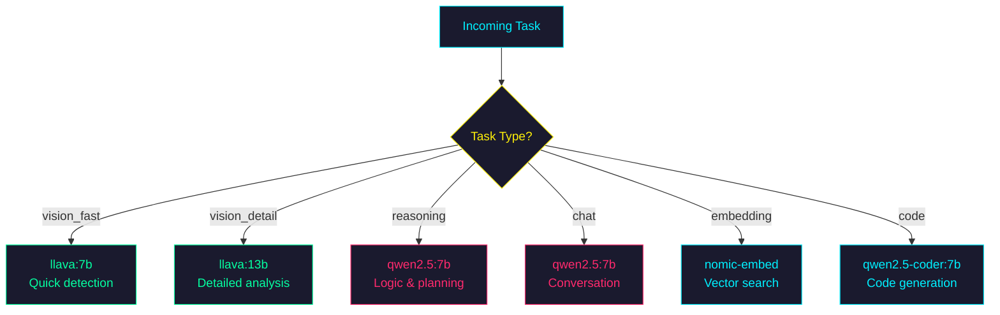
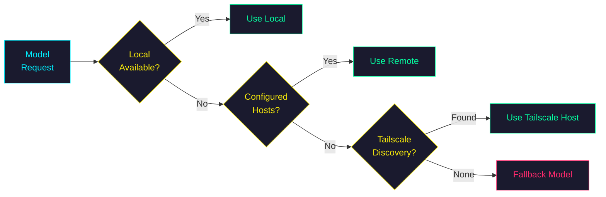

# Model Routing & Extensible Lua Framework

Design spec for task-aware model selection, fleet integration, and
extensible Lua action generation for Amy and robots.

## Problem Statement

Amy currently uses **static model assignment**: one model for chat, one
for deep vision, one for thinking — hardcoded at startup, locked to a
single Ollama host.  This means:

- **No task awareness**: simple reflections (`think("Quiet...")`) use the
  same 7B model as complex tactical reasoning
- **No fallback**: if the primary Ollama host goes down, everything stops
- **No fleet utilization**: 3 Ollama hosts exist on the Tailscale network
  but only `localhost` is used in production
- **No code generation**: Amy can only emit pre-defined Lua actions from
  a fixed registry — she can't compose novel behaviors
- **No robot thinking**: robots execute commands but don't think for
  themselves using LLMs

## Design Goals

1. **Task-aware model selection** — classify inference tasks and route to
   appropriate models (small/fast for simple, large for complex/vision)
2. **Fleet integration** — promote existing `OllamaFleet` from test-only
   to production, with zero hardcoded hostnames in the repo
3. **Fallback resilience** — try next host/model on failure, inspired by
   Open Claw's two-stage failover pattern
4. **Extensible Lua actions** — registry pattern so nodes and robots can
   register their own actions dynamically
5. **Robot thinking** — robots get their own thinking threads that
   generate Lua, using the same parser and fleet infrastructure
6. **No breaking changes** — Amy keeps working exactly as-is with static
   config; routing is opt-in via fleet discovery

## Architecture

### 1. ModelRouter (`amy/model_router.py`)

Central routing component. Inspired by Open Claw's provider abstraction
but simpler — we only have Ollama, not multiple cloud providers.

```
                    ┌──────────────┐
                    │  ModelRouter  │
                    │              │
   classify_task()──│  TaskType    │──select_model()──┐
                    │  ModelProfile│                   │
                    │  FallbackChain                   ▼
                    └──────────────┘          ┌──────────────┐
                                             │  OllamaFleet  │
                                             │  (production) │
                                             └──────────────┘
                                              ▲   ▲   ▲
                                              │   │   │
                                          host1 host2 host3
                                          (Tailscale auto-discovery)
```

#### TaskType enum

| TaskType | Description | Example |
|----------|-------------|---------|
| `simple_think` | Brief reflection, wait, nod | `think("Quiet afternoon")` |
| `complex_reason` | Tactical analysis, multi-step | Battlespace threat assessment |
| `vision` | Image analysis (requires multimodal) | Deep think with camera frame |
| `code_gen` | Lua code generation | Novel sensor interaction |
| `chat` | Conversational response | User dialogue |



#### ModelProfile dataclass

```python
@dataclass
class ModelProfile:
    name: str           # e.g. "gemma3:4b"
    capabilities: set   # {"text", "vision", "tools", "code"}
    speed: str          # "fast", "medium", "slow"
    context_length: int # e.g. 8192
    priority: int       # lower = preferred (cost/speed)
```

#### Selection Algorithm

```
1. Classify task → TaskType
2. Filter fleet models by required capabilities
3. Sort by priority (speed preference for simple, quality for complex)
4. Return ordered fallback chain
5. On inference: try each model/host in chain until success
```

#### Fallback Chain (from Open Claw)

Open Claw's best pattern: **two-stage failover**.

- **Stage 1**: Retry same model on different host (host rotation)
- **Stage 2**: Fall back to next model in capability chain

```python
def infer(self, task_type: TaskType, messages: list[dict],
          images: list[str] | None = None) -> dict:
    chain = self.select_chain(task_type, has_images=bool(images))
    for model, host in chain:
        try:
            return ollama_chat(model, messages, base_url=host.url)
        except (TimeoutError, ConnectionError):
            continue
    raise AllHostsFailedError(task_type)
```

### 2. Fleet Integration (`src/amy/inference/fleet.py`)

Promote `tests/lib/ollama_fleet.py` to production at `src/amy/inference/fleet.py`.
Same discovery logic — no changes needed:

- `conf/ollama-fleet.conf` (gitignored) — explicit host list
- `OLLAMA_HOSTS` env var — comma-separated
- Tailscale auto-discovery — `tailscale status --json`
- Localhost fallback — always available



**No hardcoded hosts in source.** The conf file is gitignored, env vars
are machine-local, and Tailscale discovery is automatic.

#### Configuration additions to `app/config.py`

```python
# Fleet / Model routing
fleet_enabled: bool = False          # opt-in, existing behavior unchanged
fleet_auto_discover: bool = True     # Tailscale scan
amy_model_profiles: str = ""         # JSON or path to model profiles
```

When `fleet_enabled=False` (default), Amy uses the existing static
`ollama_host` + `amy_chat_model` + `amy_deep_model` — zero behavior
change.

### 3. Lua Action Registry (`amy/lua_registry.py`)

Replace the hardcoded `VALID_ACTIONS` dict in `lua_motor.py` with a
registry that supports dynamic action registration.

```python
class LuaActionRegistry:
    """Registry of available Lua actions for thinking prompts."""

    def __init__(self):
        self._actions: dict[str, ActionDef] = {}

    def register(self, name: str, min_params: int, max_params: int,
                 param_types: list[type], description: str,
                 source: str = "core") -> None:
        ...

    def register_many(self, actions: dict) -> None:
        """Bulk register (backwards-compatible with VALID_ACTIONS format)."""
        ...

    def unregister(self, name: str) -> None:
        ...

    def get(self, name: str) -> ActionDef | None:
        ...

    def prompt_section(self, source_filter: str | None = None) -> str:
        """Generate the 'Available actions:' section for thinking prompts."""
        ...

    def validate(self, action: str, params: list) -> str | None:
        """Validate action + params. Returns error string or None."""
        ...
```

#### Backwards Compatibility

`lua_motor.py` initializes a default registry with all existing actions:

```python
_default_registry = LuaActionRegistry()
_default_registry.register_many(VALID_ACTIONS)
```

Existing code continues to work unchanged. The registry is the new
extension point.

#### Robot Action Registration

Robots register their own actions via MQTT:

```json
{
  "type": "register_actions",
  "robot_id": "rover-alpha",
  "actions": [
    {"name": "fire_nerf", "params": [0, 0, []], "description": "Fire nerf turret"},
    {"name": "set_led", "params": [1, 1, ["str"]], "description": "Set LED color"},
    {"name": "play_sound", "params": [1, 1, ["str"]], "description": "Play sound effect"}
  ]
}
```

Amy's thinking prompt dynamically includes robot-specific actions when
those robots are online.

### 4. Robot Thinker (`examples/robot-template/brain/thinker.py`)

Each robot gets an optional thinking thread. Uses the same Lua parser as
Amy but with robot-specific context and actions.

```python
class RobotThinker:
    """LLM-powered thinking for autonomous robots."""

    def __init__(self, robot_id: str, config: dict,
                 fleet: OllamaFleet | None = None):
        self._robot_id = robot_id
        self._registry = LuaActionRegistry()
        self._fleet = fleet
        self._model = config.get("think_model", "gemma3:4b")
        # Register robot-specific actions
        self._register_robot_actions(config)

    def think_cycle(self, context: dict) -> MotorOutput | None:
        """Run one thinking cycle. Returns parsed Lua action or None."""
        ...
```

Robot thinking prompt includes:
- Robot identity and capabilities
- Current telemetry (position, battery, status)
- Nearby targets from MQTT
- Available actions (from its own registry)
- Recent commands from Amy

The robot publishes its thoughts and actions back to Amy via MQTT:
```
tritium/{site}/robots/{id}/thoughts  → {"text": "...", "action": "..."}
```

### 5. Code Generation Mode

When `task_type == TaskType.code_gen`, the thinking prompt switches to
a code generation template that allows multi-statement Lua:

```lua
-- Amy can generate compound behaviors:
function respond_to_intruder(target_id)
    escalate(target_id, "suspicious")
    dispatch("rover-alpha", 10.0, 5.0)
    battle_cry("Contact! Deploying rover to intercept!")
end
respond_to_intruder("hostile-7")
```

The Lua parser already handles code blocks (```lua fenced blocks). The
extension is:
1. A code generation prompt template
2. Multi-action execution (parse multiple function calls from one response)
3. Validation of the full sequence before execution

## Implementation Plan

### Phase 1: ModelRouter + Fleet (core infrastructure) [COMPLETE]

1. [x] `src/amy/inference/model_router.py` — TaskType enum, ModelProfile dataclass, ModelRouter
   with classify_task(), select_chain(), infer() with two-stage failover
2. [x] `src/amy/inference/fleet.py` — OllamaFleet promoted from tests/lib, with FleetHost
   dataclass, auto-discovery (conf/env/Tailscale/localhost), parallel probing
3. [x] Fleet configuration via `conf/ollama-fleet.conf` (gitignored),
   `OLLAMA_HOSTS` env var, and Tailscale auto-discovery
4. [x] ModelRouter.from_static() factory for backwards-compatible single-host mode
5. [x] AllHostsFailedError with task_type context for diagnostics

### Phase 2: Lua Action Registry (extensibility) [COMPLETE]

6. [x] `src/amy/actions/lua_registry.py` — ActionDef dataclass, LuaActionRegistry
7. [x] register(), register_action(), register_many() (backwards-compatible
   with VALID_ACTIONS dict format)
8. [x] unregister(), unregister_by_source() for cleanup when robots disconnect
9. [x] prompt_section() generates dynamic action lists for thinking prompts
10. [x] validate() for action name + parameter count checking
11. [x] with_core_actions() factory pre-loads Amy's standard actions
12. [x] Source filtering: actions_by_source(), actions_by_source_prefix()
    for per-robot action isolation

### Phase 3: Robot Thinker (autonomous robots) [COMPLETE]

13. [x] `src/amy/inference/robot_thinker.py` — RobotThinker with LuaActionRegistry integration,
    ModelRouter support, thought history, MQTT message generation
14. [x] `examples/robot-template/brain/thinker.py` — standalone RobotThinker
    (no src/amy/ dependency), built-in Lua parser, action dispatch handlers
15. [x] `examples/robot-template/brain/vision_bridge.py` — YOLO fast-path
    to LLM slow-path bridge, thread-safe detection accumulation
16. [x] `examples/robot-template/brain/nav_planner.py` — GPS/game coordinate
    transforms, PathPlanner interface, StraightLine/Waypoint/Nav2/SLAM stubs
17. [x] ROBOT_THINKING_PROMPT with identity, telemetry, targets, commands context
18. [x] MQTT thought publishing: `tritium/{site}/robots/{id}/thoughts`
19. [x] Extended hardware telemetry: BatteryState, ImuState, odometry, motor temps

### Phase 4: Code Generation (novel behaviors) [COMPLETE]

20. [x] `src/amy/actions/lua_multi.py` — extract_multi_actions(), parse_multi_actions()
    for compound behavior sequences
21. [x] Handles code blocks, comments, thinking tags, mixed text
22. [x] validate_action_sequence() — sequence length, say() limits, validity checks
23. [x] MAX_SEQUENCE_LENGTH=10, MAX_SAY_PER_SEQUENCE=1 safety guardrails

### Phase 5: Simulation-to-Real Pipeline [PLANNED]

The bridge from simulated robots to physical hardware. Each step reduces
the reality gap between Amy's simulation engine and actual deployment.

24. [ ] **Isaac Lab integration** — high-fidelity physics simulation for
    robot locomotion, sensor noise, and terrain interaction. The TRITIUM-SC
    SimulationEngine provides the tactical layer (10Hz tick, target tracking,
    threat escalation); Isaac Lab provides the physics layer (1kHz motor
    control, contact dynamics, sensor models). Communication via MQTT:
    Isaac Lab publishes telemetry, TRITIUM-SC publishes commands.

25. [ ] **Synthetic camera imagery from AI models** — generate security
    camera test footage using DALL-E, SDXL, or Stable Video Diffusion.
    Prompts derived from SimulationTarget positions and scene layouts.
    Use to test YOLO detection pipeline without real cameras. Store in
    `data/synthetic/` alongside existing procedural OpenCV renders.

26. [ ] **Global target tracking across real+sim** — extend TargetTracker
    with cross-camera re-identification. When the same person appears on
    camera A and camera B, unify them as one TrackedTarget. Pattern
    recognition: repeated approach vectors, time-of-day correlations,
    behavioral anomalies (loitering, probing perimeter).

27. [ ] **Multi-robot fleet coordination via MQTT mesh** — move beyond
    single-robot dispatch to coordinated multi-robot behaviors. Amy
    assigns roles (scout, overwatch, interceptor), robots negotiate
    waypoints via MQTT, fleet-level state machine tracks mission progress.
    Requires: `src/amy/inference/fleet_coordinator.py`, extended MQTT topics for
    inter-robot communication (`tritium/{site}/robots/fleet/plan`).

### Phase 6: Advanced Intelligence [PLANNED]

Higher-order reasoning, identification, and multi-agent autonomy.

28. [ ] **Synthetic security camera imagery for testing** — curate a
    library of AI-generated security camera stills and clips with known
    ground truth (person count, vehicle type, time of day). Use for
    YOLO confidence tuning, false positive reduction, and edge case
    testing (rain, fog, night, glare). Automate via prompt templates:
    `"CCTV footage of {scenario}, overhead angle, {time_of_day}, {weather}"`.

29. [ ] **Target identification and re-identification** — embedding-based
    person/vehicle ReID across multiple cameras. Build an appearance
    database from labeled detections (operator feedback loop). When a
    known person enters any camera's FOV, Amy identifies them by name
    and updates the sensorium narrative.

30. [ ] **Pattern recognition** — statistical analysis of target behavior
    over time. Detect repeated approach vectors (same car every day at
    5pm), anomalous loitering (person standing near fence for 10+ minutes),
    and behavioral shifts (regular patterns suddenly changing). Feed
    patterns into ThreatClassifier for proactive escalation.

31. [ ] **Multi-agent coordination** — Amy commands, robots execute,
    feedback loop closes. Amy's thinking thread generates high-level
    tactical intent ("establish overwatch on north fence"). Fleet
    coordinator decomposes into robot-level tasks. Robots execute with
    local autonomy (obstacle avoidance, battery management). Results
    flow back through MQTT telemetry and thoughts for Amy to evaluate
    and adapt.

## Testing Strategy (TDD)

All tests written BEFORE implementation. Each phase has its own test file:

- `tests/amy/test_model_router.py` — TaskType classification, model
  selection, fallback chains, fleet integration
- `tests/amy/test_lua_registry.py` — registration, validation, prompt
  generation, unregister, source filtering
- `tests/amy/test_robot_thinker.py` — thinking cycle, action dispatch,
  MQTT publishing
- `tests/amy/test_multi_action_lua.py` — multi-statement parsing,
  sequence validation, code block extraction

## Open Claw Patterns Adopted

| Pattern | Open Claw | Amy Adaptation |
|---------|-----------|----------------|
| **Two-stage failover** | Auth rotation → model chain | Host rotation → model chain |
| **Capability discovery** | Provider introspection | Fleet model listing |
| **Per-agent model override** | Per-agent config | Per-task-type routing |
| **Session model switching** | `/model` command | API endpoint `/api/amy/model` |
| **Provider abstraction** | Multi-provider interface | Single provider (Ollama) with fleet |

## What We Don't Adopt

- **Multi-provider abstraction** (Anthropic/OpenAI/etc.) — Amy is local-only by design
- **Auth profile management** — Ollama has no auth (local network trust)
- **Billing-aware backoff** — no billing on local fleet
- **Session pinning** — Amy's model selection is per-task, not per-session
