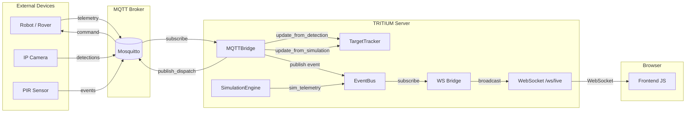
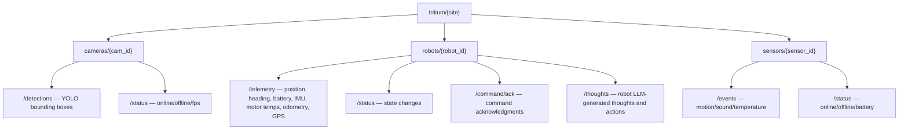
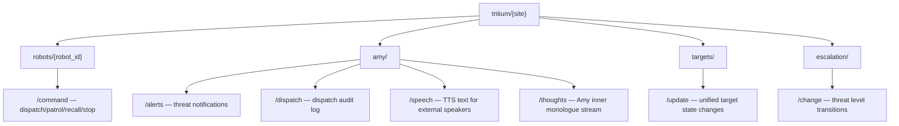

# MQTT Architecture — TRITIUM-SC Distributed Communication

## Overview

MQTT provides the inter-device communication layer for TRITIUM-SC. External
devices (Nerf rovers, camera nodes, PIR sensors) connect to a central
MQTT broker. The `MQTTBridge` translates between the MQTT wire protocol
and Amy's in-process `EventBus` + `TargetTracker`.

## Data Flow



## Three Communication Buses

The system has three buses, each serving a distinct boundary:

| Bus | Boundary | Transport | Protocol |
|-----|----------|-----------|----------|
| **MQTT** | Device <-> Server | TCP (paho-mqtt) | MQTT 3.1.1, QoS 0/1 |
| **EventBus** | Thread <-> Thread (in-process) | `queue.Queue` | Python dict `{"type", "data"}` |
| **WebSocket** | Server <-> Browser | HTTP Upgrade | JSON over WS |

**Why three?** Each bus serves a different trust/latency/reliability domain:

- **MQTT** crosses network boundaries, handles device reconnection, LWT
  (Last Will and Testament), and topic-based routing. Devices may be
  embedded Linux boards with limited memory.
- **EventBus** is zero-copy, zero-serialization in-process pub/sub. Amy's
  threads (thinking, vision, audio, simulation) communicate here. Moving
  this to MQTT would add 2ms+ per message and require JSON serialization
  for every internal event.
- **WebSocket** is browser-native. The `TelemetryBatcher` in `ws.py`
  batches 10Hz simulation telemetry into 100ms chunks to avoid flooding
  the browser.

**Data hops for an external detection:**
```
Camera -> MQTT -> MQTTBridge -> TargetTracker (direct call)
                             -> EventBus -> WS Bridge -> WebSocket -> Browser
```

This is 4 hops to the browser. The alternative (MQTT-over-WebSocket)
would eliminate the WS bridge hop but would require the browser to manage
MQTT subscriptions, topic parsing, and reconnection logic — complexity
that belongs on the server.

## Topic Hierarchy

```
tritium/{site}/{category}/{device_id}/{action}
```

### Inbound (device -> server)



### Outbound (server -> device)



### Topic Design Rationale

**Why `site` in the topic?** Multi-site deployments (home, backyard, garage)
can share a single broker with topic-level isolation. Devices subscribe
only to their site. This is simpler than per-site brokers and allows
cross-site monitoring by subscribing to `tritium/+/...`.

**Why `category/device_id/action`?** Matches the physical taxonomy: what
kind of device, which one, what happened. Wildcard subscriptions work
naturally: `tritium/home/cameras/+/detections` gets all camera detections,
`tritium/home/robots/+/#` gets all robot messages.

**Amy topics under `/amy/`:** Amy's outbound messages (alerts, speech,
thoughts) are system-level broadcasts, not device-to-device. Placing them
under a separate `amy/` namespace keeps them distinct from device topics
and makes monitoring easy.

## Message Formats

### Camera Detection
```json
{
  "boxes": [
    {
      "label": "person",
      "confidence": 0.95,
      "center_x": 0.5,
      "center_y": 0.6,
      "bbox": [0.3, 0.4, 0.7, 0.8]
    }
  ],
  "camera_id": "front-door",
  "timestamp": "2026-02-16T12:00:00+00:00"
}
```

### Robot Telemetry

Core fields (required — all robots must publish these):

```json
{
  "name": "Rover Alpha",
  "asset_type": "rover",
  "position": {"x": 3.5, "y": -2.1},
  "heading": 127.4,
  "speed": 1.2,
  "battery": 0.85,
  "status": "patrolling",
  "turret": {"pan": 45.0, "tilt": -10.0},
  "timestamp": "2026-02-16T12:00:00+00:00"
}
```

Extended fields (optional — include when hardware provides them):

```json
{
  "battery_state": {
    "charge_pct": 0.85,
    "voltage": 12.30,
    "current_draw": 1.8,
    "temperature_c": 28.5
  },
  "imu": {
    "roll": 0.5,
    "pitch": -1.2,
    "yaw": 127.4,
    "accel_x": 0.1,
    "accel_y": 2.8,
    "accel_z": 9.81
  },
  "motor_temps": {"left": 32.1, "right": 31.8},
  "odometry": 452.3,
  "gps": {"lat": 37.7749, "lng": -122.4194, "alt": 15.0}
}
```

| Extended Field | Type | Description | Source (real hardware) | Source (simulated) |
|---------------|------|-------------|----------------------|-------------------|
| `battery_state.charge_pct` | float | 0.0-1.0 charge level | BMS or INA219 | Derived from drain rate |
| `battery_state.voltage` | float | Pack voltage (e.g. 12.6V for 3S LiPo) | INA219 voltage divider | LiPo discharge curve interpolation |
| `battery_state.current_draw` | float | Amps drawn (0 = idle) | INA219 current shunt | Motor load model (idle 0.3A, moving ~2A) |
| `battery_state.temperature_c` | float | Battery pack temperature | Thermistor on pack | Thermal model from current draw |
| `imu.roll` | float | Roll angle in degrees (0 = level) | MPU6050 / BNO055 | Simulated from turn rate |
| `imu.pitch` | float | Pitch angle in degrees (0 = level) | MPU6050 / BNO055 | Simulated from acceleration |
| `imu.yaw` | float | Yaw in degrees (same as heading) | Magnetometer / gyro | Equals heading |
| `imu.accel_x/y/z` | float | Acceleration m/s^2 | IMU accelerometer | Derived from motor commands |
| `motor_temps.left/right` | float | Motor temperature in celsius | Thermistors on motor housing | Load-based thermal model |
| `odometry` | float | Total distance traveled (meters) | Wheel encoder integration | Accumulated from position delta |
| `gps.lat/lng/alt` | float | GPS position (WGS84) | NEO-6M / ZED-F9P | null (not available in sim) |

The bridge and TargetTracker process extended fields when present but do not
require them. Robots that only publish core fields work identically.

### Robot Thoughts

Published by robots with LLM-powered thinkers (see `examples/robot-template/brain/thinker.py`).
Topic: `tritium/{site}/robots/{id}/thoughts`

```json
{
  "robot_id": "rover-alpha",
  "type": "thought",
  "text": "Hostile detected at north fence. Moving to intercept.",
  "think_count": 42,
  "timestamp": 1740009600.0
}
```

These messages allow Amy to see what each robot is thinking. They are
published at the thinker's cycle rate (~0.2 Hz, configurable via
`think_interval` in the robot's config). Amy's sensorium can incorporate
robot thoughts into the battlespace narrative for richer situational
awareness.

### Robot Command (dispatch)
```json
{
  "command": "dispatch",
  "x": 15.5,
  "y": -3.2,
  "timestamp": "2026-02-16T12:00:00+00:00"
}
```

### Robot Command (patrol)
```json
{
  "command": "patrol",
  "waypoints": [{"x": 0, "y": 0}, {"x": 10, "y": 5}],
  "timestamp": "2026-02-16T12:00:00+00:00"
}
```

### Sensor Event
```json
{
  "event_type": "motion",
  "zone": "north_fence",
  "magnitude": 0.8,
  "timestamp": "2026-02-16T12:00:00+00:00"
}
```

## QoS and Retained Messages

Not all messages are equally important. High-rate telemetry uses QoS 0
(fire-and-forget) because a dropped frame is invisible. Commands and alerts
use QoS 1 (at-least-once) because a missed dispatch means a threat goes
unintercepted.

| Topic pattern | Direction | QoS | Retain | Rationale |
|---------------|-----------|-----|--------|-----------|
| `cameras/+/detections` | in | 0 | no | High rate (10 fps), stale in 100ms |
| `cameras/+/status` | in | 1 | yes | State change, new subscriber needs current state |
| `robots/+/telemetry` | in | 0 | no | High rate (2 Hz), stale in 500ms |
| `robots/+/status` | in | 1 | yes | LWT uses retain+QoS 1; explicit publishes must match |
| `robots/+/command` | out | 1 | no | Commands must be delivered |
| `robots/+/command/ack` | in | 1 | no | Robot confirms command receipt |
| `robots/+/thoughts` | in | 0 | no | Robot LLM thoughts (~0.2 Hz), ephemeral |
| `sensors/+/events` | in | 1 | no | Sensor events are infrequent and actionable |
| `sensors/+/status` | in | 1 | yes | Device online/offline state |
| `amy/alerts` | out | 1 | no | Alerts are actionable, must not be lost |
| `amy/dispatch` | out | 0 | no | Monitoring/audit trail, not actionable |
| `amy/speech` | out | 0 | no | TTS text, ephemeral |
| `amy/thoughts` | out | 0 | no | Stream of consciousness, ephemeral |
| `targets/update` | out | 0 | no | High rate, UI consumes latest only |
| `escalation/change` | out | 1 | yes | Threat level, new subscriber needs current state |

**Retained messages** allow a newly connected device or monitoring tool to
immediately know the current state without waiting for the next publish cycle.
Robot status uses retain so a new TRITIUM-SC instance knows which robots are
online. Escalation level uses retain so external alert displays show the
current threat level on connect.

## Architecture Decisions

### Why MQTT (not gRPC, ZeroMQ, Redis, raw WebSocket)?

| Alternative | Why not |
|-------------|---------|
| **gRPC** | Requires protobuf schema compilation, heavier client libraries, poor fit for embedded Linux. MQTT clients exist for Arduino, MicroPython, ESP32. |
| **ZeroMQ** | No broker = no LWT, no retained messages, no topic wildcards. Device discovery becomes manual. |
| **Redis pub/sub** | Requires Redis server (another dependency). No LWT. Not designed for IoT. No built-in reconnection. |
| **Raw WebSocket** | Each device would need a persistent WS connection to the server. No fan-out, no topic routing, no QoS, no LWT. |

MQTT wins because:
1. **Ubiquitous IoT support** — clients exist for every platform
2. **LWT** — broker announces device death automatically
3. **Topic wildcards** — flexible subscription patterns
4. **Retained messages** — new subscribers get last-known state
5. **QoS levels** — fire-and-forget (0) for telemetry, at-least-once (1) for commands
6. **Tiny footprint** — Mosquitto runs on a Raspberry Pi Zero

### Why paho-mqtt?

The Eclipse Paho client is the reference MQTT implementation for Python.
It handles reconnection, threading, and protocol compliance. Alternatives
(gmqtt, asyncio-mqtt) add async support but paho's threaded model
integrates cleanly with Amy's threaded architecture (EventBus, sim engine,
vision thread — all threads, not asyncio).

**Version constraint: `paho-mqtt>=1.6.0,<2.0.0`.** Paho 2.0 changed the
`Client()` constructor to require `CallbackAPIVersion` and renamed several
keyword arguments. Both the bridge and the robot template use the v1 API.
Pin to `<2.0.0` until a migration is done.

### Package location: `comms/mqtt_bridge.py`

The `MQTTBridge` lives in the `comms/` package alongside `EventBus`:

1. **Communication infrastructure, not AI consciousness.** The bridge
   translates between MQTT wire protocol and internal data structures.
   Amy orchestrates it but does not own it — the bridge would exist
   even without Amy (e.g., for a headless sensor aggregator).

2. **Clean dependency direction.** `src/amy/comms/` depends on `src/amy/tactical/`
   (TargetTracker) for data injection. Amy modules depend on `src/amy/comms/`
   (EventBus) for pub/sub. No circular imports.

### Reconnection Behavior

Paho's `loop_start()` runs a background thread that handles automatic
reconnection. When the broker restarts or the network drops:

1. Paho detects the TCP disconnect and calls `_on_disconnect(rc != 0)`.
2. The bridge sets `_connected = False` and publishes `mqtt_disconnected`
   on the EventBus.
3. Paho's internal loop retries the connection using exponential backoff
   (1s, 2s, 4s, ..., up to 120s by default).
4. On successful reconnect, `_on_connect` is called again, which
   **re-subscribes** to all topics (subscriptions are not persisted across
   reconnects in MQTT 3.1.1 without `clean_session=False`).
5. The bridge sets `_connected = True` and publishes `mqtt_connected`.
6. The bridge resumes tracking device liveness from new messages.

The `_on_connect` callback handles resubscription because paho calls it
on every (re)connect. This is tested by
`TestReconnect.test_on_connect_resubscribes_on_reconnect`.

**Robot template** relies on the same paho reconnection. The robot's
`_on_disconnect` logs the event; paho retries automatically. On reconnect,
`_on_connect` re-subscribes to the command topic and re-announces online
status.

### Synthetic / Real Equivalence

**Current state: partially achieved.**

The `TargetTracker` already unifies real and virtual:
- YOLO detections from cameras -> `update_from_detection()` (source="yolo")
- Simulation targets -> `update_from_simulation()` (source="simulation")
- MQTT robot telemetry -> `update_from_simulation()` (source="simulation")

Amy reasons about all targets identically through `tracker.summary()`.
The frontend renders them on the same tactical map.

**What is not yet equivalent:**
- Camera video feeds: real cameras serve MJPEG via `/api/amy/nodes/{id}/video`.
  Simulated cameras would need a synthetic MJPEG endpoint.
- Audio: real audio comes from BCC950 mic. There is no simulated audio source.
- The SensorNode abstraction (`src/amy/nodes/base.py`) supports this
  conceptually but no MQTT-based remote SensorNode implementation exists yet.

### Scalability Considerations

**Current capacity:** The bridge processes messages synchronously in
paho's callback thread. At 10 cameras x 10 detections/second = 100 msg/s,
this is well within a single thread's capacity (JSON parse + dict update
takes ~0.1ms per message).

**Bottleneck threshold:** ~10,000 msg/s would saturate the callback thread.
At that point, consider:
- Moving to async MQTT (gmqtt/aiomqtt) with the FastAPI event loop
- Per-category bridges (one for cameras, one for robots)
- Edge aggregation (cameras batch 10 frames of detections into one message)

**Current mitigations:**
- `TelemetryBatcher` in `ws.py` aggregates 10Hz sim telemetry into 100ms
  batches before WebSocket broadcast
- `TargetTracker` coalesces nearby YOLO detections (proximity < 0.2)
- Stale YOLO detections are pruned after 30 seconds

## Configuration

Environment variables in `.env`:

```bash
MQTT_ENABLED=true          # Enable/disable the bridge (default: false)
MQTT_HOST=192.168.1.100    # Broker hostname (default: localhost)
MQTT_PORT=1883             # Broker port (default: 1883)
MQTT_SITE_ID=home          # Site identifier in topic prefix
MQTT_USERNAME=admin        # Optional authentication
MQTT_PASSWORD=secret       # Optional authentication
```

## Thread Safety

MQTT callbacks (`_on_connect`, `_on_disconnect`, `_on_message`) execute on
paho's network thread, not the main thread. The bridge must be safe to call
from this thread.

**TargetTracker** — Thread-safe. All public methods (`update_from_detection`,
`update_from_simulation`, `get_all`, `get_target`, `remove`) acquire
`self._lock` before modifying `self._targets`. The paho callback thread
calling `update_from_detection()` is safe.

**EventBus** — Thread-safe. `publish()` acquires `self._lock` before
iterating subscribers. `queue.Queue.put_nowait()` is itself thread-safe.
Publishing from the paho callback thread is safe.

**Bridge counters** (`_messages_received`, `_messages_published`) — These
are plain int increments from the paho thread. CPython's GIL makes simple
int operations atomic, but this is an implementation detail. The counters
are used for stats reporting only (no control flow depends on them), so
the worst case is a slightly stale count — acceptable for monitoring.

**Publish during stop()** — The `_publish()` method checks `self._connected`
and `self._client is not None` before calling `client.publish()`. A race
between `stop()` (which sets both to None/False) and a concurrent publish
would either: (a) see the flag and skip, or (b) attempt to publish on a
disconnecting client, which raises an exception caught by the try/except.

## Command Acknowledgment Protocol

MQTT QoS 1 guarantees delivery to the **broker**, not to the **robot**.
The command ACK protocol closes the loop between Amy and the physical device:

```
Amy -> publish_dispatch("rover-alpha", 10.0, -5.0)
  -> tritium/home/robots/rover-alpha/command  (QoS 1)
       Robot receives command, begins executing
  <- tritium/home/robots/rover-alpha/command/ack  (QoS 1)
       {"command": "dispatch", "command_timestamp": "...", "status": "accepted"}
```

### ACK Message Format

```json
{
  "command": "dispatch",
  "command_timestamp": "2026-02-16T10:30:00+00:00",
  "status": "accepted",
  "robot_id": "rover-alpha",
  "timestamp": "2026-02-16T10:30:00.123+00:00"
}
```

### ACK Status Values

| Status | Meaning |
|--------|---------|
| `accepted` | Robot received the command and will execute it |
| `rejected` | Robot cannot execute (unknown command, low battery, hardware fault) |
| `completed` | Robot finished executing the command |

### Bridge Tracking

The `MQTTBridge` tracks pending commands by timestamp and stores received
ACKs in `_command_acks`. Call `bridge.get_command_ack(timestamp)` to check
if a specific command was acknowledged. Old ACKs are pruned automatically
(keeps last 100).

The bridge also publishes `mqtt_command_ack` events on the EventBus so
Amy's thinking thread can see ACK status in her battlespace context.

### Without ACK

If a robot does not implement ACK (e.g. a simple sensor-only device),
the bridge still works. ACK is advisory — commands are fire-and-forget
from the bridge's perspective. The `device_stale_timeout` provides a
secondary liveness signal: if no telemetry arrives for 30 seconds,
the device is flagged as stale regardless of ACK status.

## Device Liveness and Heartbeat Awareness

### The Problem

MQTT LWT (Last Will and Testament) handles **disconnection** — if the TCP
connection drops, the broker publishes the will message. But LWT does NOT
detect a **hung process**: a robot that is still TCP-connected but has
stopped publishing telemetry (infinite loop, deadlock, OOM).

### The Solution

The bridge tracks `_device_last_seen` — a monotonic timestamp updated on
every inbound message from each device. `get_stale_devices()` returns
device IDs that have not published any message in `device_stale_timeout`
seconds (default 30).

This covers two failure modes:
1. **Clean disconnect**: LWT fires, broker publishes offline status,
   bridge sees the status message.
2. **Hung process**: No LWT fires, but telemetry stops. After 30 seconds
   of silence, `get_stale_devices()` returns the device ID.

The `stats` property includes `stale_devices` so the UI and Amy's
thinking thread can see which devices are unresponsive.

### TargetTracker Staleness

The `TargetTracker` also prunes stale entries:
- YOLO detections: pruned after `STALE_TIMEOUT` (30s)
- Simulation/MQTT targets: pruned after `SIM_STALE_TIMEOUT` (10s)

This means an MQTT robot that stops publishing telemetry will be removed
from the tactical map within 10 seconds. Combined with the bridge's
`device_stale_timeout` (30s), the system detects both "target disappeared"
(fast, 10s) and "device unresponsive" (slower, 30s).

## Discovery

TRITIUM-SC does not implement automatic device discovery (no mDNS, no
registration topic). Devices must be manually configured with:

1. **Broker address**: The IP/hostname of the MQTT broker.
2. **Site ID**: Must match `MQTT_SITE_ID` in the server's `.env` file.
3. **Robot ID**: A unique identifier for the device.

This is a deliberate design choice for the current scale (1-10 devices
on a home LAN). The topic wildcard subscriptions (`robots/+/telemetry`)
mean any robot that publishes telemetry to the correct topic hierarchy
will automatically appear in Amy's TargetTracker — no registration step
needed. "Discovery" is implicit: publish telemetry, and you exist.

For larger deployments, consider adding a `tritium/{site}/discovery/announce`
topic where devices publish their capabilities on connect, and a
`tritium/{site}/discovery/roster` retained topic where the server
publishes the known device list.

## Bandwidth Expectations

| Source | Rate | Message Size | Bandwidth |
|--------|------|-------------|-----------|
| Robot telemetry (core) | 2 Hz | ~200 bytes | 400 B/s per robot |
| Robot telemetry (extended) | 2 Hz | ~500 bytes | 1 KB/s per robot |
| Robot thoughts | ~0.2 Hz | ~200 bytes | negligible per robot |
| Camera detections | 1-10 Hz | ~300 bytes/frame | 0.3-3 KB/s per camera |
| Sensor events | ~0.1 Hz | ~100 bytes | negligible |
| Amy commands | ~0.01 Hz | ~150 bytes | negligible |
| Amy speech/thoughts | ~0.2 Hz | ~200 bytes | negligible |

**Typical deployment** (3 robots, 2 cameras, 5 sensors):
- Inbound: ~8 KB/s (dominated by camera detections)
- Outbound: ~1 KB/s (Amy commands + alerts)
- Total: ~9 KB/s — well within any LAN or even cellular connection

**At scale** (20 robots, 10 cameras):
- Inbound: ~38 KB/s
- Outbound: ~2 KB/s
- Still well within Mosquitto's capacity (~100K msg/s on a Pi 4)

**What about video frames?** Do NOT publish raw JPEG frames over MQTT.
A 640x480 JPEG at 10 fps = ~3 MB/s per camera. Use RTSP/WebRTC for video.
The robot template's `camera.py` publishes only YOLO bounding boxes
(~300 bytes), not frames.

## Security Model

### Current State (Development)

- **Transport**: Plaintext TCP on port 1883. All payloads are JSON in
  cleartext. Suitable for isolated home LANs only.
- **Authentication**: Optional username/password via `MQTT_USERNAME` /
  `MQTT_PASSWORD` in `.env`. Credentials are sent in cleartext without TLS.
- **Authorization**: None. Any connected client can publish to any topic.
  A compromised device could spoof telemetry from other robots or inject
  fake commands.
- **Input validation**: The bridge validates topic structure (5+ segments)
  and catches malformed JSON. Payload key collision is protected by setting
  explicit keys after `**payload` spread.

### Production Hardening

For deployments beyond a private LAN:

1. **Enable TLS** (port 8883):
   ```python
   # In mqtt_bridge.py start():
   self._client.tls_set(
       ca_certs="/etc/mosquitto/ca.crt",
       certfile="/etc/mosquitto/client.crt",
       keyfile="/etc/mosquitto/client.key",
   )
   ```
   Same for robot template's `brain/mqtt_client.py`.

2. **Mosquitto ACL file** (`/etc/mosquitto/acl`):
   ```
   # Robots can only publish to their own topics
   user rover-alpha
   topic write tritium/+/robots/rover-alpha/#
   topic read tritium/+/robots/rover-alpha/command

   # Server can read all, write commands
   user tritium-server
   topic read tritium/#
   topic write tritium/+/robots/+/command
   topic write tritium/+/amy/#
   ```

3. **Client certificates**: Use per-device X.509 certificates instead of
   shared username/password. Mosquitto supports this with `require_certificate true`.

4. **Rate limiting**: Mosquitto 2.0+ supports `max_inflight_messages` and
   connection rate limits. Configure per-client limits to prevent a
   compromised device from flooding the broker.

## Offline / Reconnect Behavior

**Scenario: Server restarts while robots are running.**

1. Server crashes. MQTT broker may or may not restart with it.
2. Robots detect TCP disconnect. Paho's `loop_start()` retries with
   exponential backoff (1s, 2s, 4s, ..., up to 120s).
3. Robot's `_on_disconnect` logs the event. Telemetry publishing silently
   fails (checked `_connected` flag).
4. Server restarts. Broker comes up. Robots reconnect within seconds.
5. Robot's `_on_connect` re-subscribes to command topic, re-announces
   "online" status (retained).
6. Server's bridge reconnects, re-subscribes to all topics.
7. Bridge picks up retained robot status messages ("online") immediately.
8. Robot telemetry resumes. `TargetTracker` creates fresh entries.

**Key points:**
- No telemetry is buffered or replayed during downtime. The bridge gets
  a fresh view of the world on reconnect, not a historical replay.
- Retained status messages ensure the bridge knows which robots are
  online immediately on reconnect, without waiting for the next telemetry cycle.
- The 10s `SIM_STALE_TIMEOUT` means stale robots are cleaned up quickly
  after the server comes back, rather than showing phantom targets.

## Robot Template

The `examples/robot-template/` provides a complete reference implementation
of a TRITIUM-SC robot brain. See `brain/mqtt_client.py` for the device-side
MQTT client, including command ACK support. Protocol compatibility is enforced
by `tests/test_brain.py::TestProtocolCompatibility`.

## Telegraf + InfluxDB Integration

All MQTT telemetry is automatically persisted to InfluxDB via Telegraf's
MQTT consumer plugin. No changes to publishers are required — Telegraf
subscribes independently alongside the `MQTTBridge`.

### How It Works

```
Robot --MQTT--> Mosquitto --subscribe--> Telegraf --write--> InfluxDB
                    |
                    +--subscribe--> MQTTBridge (existing, unchanged)
```

Telegraf and MQTTBridge are independent MQTT subscribers. Both receive every
message. Telegraf writes to InfluxDB for historical storage; MQTTBridge
feeds the real-time pipeline (EventBus -> WebSocket -> browser).

### Configuration

Central Telegraf config: `conf/telegraf/telegraf.conf`

Each MQTT topic pattern maps to an InfluxDB measurement:

| MQTT Topic | Measurement | Tags |
|-----------|-------------|------|
| `tritium/+/robots/+/telemetry` | `robot_telemetry` | `site`, `robot_id` |
| `tritium/+/cameras/+/detections` | `camera_detections` | `site`, `camera_id` |
| `tritium/+/sensors/+/events` | `sensor_events` | `site`, `sensor_id` |
| `tritium/+/+/+/status` | `device_status` | (from payload) |

Topic parsing extracts tags from the topic path using Telegraf's
`topic_parsing` feature. For example, `tritium/home/robots/rover-alpha/telemetry`
produces tags `site=home, robot_id=rover-alpha`.

### Querying Historical Data

Use the FastAPI telemetry proxy (tokens stay server-side):

```bash
# Robot battery over last 24 hours
curl http://localhost:8000/api/telemetry/robot/rover-alpha?field=battery&hours=24

# Detection counts per camera
curl http://localhost:8000/api/telemetry/detections?hours=12

# Fleet summary
curl http://localhost:8000/api/telemetry/summary
```

See `docs/INFRASTRUCTURE.md` for full API documentation.

### Robot-Side Telegraf

Each robot can also run Telegraf locally (`conf/telegraf/telegraf-robot.conf`)
to collect system metrics (CPU, memory, disk, network) and write them to
the central InfluxDB. This provides infrastructure monitoring alongside
application telemetry.

## Test Coverage

Unit and integration tests across three files:

- `tests/amy/test_mqtt_bridge.py` — Unit tests covering init, start/stop,
  message routing, outbound publishing (with QoS assertions), command ACK,
  device liveness tracking, edge cases, key collision, reconnect, import safety
- `tests/amy/test_mqtt_e2e.py` — Integration tests with real EventBus +
  real TargetTracker (mock MQTT client, real data pipeline): camera detection
  flow, robot telemetry flow, mixed device scenarios, stale pruning, stats
- `examples/robot-template/tests/test_brain.py` — Protocol compatibility
  tests verifying robot and bridge speak identical topic hierarchy and
  message formats, including command ACK
