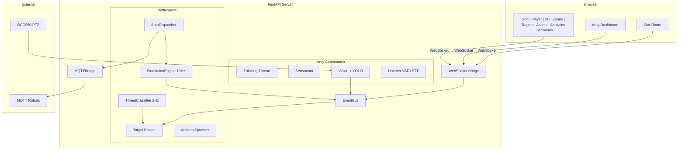

# TRITIUM-SC Development Plan

```
  _____ ___ ___ _____ ___ _   _ __  __     ___  ___
 |_   _| _ \_ _|_   _|_ _| | | |  \/  |   / __|/ __|
   | | |   /| |  | |  | || |_| | |\/| |___\__ \ (__
   |_| |_|_\___| |_| |___|\___/|_|  |_|___|___/\___|
       SECURITY CENTRAL -- BATTLESPACE MANAGEMENT
```

## Vision

TRITIUM-SC (Tritium-Security Central) is a neighborhood-scale Nerf battlefield
management system and real-time strategy game. It interfaces with real and
virtual sensors to provide tactical situational awareness through a trusted
access terminal with AI Commander Amy.

The system tracks real people, real cars, and real events — then layers virtual
combatants, autonomous rovers, turrets, and hostile intruders on the same
tactical map, through the same APIs, the same event bus, the same detection
pipeline. Simulation lives alongside reality.

Inspired by Masanobu Fukuoka's "One-Straw Revolution" — the operator tends the
system like a garden, not a factory. Amy thinks, observes, and acts on her own.
Assets patrol autonomously. The human plants seeds and watches what grows.

---

## Three Layers

```
+---------------------------------------------------------------+
|                  TRUSTED ACCESS TERMINAL                      |
|  Frontend SPA -- 8 views, keyboard/gamepad, cyberpunk UI      |
|  Grid | Player | 3D Map | Zones | Targets | Assets | Amy     |
+---------------------------------------------------------------+
        |               |                |
        v               v                v
+---------------------------------------------------------------+
|                    AI COMMANDER AMY                            |
|  4 cognitive layers: reflex -> instinct -> awareness ->       |
|  deliberation. Continuous inner monologue. Sees, hears,       |
|  speaks, moves cameras, dispatches assets, sets goals.        |
+---------------------------------------------------------------+
        |               |                |
        v               v                v
+---------------------------------------------------------------+
|                      BATTLESPACE                              |
|  Real sensors: BCC950 PTZ, NVR cameras, RTSP, USB mics       |
|  Virtual units: simulated rovers, drones, turrets, hostiles   |
|  Both produce events, detections, tracks on same map          |
+---------------------------------------------------------------+
```

**Real sensors today:**
- Logitech BCC950 PTZ camera + mic + speaker (Amy's body)
- NVR IP cameras via RTSP
- USB microphones (Silero VAD + whisper.cpp GPU STT)

**Virtual units (operational):**
- Simulated rovers with patrol routes
- Automated Nerf turrets (stationary)
- Recon/scout/heavy drones
- Hostile intruders with multi-waypoint paths
- Ambient neighborhood activity (neighbors, cars, dogs, cats, delivery people)

Both real and virtual coexist: same tactical map, same WebSocket events,
same YOLO detection pipeline, same zone alerts.

---

## Scale Progression

```
COMPLETE (Phase 0-3)      PHASE 4 (Active)         FUTURE (Phase 5+)
1 real cam                RTS War Room view         N real cameras
+ Amy consciousness       with Canvas 2D            + real hardware
+ simulation engine       + unit selection           + mesh network
+ threat escalation       + fog of war              + historical replay
+ auto dispatch           + engagement viz           + synthetic cameras
+ MQTT distributed bus    + operator override
+ ambient activity
```

---

## Implementation Phases

### Phase 0: Foundation [COMPLETE]
- [x] FastAPI backend with async SQLite + FTS5
- [x] YOLO v8 detection with ByteTrack tracking
- [x] Video browsing, streaming, channel discovery
- [x] NVR auto-discovery (ONVIF)
- [x] 3D tactical map (Three.js, 30 asset types)
- [x] Zone system: CRUD, polygon editor, 4 zone types
- [x] Zone events: enter/exit, activity, state change, tripwire
- [x] Asset management: CRUD, type taxonomy, status tracking
- [x] WebSocket live event bus
- [x] Keyboard + gamepad navigation (8 views)
- [x] CYBERCORE CSS framework (cyberpunk aesthetic)
- [x] Playwright E2E test suite

### Phase 1: Amy Consciousness [COMPLETE]
- [x] Commander event loop with 4 cognitive layers
- [x] BCC950 sensor node (PTZ + mic + speaker)
- [x] Sensorium: temporal sensor fusion, narrative generation
- [x] Thinking thread: continuous inner monologue via LLM
- [x] Vision thread: YOLO detection, layered perception (L0-L2)
- [x] Listener: Silero VAD + whisper.cpp GPU STT
- [x] Speaker: TTS with BCC950 ALSA output
- [x] Memory system: v3 schema, people, facts, self-model
- [x] Lua action system: motor control, goals, memory, speech
- [x] Chat agent: contextual dialogue with scene awareness
- [x] Goal stack: priority queue, 5min expiry, LLM-driven
- [x] Behavioral scoring: 7 metrics + composite (33 scenarios, 208 runs)
- [x] Scenario framework: JSON scenarios, automated runner, results
- [x] Layered perception: quality gate, complexity, motion detection
- [x] Auto-tracking: complexity-weighted camera movement
- [x] Motion events: reflex snap-to-motion with debounce
- [x] Adversarial resistance: prompt injection defense, safety 100%

### Phase 2: Simulation Engine [COMPLETE]
- [x] SimulationTarget flat dataclass (all entity types share fields)
- [x] SimulationEngine: 10Hz tick loop with EventBus telemetry
- [x] Virtual unit spawning: rovers, turrets, drones, hostiles
- [x] Patrol route system: waypoints, loiter, multi-waypoint paths
- [x] TargetTracker: unified registry of real (YOLO) + virtual (sim) targets
- [x] Hostile spawner: adaptive rate (30-120s), NATO phonetic names, cap at 10
- [x] AmbientSpawner: neutral neighborhood activity (neighbors, cars, dogs, cats)
- [x] TritiumLevelFormat JSON loader (targets + zones + waypoint assignment)
- [x] Battery drain per asset type, lifecycle state machine
- [x] API: spawn, list, remove simulation targets

### Phase 3: Amy Dispatches + Threat Escalation [COMPLETE]
- [x] Amy awareness of virtual units (sensorium battlespace summary)
- [x] Lua actions: dispatch(target_id, x, y), alert(), patrol()
- [x] ThreatClassifier: 2Hz zone-based threat ladder (none/unknown/suspicious/hostile)
- [x] AutoDispatcher: nearest-available friendly dispatch on escalation
- [x] De-escalation: step-down after 30s outside zones
- [x] Zone violation events + escalation events on EventBus
- [x] MQTT bridge: distributed device communication
- [x] MQTT-connected robots publish telemetry, receive dispatch commands
- [x] Robot template: `examples/robot-template/` reference implementation
- [x] Amy speech announcements on dispatch events
- [x] TelemetryBatcher: 100ms batching for WebSocket efficiency

### Phase 4: War Room RTS Frontend [IN PROGRESS]
- [x] War Room view: full-screen Canvas 2D tactical map (keyboard: W)
- [x] Three modes: OBSERVE (read-only), TACTICAL (select + dispatch), SETUP (place/remove)
- [x] Target rendering: alliance colors (green/red/yellow), heading indicators
- [x] Camera pan/zoom with smooth interpolation
- [x] Box select and individual target selection
- [x] Dispatch via click-to-move in TACTICAL mode
- [x] HUD panels: mode indicator, Amy speech toast, alert log, unit info
- [x] WebSocket integration: live target updates from sim_telemetry_batch
- [ ] Fog of war: areas outside sensor coverage dimmed
- [ ] Engagement visualization: firing arcs, hit indicators
- [ ] Minimap with alert markers
- [ ] Operator can suggest, Amy can override (One-Straw philosophy)

### Phase 5: Hardware Integration [FUTURE]
- [ ] N real cameras on mesh network
- [ ] Real Nerf turret servo control (pan/tilt/fire)
- [ ] Real rover with motor control + onboard camera (reference: `examples/robot-template/`)
- [ ] Drone integration (MAVLink or similar)
- [ ] Mesh radio for field communication
- [ ] Battery and health monitoring for real assets

### Phase 6: Advanced Features [FUTURE]
- [ ] Virtual sensor nodes (simulated cameras with FOV)
- [ ] Synthetic MJPEG feeds from simulated cameras
- [ ] Historical replay: load past sessions and replay on tactical map
- [ ] Collision detection with zone boundaries
- [ ] Behavioral memory in ThreatClassifier (suspicion score, hysteresis)
- [ ] Pursuit intercept: dispatcher tracks moving targets, not static positions
- [ ] Force reserve: keep fraction of units uncommitted
- [ ] Unit type awareness in dispatch (rovers for interdiction, drones for recon)

---

## Technical Architecture

See [docs/ARCHITECTURE.md](ARCHITECTURE.md) for detailed diagrams (mermaid).



### Component Summary

```
Commander (event loop)
  |-- EventBus (thread-safe pub/sub for all internal events)
  |-- VisionThread (YOLO + layered perception L0-L2)
  |-- ThinkingThread (inner monologue, goal-setting)
  |-- ListenerThread (Silero VAD + whisper.cpp GPU STT)
  |-- Speaker (Piper TTS + BCC950 ALSA)
  |-- Motor (PTZ auto-track, complexity-weighted)
  |-- Sensorium (sensor fusion, narrative, battlespace)
  |-- Memory (v3: people, facts, self-model)
  |-- LuaMotor (action execution)
  |-- Agent (chat, tool use)
  |-- Perception (frame analysis: quality, complexity, motion)
  |-- TargetTracker (unified real+virtual registry)

Battlespace
  |-- SimulationEngine (10Hz tick, target registry)
  |-- AmbientSpawner (neutral neighborhood activity)
  |-- ThreatClassifier (2Hz zone-based escalation ladder)
  |-- AutoDispatcher (nearest-unit dispatch on escalation)
  |-- MQTTBridge (distributed device communication)

Frontend (10 views)
  |-- Grid: multi-camera mosaic
  |-- Player: single-camera playback
  |-- 3D Map: Three.js tactical view (30 asset types)
  |-- Zones: polygon editor + event timeline
  |-- Targets: detection gallery
  |-- Assets: autonomous unit management
  |-- Analytics: event statistics
  |-- Amy: consciousness dashboard (thoughts, video, chat)
  |-- War Room: full-screen Canvas 2D RTS map
  |-- Scenarios: behavioral test runner dashboard

Backend (FastAPI)
  |-- /api/cameras, /api/videos, /api/zones, /api/assets
  |-- /api/amy/* (status, thoughts SSE, chat, commands, video)
  |-- /api/amy/simulation/* (targets, spawn, remove)
  |-- /api/targets/* (unified tracker, hostiles, friendlies)
  |-- /api/ai/analyze (YOLO pipeline)
  |-- /ws/live (WebSocket event bus + TelemetryBatcher)
  |-- SQLite + FTS5 (events, zones, assets, targets)
```

---

## Design Principles

1. **Real and virtual are peers.** A simulated rover and a real camera produce
   events through the same pipeline. Amy does not distinguish.

2. **Amy is autonomous.** She observes, thinks, and acts on her own schedule.
   The operator provides guidance, not commands.

3. **One-Straw philosophy.** Tend the garden. Set conditions for emergence.
   Do not micromanage every patrol route and firing solution.

4. **Cyberpunk aesthetic.** Neon on dark. ASCII art. Glitch effects. The
   terminal is a window into a world that feels alive.

5. **No frameworks.** Vanilla JavaScript, raw WebSocket, hand-rolled CSS.
   The system is transparent down to every pixel and packet.
