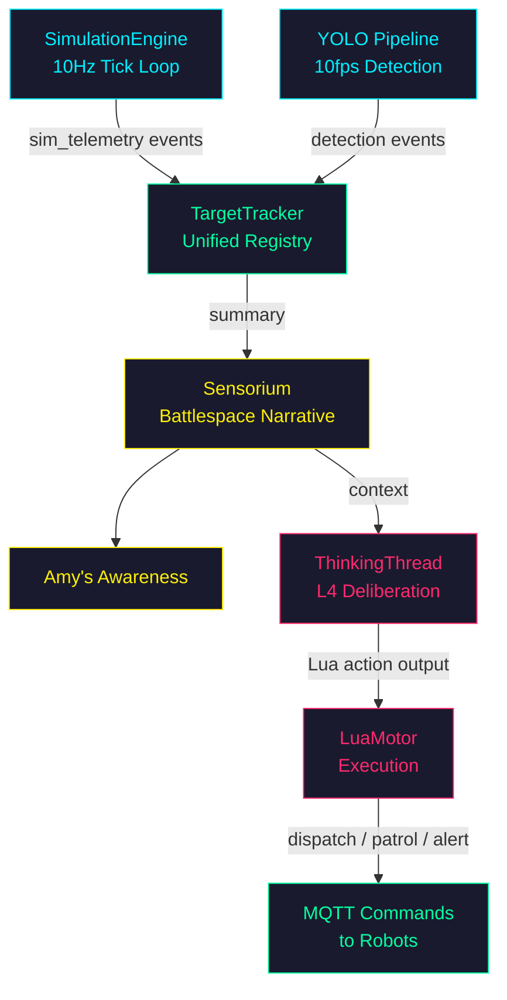

# Simulation Architecture

Full pipeline from simulation engine through robot thinking to Amy's
situational awareness. Covers the data flow, coordinate system, MQTT
topics, and how to extend the system with new simulated robot types.

## Pipeline Overview

```
SimulationEngine (10Hz)                     YOLO Pipeline (10fps)
      |                                           |
      | sim_telemetry events                      | detection events
      v                                           v
 TargetTracker  <--- unified registry --->  TargetTracker
      |                                           |
      | summary()                                 |
      v                                           v
   Sensorium  ----  battlespace narrative  --->  ThinkingThread
      |                                           |
      |                                    Lua action output
      v                                           |
 Amy's awareness                            LuaMotor execution
                                                  |
                                           dispatch / patrol / alert
                                                  |
                                           MQTT commands to robots
```



### Data Flow: Simulation to Amy

1. **SimulationEngine** ticks at 10Hz, updating all SimulationTarget positions
   (patrol routes, hostile waypoints, ambient movement, combat projectiles).

2. **EventBus** receives `sim_telemetry` events containing the full target list
   with positions, headings, health, battery, alliance, and combat state.

3. **TargetTracker** (`src/amy/tactical/target_tracker.py`) ingests telemetry via
   `update_from_simulation()`. Each target becomes a TrackedTarget in the
   unified registry alongside real YOLO detections.

4. **Sensorium** calls `tracker.summary()` to build the battlespace narrative.
   This feeds into Amy's thinking prompt as situational context.

5. **ThinkingThread** reasons about the battlespace and emits Lua actions
   (dispatch, patrol, alert, escalate, battle_cry).

6. **LuaMotor** executes actions. Dispatch commands propagate to the
   SimulationEngine (for virtual units) or MQTTBridge (for real robots).

### Data Flow: MQTT Robot to Amy

1. **Robot** publishes telemetry to `tritium/{site}/robots/{id}/telemetry`.
2. **MQTTBridge** receives the message and calls `tracker.update_from_simulation()`.
3. From this point, the MQTT robot is indistinguishable from a simulation target
   in Amy's awareness. Same tracker, same sensorium, same thinking context.

### Data Flow: Robot Thinking

1. **RobotThinker** builds context from local telemetry, nearby targets
   (via VisionBridge), and recent commands from Amy.
2. **Ollama** generates a Lua function call (using the same format as Amy).
3. **Thinker** parses the response, dispatches to local hardware handlers.
4. **Thoughts** are published via MQTT to `tritium/{site}/robots/{id}/thoughts`
   so Amy can see what the robot is thinking and factor it into her reasoning.

## YOLO Fast-Path / LLM Slow-Path

The system uses a dual-speed processing pipeline:

| Layer | Speed | Purpose | Implementation |
|-------|-------|---------|----------------|
| **YOLO fast-path** | 10 fps | Reactive detection: bounding boxes, tracking IDs, position | `src/app/ai/detector.py`, `src/amy/brain/perception.py` |
| **LLM slow-path** | ~5s cycles | Strategic reasoning: threat assessment, dispatch decisions, dialogue | `src/amy/brain/thinking.py`, `src/amy/inference/robot_thinker.py` |

**VisionBridge** (`examples/robot-template/brain/vision_bridge.py`) bridges
the two speeds on the robot side:

```
Camera (YOLO @ 10fps)  --->  VisionBridge (accumulate)  --->  Thinker (LLM @ 0.2Hz)
   push_detections()            thread-safe buffer          get_nearby_targets()
```

The bridge:
- Accumulates YOLO detections with timestamps
- Prunes detections older than 5 seconds
- Deduplicates by label (keeps most recent per class)
- Converts image-space coordinates to approximate world coordinates
- Presents targets in the format the thinker expects

This ensures the LLM always has fresh detection context without being
overwhelmed by the raw detection stream.

## Coordinate System

```
                    North (+Y)
                       ^
                       |
        (-X) West <----+----> East (+X)
                       |
                       v
                    South (-Y)

    Origin: map center (from layout config or geocoding)
    Units: 1 unit = 1 meter
    Heading: 0 = North, 90 = East, 180 = South, 270 = West (clockwise)
```

### Coordinate Transforms

| Source | Target | Function | Location |
|--------|--------|----------|----------|
| GPS (WGS84) | Game meters | `gps_to_world()` | `examples/robot-template/brain/nav_planner.py` |
| Game meters | GPS (WGS84) | `world_to_gps()` | `examples/robot-template/brain/nav_planner.py` |
| Lat/Lng | Game coords | `latlngToGame()` | `frontend/js/geo.js` |
| Game coords | Lat/Lng | `gameToLatlng()` | `frontend/js/geo.js` |

The projection is equirectangular, accurate to <1m error at neighborhood
scale (<1km). Python and JavaScript implementations use identical math.

### Real Robot GPS Integration

For robots with GPS receivers, the nav_planner provides the full pipeline:

```python
from brain.nav_planner import gps_to_world, GpsPosition

gps = GpsPosition(lat=37.7749, lng=-122.4194)
world = gps_to_world(gps, origin_lat=37.7750, origin_lng=-122.4190)
# world.x and world.y are meters from map center
```

The layout config provides `origin_lat` and `origin_lng` for each site.

## MQTT Topic Hierarchy for Robot Fleet

See [MQTT.md](MQTT.md) for the full topic reference. Robot-specific topics:

### Inbound (robot -> server)

| Topic | Payload | Rate | Purpose |
|-------|---------|------|---------|
| `tritium/{site}/robots/{id}/telemetry` | Extended telemetry JSON | 2 Hz | Position, battery, IMU, motor temps |
| `tritium/{site}/robots/{id}/status` | `{"status": "online"}` | On change | LWT + explicit state |
| `tritium/{site}/robots/{id}/command/ack` | ACK JSON | On command | Command acknowledgment |
| `tritium/{site}/robots/{id}/thoughts` | Thought JSON | ~0.2 Hz | Robot's LLM-generated thoughts |

### Outbound (server -> robot)

| Topic | Payload | Purpose |
|-------|---------|---------|
| `tritium/{site}/robots/{id}/command` | Command JSON | dispatch, patrol, recall, stop |

### Extended Telemetry Message

```json
{
  "name": "Rover Alpha",
  "asset_type": "rover",
  "position": {"x": 3.5, "y": -2.1},
  "heading": 127.4,
  "speed": 1.2,
  "battery": 0.85,
  "battery_state": {
    "charge_pct": 0.85,
    "voltage": 12.30,
    "current_draw": 1.8,
    "temperature_c": 28.5
  },
  "imu": {
    "roll": 0.5,
    "pitch": -1.2,
    "yaw": 127.4,
    "accel_x": 0.1,
    "accel_y": 2.8,
    "accel_z": 9.81
  },
  "motor_temps": {"left": 32.1, "right": 31.8},
  "odometry": 452.3,
  "gps": {"lat": 37.7749, "lng": -122.4194, "alt": 15.0},
  "status": "patrolling",
  "turret": {"pan": 45.0, "tilt": -10.0},
  "timestamp": "2026-02-20T12:00:00+00:00"
}
```

### Robot Thought Message

```json
{
  "robot_id": "rover-alpha",
  "type": "thought",
  "text": "Hostile detected at north fence. Moving to intercept.",
  "think_count": 42,
  "timestamp": 1740009600.0
}
```

## Adding a New Simulated Robot Type

### Step 1: Define the hardware backend

Create a new file in `examples/robot-template/hardware/` implementing
`HardwareInterface` from `hardware/base.py`.

Required methods:
- `initialize()`, `shutdown()`
- `set_motors(left, right)` — differential drive
- `get_position()`, `get_heading()`, `get_speed()`, `get_battery()`
- `set_turret(pan, tilt)`, `fire_trigger()`

Optional extended telemetry:
- `get_battery_state()` — voltage, current, temperature
- `get_imu()` — roll, pitch, yaw, acceleration
- `get_odometry()` — total distance traveled
- `get_motor_temps()` — left/right motor temperatures
- `get_gps()` — lat/lng/alt (None for simulation)
- `get_elevation()` — meters above sea level

### Step 2: Register custom actions

In the thinker config, register robot-specific actions:

```yaml
thinker:
  enabled: true
  model: "gemma3:4b"
  actions:
    - name: fire_nerf
      description: "Fire the nerf turret at current target"
    - name: set_led
      description: "Set LED strip color"
      param_types: ["str"]
      min_params: 1
      max_params: 1
    - name: deploy_caltrops
      description: "Drop nerf caltrops behind the rover"
```

Actions are automatically included in the robot's thinking prompt and
validated before dispatch.

### Step 3: Register action handlers

```python
thinker = RobotThinker(config)
thinker.on_action("fire_nerf", lambda params: hardware.fire_trigger())
thinker.on_action("set_led", lambda params: hardware.set_led(params[0]))
```

### Step 4: Add to TRITIUM-SC layout

In the TritiumLevelFormat JSON layout file:

```json
{
  "robots": [
    {
      "id": "rover-gamma",
      "name": "Gamma",
      "type": "rover",
      "position": [5.0, -3.0],
      "heading": 90,
      "patrol_route": "north_patrol",
      "weapon_range": 10.0,
      "weapon_damage": 15
    }
  ]
}
```

The SimulationEngine will spawn this as a SimulationTarget. If a real robot
with this ID connects via MQTT, its telemetry overrides the simulated position.

## Testing Strategy

### Unit Tests (no hardware, no Ollama)

| Test Target | File | What It Tests |
|-------------|------|---------------|
| ModelRouter | `tests/amy/test_model_router.py` | Task classification, model selection, fallback chains |
| LuaRegistry | `tests/amy/test_lua_registry.py` | Registration, validation, prompt generation, source filtering |
| RobotThinker | `tests/amy/test_robot_thinker.py` | Context building, think cycle with mocked Ollama, MQTT messages |
| Multi-action Lua | `tests/amy/test_multi_action_lua.py` | Compound parsing, sequence validation, code blocks |
| VisionBridge | `tests/amy/test_vision_bridge.py` (if exists) | Detection accumulation, pruning, target conversion |
| NavPlanner | Robot template tests | GPS/game transforms, path planning, waypoint following |
| SimulatedHardware | Robot template tests | Physics loop, battery curve, motor temps, IMU |

### Synthetic Imagery Testing

The existing synthetic video pipeline (`src/amy/synthetic/video_gen.py`) generates
procedural OpenCV scenes for testing without real cameras:

- `bird_eye` — overhead tactical view
- `street_cam` — street-level security camera
- `battle` — combat scene with projectiles
- `neighborhood` — suburban ambient activity

These are validated by:
- 49 OpenCV pixel tests (`tests/amy/test_video_opencv.py`)
- 15 performance benchmarks (`tests/amy/test_video_perf.py`)
- 5 LLaVA structured validation tests (`tests/amy/test_video_llava.py`)

### Integration Tests

The three-layer visual E2E tests (`tests/visual/`) validate the full pipeline:
1. **OpenCV** — pixel-level assertions (colors, shapes, positions)
2. **LLM** — structured vision analysis via Ollama fleet
3. **API** — server state cross-validation

All three layers must agree (AND logic, not OR).

### Mocked Ollama for Unit Tests

Robot thinker tests mock the Ollama HTTP API:

```python
def mock_ollama_response(text):
    return {"message": {"content": text}}

with patch("requests.post") as mock_post:
    mock_post.return_value.json.return_value = mock_ollama_response('think("patrol north")')
    result = thinker.think_once(telemetry={"position": {"x": 0, "y": 0}})
    assert result["action"] == "think"
```

## Isaac Lab Future Integration

Isaac Lab provides high-fidelity physics simulation for bridging the
sim-to-real gap. The planned integration:

```
TRITIUM-SC                          Isaac Lab
SimulationEngine (10Hz)             Physics Engine (1kHz)
   |                                    |
   | MQTT: dispatch/patrol              | MQTT: telemetry
   |------>                             |<------
   |       Rover in Isaac Lab           |
   |       - motor dynamics             |
   |       - terrain interaction        |
   |       - sensor noise models        |
   |       - camera rendering           |
   |<------                             |------>
   | MQTT: telemetry                    | MQTT: commands
   |                                    |
TargetTracker                       USD scene
   |                                    |
Amy's awareness                     Synthetic camera frames
```

### Key Integration Points

1. **MQTT as the interface** — Isaac Lab robots publish the same telemetry
   format as real robots. TRITIUM-SC treats them identically.

2. **Synthetic camera frames** — Isaac Lab can render realistic camera views
   and publish them as JPEG frames via MQTT. These feed into the YOLO
   detection pipeline for testing detection accuracy.

3. **Domain randomization** — Isaac Lab supports randomizing textures,
   lighting, and object placement. Use this to generate diverse training
   data for YOLO fine-tuning.

4. **Coordinate alignment** — Isaac Lab uses meters with configurable origin.
   Match the TRITIUM-SC layout origin for direct coordinate compatibility.

### What Isaac Lab Does NOT Replace

- TRITIUM-SC's SimulationEngine remains the tactical layer (target tracking,
  threat escalation, game mode, combat system)
- Isaac Lab is the physics layer only (motor control, collision, sensors)
- Both coexist: SimulationEngine for fast tactical iteration, Isaac Lab
  for high-fidelity hardware validation
