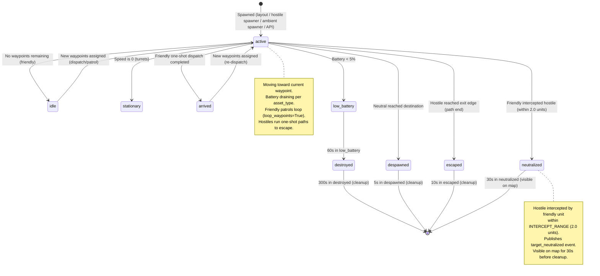
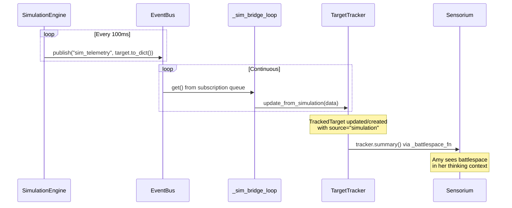

# Simulation Engine

The simulation engine drives virtual targets across the tactical map at 10 Hz. It spawns hostile intruders, friendly units (rovers, drones, turrets), and ambient neighborhood activity (neighbors, cars, dogs, cats, delivery people). All simulated targets flow through the same TargetTracker and EventBus as real YOLO detections.

Source: `amy/simulation/` package

## Target Lifecycle



### Status Values

| Status | Meaning | Next |
|--------|---------|------|
| `active` | Moving toward waypoints | `idle`, `arrived`, `escaped`, `neutralized`, `despawned`, `low_battery` |
| `idle` | Friendly with no waypoints | `active` (on dispatch) |
| `stationary` | Turret (speed=0) | Permanent |
| `arrived` | Friendly completed one-shot dispatch | `active` (on re-dispatch) |
| `escaped` | Hostile reached its exit edge | Removed after 10s |
| `neutralized` | Hostile intercepted by a friendly unit | Removed after 30s |
| `despawned` | Neutral reached destination | Removed after 5s |
| `low_battery` | Battery < 5% | `destroyed` after 60s |
| `destroyed` | Unit is dead | Removed after 300s |

### Waypoint Modes

| `loop_waypoints` | Behavior | Used by |
|-------------------|----------|---------|
| `True` | Loops back to waypoint 0 at path end | Friendly patrol routes (layout loader, `patrol()` Lua action) |
| `False` (default) | One-shot path, terminal status at end | Hostile paths, friendly dispatches, neutral paths |

## Architecture

```mermaid
graph TB
    subgraph "SimulationEngine"
        TICK[Tick Loop 10Hz]
        HS[Hostile Spawner]
        AS[Ambient Spawner]
        TARGETS[(Target Registry)]
    end

    subgraph "Data Sources"
        LAYOUT[TritiumLevelFormat JSON]
        API[REST API /api/amy/simulation/spawn]
        LUA[Lua dispatch/patrol actions]
    end

    subgraph "Consumers"
        BUS[EventBus]
        BRIDGE[Commander._sim_bridge_loop]
        TT[TargetTracker]
        TC[ThreatClassifier]
        WS[WebSocket -> Frontend]
    end

    LAYOUT -->|load_layout()| TARGETS
    API -->|spawn_hostile()| TARGETS
    LUA -->|set waypoints| TARGETS

    TICK -->|target.tick(0.1)| TARGETS
    TICK -->|publish sim_telemetry| BUS
    HS -->|spawn_hostile() every 30-120s| TARGETS
    AS -->|spawn random neutral every 15-45s| TARGETS

    BUS -->|subscribe| BRIDGE
    BRIDGE -->|update_from_simulation()| TT
    TT -->|get_all() at 2Hz| TC
    BUS -->|TelemetryBatcher| WS
```

## Tick Loop

The tick loop runs in a dedicated thread (`sim-tick`) at 10 Hz:

```python
while self._running:
    time.sleep(0.1)
    for target in targets:
        target.tick(0.1)                              # Advance position
        self._event_bus.publish("sim_telemetry", target.to_dict())  # Broadcast

    self._check_interceptions(targets)  # Friendly near hostile -> neutralize
    # Cleanup: remove dead/despawned/escaped/neutralized targets after cooldown
```

### Per-Tick Processing (`target.tick(dt)`)

1. **Battery drain** -- subtract `_DRAIN_RATES[asset_type] * dt`
2. **Low battery check** -- if battery < 5%, set `low_battery` and stop
3. **Waypoint navigation** -- calculate distance to current waypoint
4. **Arrival check** -- if within 1.0 unit, advance to next waypoint or finish
5. **Heading update** -- `atan2(dx, dy)` converted to degrees (0 = north)
6. **Position update** -- move `min(speed * dt, distance)` toward waypoint

### Battery Drain Rates

| Asset Type | Drain per Second | Time to Deplete |
|------------|-----------------|-----------------|
| `rover` | 0.001 | ~17 minutes |
| `drone` | 0.002 | ~8 minutes |
| `turret` | 0.0005 | ~33 minutes |
| `person` | 0.0 | Never |
| `vehicle` | 0.0 | Never |
| `animal` | 0.0 | Never |

## Spawner Types

### Hostile Spawner

Runs in `sim-spawner` thread. Adaptive spawn rate based on current hostile count.

| Hostile Count | Spawn Interval |
|---------------|---------------|
| 0 -- 5 | 30 -- 60s |
| 6 -- 9 | 60 -- 120s |
| 10 (MAX_HOSTILES) | Paused (check every 10s) |

**Hostile path generation:**
1. Spawn at random map edge
2. Approach point (halfway to center + jitter)
3. Objective (random point near center)
4. Loiter point (near objective + jitter)
5. Escape to random edge

Speed: 1.5 units/second. Alliance: `hostile`. Asset type: `person`.

Hostile paths are **one-shot** (not looping). A hostile that completes its path transitions to `escaped` and is removed after 10s. Only `active` hostiles count toward MAX_HOSTILES -- neutralized and escaped hostiles free up spawn slots.

Names drawn from NATO phonetic alphabet pool (`Intruder Alpha` through `Intruder Hotel`) with suffix dedup.

### Interception Mechanic

Each tick, the engine checks all (active friendly, active hostile) pairs. When a friendly unit is within `INTERCEPT_RANGE` (2.0 map units) of a hostile, the hostile is set to `neutralized` and a `target_neutralized` event is published on the EventBus with:
- `hostile_id`, `hostile_name` -- the neutralized hostile
- `interceptor_id`, `interceptor_name` -- the friendly that intercepted
- `position` -- where the interception occurred

Neutralized targets stop moving and remain visible on the map for 30s before cleanup. The dispatched friendly becomes `arrived` (if it was a one-shot dispatch) or continues patrolling (if `loop_waypoints=True`).

This completes the core game loop: **spawn -> detect -> classify -> dispatch -> intercept -> neutralize -> repeat**.

### Ambient Spawner

Runs in `ambient-spawner` thread. Creates neutral neighborhood activity for realism and to test Amy's threat discrimination.

**Spawn interval:** 15 -- 45 seconds. **Cap:** 8 simultaneous neutrals (`MAX_NEUTRALS`).

**Spawn probabilities:**

| Type | Probability | Speed | Path Style |
|------|------------|-------|------------|
| Neighbor (person) | 35% | 1.2 | Sidewalk (edge to edge with midpoint jitter) |
| Car (vehicle) | 20% | 8.0 | Road (straight edge to edge) |
| Dog (animal) | 15% | 2.0 | Yard wander (3-5 random points near a yard center) |
| Cat (animal) | 10% | 1.5 | Yard wander |
| Delivery person | 20% | 1.0 | Delivery (edge -> door -> pause -> return to edge) |

All neutrals auto-despawn when they reach their final waypoint.

**Design note:** The AmbientSpawner is deliberately separate from the hostile spawner. They have different timing models, target profiles, and lifecycle rules. Merging them would couple narrative pacing (ambient) to tactical pressure (hostile) for no benefit.

### Layout Loader

`load_layout()` reads a TritiumLevelFormat JSON file and populates the engine with targets.

**Recognized target types:**

| Layout Type | Alliance | Asset Type | Speed |
|-------------|----------|------------|-------|
| `patrol_rover` | friendly | rover | 2.0 |
| `interceptor_bot` | friendly | rover | 3.5 |
| `sentry_turret` | friendly | turret | 0.0 |
| `recon_drone` | friendly | drone | 5.0 |
| `heavy_drone` | friendly | drone | 2.5 |
| `scout_drone` | friendly | drone | 4.0 |
| `*robot*`, `*rover*` | friendly | rover | 2.0 |
| `*drone*` | friendly | drone | 4.0 |
| `*turret*` | friendly | turret | 0.0 |
| `*person*`, `*intruder*` | hostile | person | 1.5 |

**Skipped types:** cameras, structures, terrain, sensors, buildings (see `_SKIP_TYPES` in `loader.py`).

**Waypoint assignment:** Standalone `patrol_waypoint` and `observation_point` objects are assigned to the nearest created target in a second pass.

**Zone extraction:** `load_zones()` extracts `activity_zone`, `entry_exit_zone`, `tripwire`, and `restricted_area` objects for the ThreatClassifier.

## Target Dataclass

`SimulationTarget` is a flat dataclass -- all entity types share the same fields. Type-specific behavior is encoded in lookup tables (`_DRAIN_RATES`) and the `tick()` state machine, not in subclasses.

```python
@dataclass
class SimulationTarget:
    target_id: str                           # UUID
    name: str                                # Display name
    alliance: str                            # "friendly", "hostile", "neutral", "unknown"
    asset_type: str                          # "rover", "drone", "turret", "person", "vehicle", "animal"
    position: tuple[float, float]            # (x, y) map coordinates
    heading: float = 0.0                     # Degrees, 0 = north (+y), clockwise
    speed: float = 1.0                       # Units/second
    battery: float = 1.0                     # 0.0 - 1.0
    waypoints: list[tuple[float, float]]     # Navigation path
    _waypoint_index: int = 0                 # Current waypoint
    status: str = "active"                   # Lifecycle state
```

### Design decisions

**Why flat, not subclassed?** A turret is speed=0 with drain 0.0005/s. A person has drain=0. A drone is just higher speed and faster drain. All targets flow through the same tick loop, EventBus serialisation, TargetTracker pipeline, and API. Polymorphism would add dispatch overhead with no behavioural gain. The loader and spawners create targets from data; a component/subclass system would require a factory registry for the same outcome.

**Why waypoints on the target, not a separate navigation service?** Navigation is per-entity state (current waypoint index, loop-vs-one-shot semantics). A separate pathfinding service would be warranted only if targets needed collision avoidance or A* routing. For waypoint-following, inline state is simpler.

**Why no sensor_range?** Detection is handled by the vision pipeline (YOLO) and zone-based threat classification, not by simulated sensor radii. Adding sensor_range would require a spatial query system with no current consumer.

### Serialization (`to_dict()`)

```json
{
    "target_id": "uuid-string",
    "name": "Rover Alpha",
    "alliance": "friendly",
    "asset_type": "rover",
    "position": {"x": 5.2, "y": -3.1},
    "heading": 127.4,
    "speed": 2.0,
    "battery": 0.85,
    "status": "active",
    "waypoints": [{"x": 10.0, "y": 0.0}, {"x": 0.0, "y": -10.0}]
}
```

Note: `threat_level` is NOT serialized on the target. It is computed externally by the ThreatClassifier from zone membership and dwell time (see [ESCALATION.md](ESCALATION.md)).

## Interaction with TargetTracker

The Commander's `_sim_bridge_loop` thread subscribes to the EventBus and forwards simulation telemetry to the TargetTracker:



The bridge also forwards YOLO detections to the tracker for real-world targets.

**Stale target pruning:** The TargetTracker prunes targets that stop receiving updates. YOLO detections are pruned after 30s (`STALE_TIMEOUT`). Simulation targets are pruned after 10s (`SIM_STALE_TIMEOUT`) -- this handles the case where the engine removes a target (cleanup) but the tracker still has a ghost entry. Under normal operation, the 10Hz tick loop keeps sim targets fresh.

## Map Coordinate System

- Map bounds: -30.0 to 30.0 on both axes (60 x 60 units)
- **Scale: 1 unit = 1 meter.** The map represents a 60m x 60m area -- roughly one residential block.
- Origin (0, 0) is map center (Amy's property / the defended position)
- Positive Y is north, positive X is east
- Heading: 0 = north, clockwise in degrees
- Edge spawns use the four boundaries (north=y30, south=y-30, east=x30, west=x-30)

### Scale Validation

At 1 unit = 1 meter:

| Entity | Speed (units/s) | Real equivalent | Cross-map time |
|--------|-----------------|-----------------|----------------|
| Person walking | 1.2 | 1.2 m/s = 4.3 km/h | 50s |
| Hostile intruder | 1.5 | 1.5 m/s = 5.4 km/h (fast walk) | 40s |
| Dog | 2.0 | 2.0 m/s = 7.2 km/h (trot) | 30s |
| Rover | 2.0 | 2.0 m/s = 7.2 km/h | 30s |
| Interceptor bot | 3.5 | 3.5 m/s = 12.6 km/h (jog pace) | 17s |
| Drone | 4.0-5.0 | 4-5 m/s = 14-18 km/h | 12-15s |
| Car | 8.0 | 8.0 m/s = 29 km/h (residential speed) | 7.5s |

These are realistic for a residential block. A person crossing one block in 50 seconds, a car at residential speed limit -- this feels right.

### Neighborhood Street Grid

The default neighborhood has two north-south streets (x = -10, x = +10) and two east-west streets (y = -10, y = +10). This divides the map into:

```
     -30        -10         0        +10        +30
+30   +---------+-----------+---------+---------+
      |         | NW yard   | property| NE yard |
+10   |  edge   +-----------+---------+---------+  <- EW street
      |         |    Amy's property   |         |
-10   |  zone   +-----------+---------+---------+  <- EW street
      |         | SW yard   |         | SE yard |
-30   +---------+-----------+---------+---------+
                ^                     ^
             NS street             NS street
```

- **Center (0,0):** Amy's property -- the defended position
- **Inner quadrants (-10 to +10):** Yards, front porch, back porch, driveway
- **Outer ring (-30 to -10, +10 to +30):** Edge zone where targets spawn/despawn
- **Streets:** Ambient targets follow these corridors instead of cutting through yards

Paths generated by the AmbientSpawner snap to the street grid, producing L-shaped walking patterns (walk along one street, turn at an intersection, continue on the perpendicular street). This makes movement look like real neighborhood foot traffic rather than random diagonal lines.

### Time-of-Day Activity

Spawn rates scale with time of day to create a realistic activity cycle:

| Time | Ambient Rate | Hostile Rate | Feel |
|------|-------------|-------------|------|
| 8am - 8pm | 1.0x (full) | 0.3x (rare) | Busy neighborhood, occasional scouting |
| 6-8am, 8-10pm | 0.6x | 0.3x | Quiet hours, commuters |
| 10pm - 2am | 0.3x | 0.8x | Late evening, hostiles more active |
| 2am - 6am | 0.1x (near zero) | 1.0x (full) | Dead of night, peak threat window |

This means Amy's tactical situation shifts naturally: daytime is about people-watching and discrimination (is that person a neighbor or a threat?), while nighttime is about detecting genuine intrusions with fewer false positives.

## API Endpoints

| Method | Path | Description |
|--------|------|-------------|
| GET | `/api/amy/simulation/targets` | List all simulation targets |
| POST | `/api/amy/simulation/spawn` | Spawn a hostile target |
| DELETE | `/api/amy/simulation/targets/{id}` | Remove a target |
| GET | `/api/targets` | All tracked targets (unified registry) |
| GET | `/api/targets/hostiles` | Hostile targets only |
| GET | `/api/targets/friendlies` | Friendly targets only |

## Configuration

| Setting | Default | Description |
|---------|---------|-------------|
| `simulation_enabled` | `true` | Enable/disable simulation engine |
| `simulation_layout` | `""` | Path to TritiumLevelFormat JSON file |

## Test Coverage

Tests in `tests/amy/`:
- `test_simulation_target.py` -- Target tick, waypoint navigation, battery drain, status transitions
- `test_simulation_engine.py` -- Engine lifecycle, hostile spawning, cleanup
- `test_simulation_loader.py` -- Layout loading, type mapping, waypoint assignment, zone extraction
- `test_ambient_spawner.py` -- Neutral spawn types, name dedup, paths, cap enforcement
- `test_target_tracker.py` -- Unified registry, simulation + YOLO updates, pruning, summary

## Scaling Considerations

A real neighborhood deployment: 30+ cameras, 10 robots, 100+ people/hour, 20+ zones.

| Subsystem | Complexity | At 200 targets | Bottleneck |
|-----------|-----------|----------------|------------|
| Tick loop | O(N) at 10 Hz | ~1ms per tick | EventBus publish volume |
| TargetTracker matching | O(N*M) per YOLO frame | 1000 distance checks | Negligible |
| ThreatClassifier | O(N*Z) at 2 Hz | 4000 distance checks | Negligible |
| EventBus fan-out | O(N*S) per tick | S subscribers * 200 events | First real bottleneck |

**Mitigation**: If EventBus becomes saturated, switch to batched telemetry (one event with all targets per tick instead of one per target). This reduces publish volume by 100-200x.

## TritiumLevelFormat Specification

Layout files define the static starting state of a neighborhood. The loader (`amy/simulation/loader.py`) reads these at boot and populates the simulation engine.

### File Structure

```json
{
  "format": "TritiumLevelFormat",
  "version": 1,
  "meta": {
    "name": "Cul-de-Sac Neighborhood",
    "description": "One residential block with street grid",
    "scale": "1 unit = 1 meter",
    "map_bounds": [-30, 30]
  },
  "objects": [
    {
      "type": "patrol_rover",
      "name": "Rover Alpha",
      "position": {"x": -10.0, "y": 0.0, "z": 10.0},
      "properties": {
        "name": "Rover Alpha",
        "patrol_waypoints": [
          {"x": -10.0, "z": 10.0},
          {"x": 10.0, "z": 10.0}
        ]
      }
    }
  ]
}
```

### Coordinate Convention

Objects use 3D coordinates: `x` = east-west, `y` = height (ignored by sim), `z` = north-south. The loader extracts `(x, z)` as the 2D map position.

### Object Types

**Spawned as simulation targets:**

| Type | Alliance | Asset | Speed | Notes |
|------|----------|-------|-------|-------|
| `patrol_rover` | friendly | rover | 2.0 | Standard patrol unit |
| `interceptor_bot` | friendly | rover | 3.5 | Fast response unit |
| `sentry_turret` | friendly | turret | 0.0 | Fixed position |
| `recon_drone` | friendly | drone | 5.0 | Fast, fragile |
| `heavy_drone` | friendly | drone | 2.5 | Slow, long endurance |
| `scout_drone` | friendly | drone | 4.0 | Balanced |
| `*robot*`, `*rover*` | friendly | rover | 2.0 | Keyword match |
| `*drone*` | friendly | drone | 4.0 | Keyword match |
| `*turret*` | friendly | turret | 0.0 | Keyword match |
| `*person*`, `*intruder*` | hostile | person | 1.5 | Keyword match |

**Collected for zones (not spawned as targets):**
`activity_zone`, `entry_exit_zone`, `tripwire`, `restricted_area`

**Collected for waypoint assignment:**
`patrol_waypoint`, `observation_point` -- assigned to nearest target in second pass

**Silently skipped (infrastructure):**
cameras, structures, walls, floors, lights, sensors, speakers, buildings, roads, fences, gates, driveways, paths, sidewalks, curbs, sheds, garages

### Sample Layout

See `scenarios/neighborhood_default.json` for a complete example with:
- 1 patrol rover (perimeter route along streets)
- 2 sentry turrets (north and south coverage)
- 1 scout drone (wide aerial patrol)
- 1 interceptor bot (idle, waiting for dispatch)
- 3 security cameras (skipped by loader)
- 3 zones (front yard, back porch restricted, driveway entry/exit)
- 2 standalone waypoints (assigned to nearest target)

### Future: What the Format Should Grow Into

The current format defines *spawn points* but not *terrain*. For the simulation to feel truly like a neighborhood, the format should eventually support:

1. **Building footprints** -- rectangles with properties like "house", "garage", "shed". Targets could path-find around them instead of through them.
2. **Street segments** -- explicit line segments defining road corridors. Currently streets are hardcoded in ambient.py; they should come from the layout.
3. **Fence/wall lines** -- barriers that block movement. Hostiles would need to find gaps (gates, broken sections).
4. **Lighting zones** -- areas with floodlights. Hostiles could prefer dark approaches at night.
5. **Cover positions** -- bushes, trees, parked cars. Hostiles could use these for concealment.

These are NOT needed for the current game loop but would make the simulation meaningfully more tactical.

## Related Documentation

- [ARCHITECTURE.md](ARCHITECTURE.md) -- System overview and boot sequence
- [ESCALATION.md](ESCALATION.md) -- How targets become threats
- [MQTT.md](MQTT.md) -- How real robots participate alongside simulated ones
