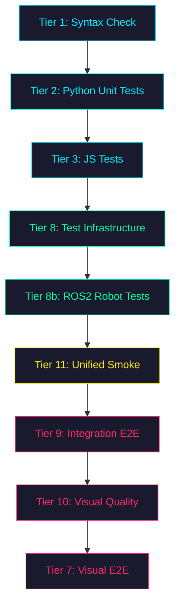
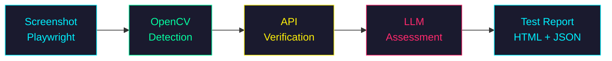
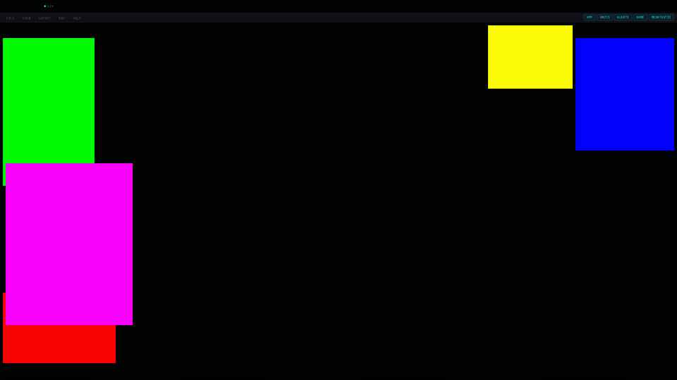
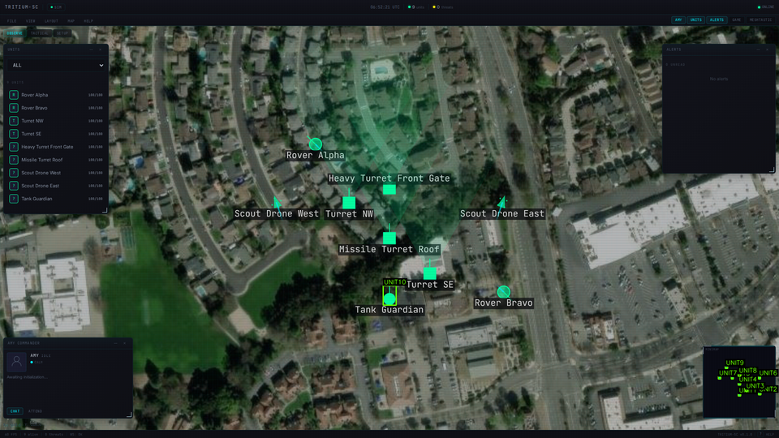
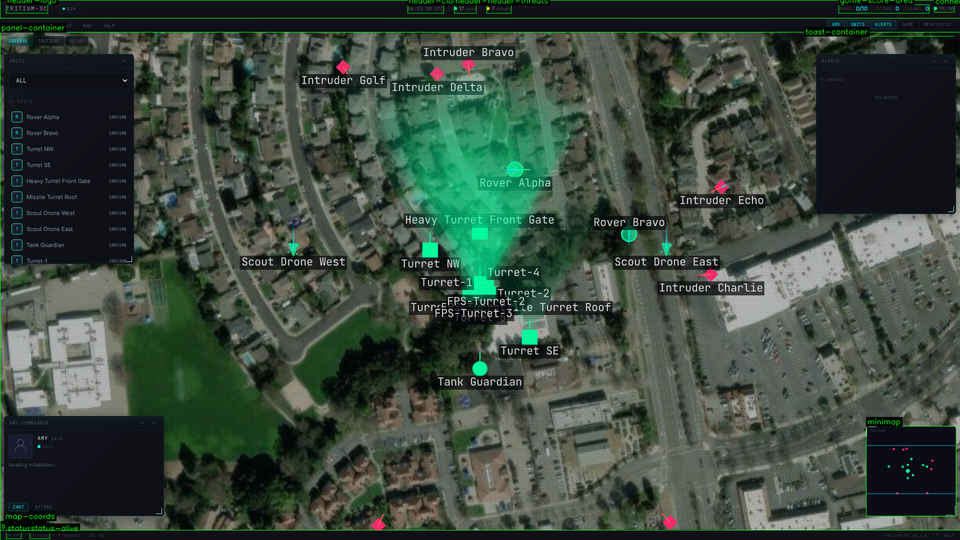

# TRITIUM-SC Testing Philosophy

## Core Principles

### 1. Never Trust, Always Verify
- Code that passes syntax checks is NOT working code
- Code that has unit tests is NOT tested code — the tests must actually exercise real paths
- "It compiles" means nothing. "It runs end-to-end on both machines" means something.
- Every claim of "it works" must be backed by a test that ACTUALLY RAN and ACTUALLY VERIFIED the output

### 2. TDD Is Non-Negotiable
- Write the test FIRST. Run it. Watch it FAIL.
- Then write the implementation. Run the test. Watch it PASS.
- If you didn't see the test fail first, you don't know your test tests anything.
- Tests must be specific and falsifiable — not "does it return something" but "does it return this exact thing"

### 3. Multiple Perspectives Break Assumptions
- When you think something works, assume there's a gap in your thinking
- Approach every piece of work from at least 2 angles:
  - **Builder**: writes the code and unit tests
  - **Breaker**: adversarial agent that tries to break it, finds edge cases
  - **Integrator**: tests end-to-end across the full stack
  - **Operator**: runs it on real hardware (both GB10 machines), watches for runtime failures
- Agents on the same task should have DIFFERENT narratives — don't just split the work, split the WORLDVIEW

### 4. Automation Over Manual Verification
- If a human has to look at it to verify it, it's not tested
- Use llava:7b on ollama for visual verification
- Use qwen2.5:7b for reasoning about test results
- The test suite should be able to run overnight unattended and produce a meaningful report

### 5. Distributed by Default
- GB10-01 (local) and GB10-02 (SSH, same codebase) are both available
- Tests should run on both machines to catch environment-specific issues
- `./test.sh --dist` splits work across both machines
- Ollama models are available on both machines

### 6. Test The Tests
- A test that always passes is worthless
- Mutation testing: does changing the code actually cause the test to fail?
- Coverage: are the critical paths actually exercised?
- The test infrastructure itself must be tested (test.sh must work before testing anything else)

## Testing Tiers

| Tier | What | Tool | Time | Machine |
|------|------|------|------|---------|
| 1 | Syntax | py_compile + node --check | <5s | Either |
| 2 | Unit tests | pytest -m unit | ~50s | Either |
| 3 | JS tests | node tests/js/ | <2s | Either |
| 4 | Vision audit | llava:7b via ollama | ~5min | Either/Both |
| 4.5 | Gameplay | Playwright + llava | ~3min | Either |
| 5 | E2E | Playwright | ~30s | Either |
| 6 | Integration | Full server + WebSocket + combat | ~5min | Either |
| 7 | Cross-machine | Distributed across both GB10s | ~3min | Both |

## Bash Pitfalls Checklist
- `((var++))` when var=0 returns exit code 1 under `set -e` — use `var=$((var + 1))`
- `set -e` kills the script on ANY non-zero exit — disable it during test functions
- Background processes (`&`) need proper `wait` and error handling
- SSH commands in scripts need proper quoting and error paths
- Always test scripts by RUNNING THEM, not just reading them

## Visual Testing with Ollama

### Available Models
- **llava:7b** — vision model for screenshot analysis (both machines)
- **qwen2.5:7b** — reasoning model for report review (GB10-02)
- **glm-ocr:latest** — OCR for text extraction from screenshots

### Prompt Engineering for Visual Tests
- Be SPECIFIC: "Is there a green square at the center?" not "Does it look right?"
- Ask YES/NO questions that can be parsed programmatically
- Include the expected state: "There should be 3 red diamonds and 2 green squares"
- Use multiple prompts per screenshot to cross-validate

### Verification Chain
1. Screenshot (Playwright)
2. Visual analysis (llava:7b) — "what do you see?"
3. State comparison (API) — "what should be there?"
4. Report generation (JSON)
5. Report review (qwen2.5:7b) — "are these results consistent?"

## Agent Team Patterns

### For New Feature Development
1. **Architect agent**: reads existing code, proposes design, writes to docs/
2. **Test agent**: writes tests based on design spec (fails initially)
3. **Builder agent**: implements to make tests pass
4. **Breaker agent**: writes adversarial tests, edge cases, mutation tests
5. **Integrator agent**: runs full stack, end-to-end verification

### For Bug Investigation
1. **Reproducer agent**: creates minimal reproduction case
2. **Analyst agent**: reads code, traces the bug path
3. **Fixer agent**: implements fix
4. **Verifier agent**: confirms fix on both machines

### For Test Infrastructure
1. **Runner agent**: executes tests, captures raw output
2. **Analyst agent**: reviews results with LLM, identifies patterns
3. **Reporter agent**: generates human-readable summary

---

### Visual Verification Examples

*Solid-color panel diagnostic — each panel rendered in a unique color to detect overlaps*

*OpenCV color detection on the tactical map — green pixel clusters (friendly units) are visible on satellite imagery. Current detection finds blobs by color threshold; bounding-box accuracy varies (some units missed, no hostile detection shown here). This is the baseline we're improving against.*

*Full DOM element audit — every interactive element labeled and verified*

## UI Quality Gates

### Why Unit Tests Passing != UI Working

Session 14 proved this conclusively: 9/9 test tiers passed while the Command Center was a black void. The Canvas 2D map rendered nothing — zero units, zero tiles, zero grid lines. All Python unit tests passed. All JS tests passed. The integration tests passed. But the actual page a user would see was completely broken.

The root cause: `map3d.js` (Three.js 3D renderer) had 8+ bugs but was never tested in a browser. The JS tests run in Node.js against isolated functions, not in a real browser with WebSocket data flow, DOM elements, and canvas rendering contexts. Unit tests verify that individual functions return correct values. They do not verify that the full pipeline — from WebSocket message to canvas pixel — actually works.

The lesson: **you need tests that load the actual page and verify pixels render.**

### The Smoke Test Pattern (test_unified_smoke.py)

The smoke test suite loads the Command Center (`/`) in a real Playwright browser, waits for WebSocket data to flow, and makes deterministic assertions about what appears on screen. Eight tests, each targeting a specific layer of the rendering pipeline:

1. **Console errors** — JS exceptions = instant fail. Any `console.error` or uncaught exception means the page is broken. This catches import errors, missing globals, and runtime crashes that Node.js tests never see.
2. **Canvas visibility** — The `#tactical-canvas` DOM element exists and has non-trivial dimensions (`width > 100, height > 100`). Catches CSS display issues, missing elements, and layout collapse.
3. **Canvas content** — Pixel sampling from the canvas. The canvas must not be pure black. This catches renderer initialization failures, camera misconfiguration, and missing draw calls.
4. **Data flow** — `TritiumStore.units` must be populated via WebSocket (`size >= 5`). This verifies the entire server-to-store pipeline: SimulationEngine ticks, EventBus publishes, TelemetryBatcher batches, WebSocket delivers, websocket.js routes to store.
5. **Colored shapes** — OpenCV color detection on a canvas screenshot. Green pixels (friendly units) must appear in sufficient quantity (`>= 30` green pixels). This proves units are not just in the store but actually drawn on the canvas with correct alliance colors.
6. **Header live data** — The header bar shows connection status (ONLINE), unit count, and a UTC clock. Verifies that reactive DOM updates work.
7. **Panel content** — Floating panels (Amy, Units, Alerts) are visible and contain list items. Verifies the panel system mounts and populates from store data.
8. **Frame rate** — The FPS counter reads >= 10. Verifies the render loop is running and not blocked.

### Key Design Decisions

- **Deterministic assertions only** — No LLM visual checks. llava:7b has a 20-83% false negative rate on dark cyberpunk backgrounds. Every assertion is a numeric comparison, string match, or pixel count threshold. Tests either pass or fail with no ambiguity.
- **Hard failures** — No `time.sleep()` fallbacks, no `try/except: pass`, no silent continues. If a condition is not met within the timeout, the test fails immediately with a clear message.
- **Every test records to SQLite** — Results go into a SQLite database for trend analysis. Flaky tests show up as intermittent failures over time, not as one-off surprises.
- **Screenshots captured per test** — Every test saves a screenshot on completion (pass or fail) for post-mortem debugging.

### Quality Sweep (scripts/quality_sweep.py)

A standalone monitoring script that complements the smoke tests:

- `--baseline` mode: captures reference screenshots and metrics for SSIM comparison
- `--watch` mode: continuously monitors the page, recording metrics at intervals
- `--report` mode: generates a summary from the SQLite database
- Measures: canvas brightness, unit count, FPS, WebSocket connection state
- Records to the same SQLite DB as smoke tests for unified trend analysis
- SSIM baseline comparison detects visual regressions that numeric assertions might miss

### Regression Verification

The most important property of a quality gate test is that it actually catches the problem it claims to catch. The verification protocol:

1. **Before the fix**: run the smoke tests and confirm they FAIL. If they pass on broken code, they test nothing.
2. **After the fix**: run the smoke tests and confirm they PASS.
3. **If tests pass regardless**: the test is worthless. Delete it and write one that actually detects the failure mode.

This is the same principle as TDD (watch the test fail first), applied to quality gates. A test that was never seen to fail is a test that tests nothing.
