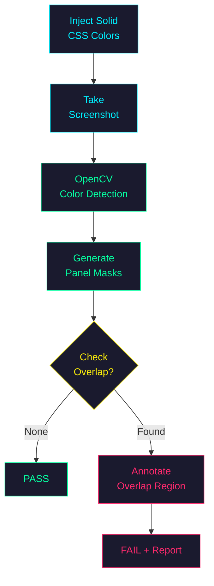
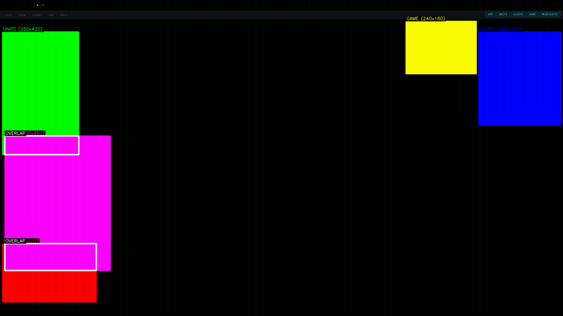
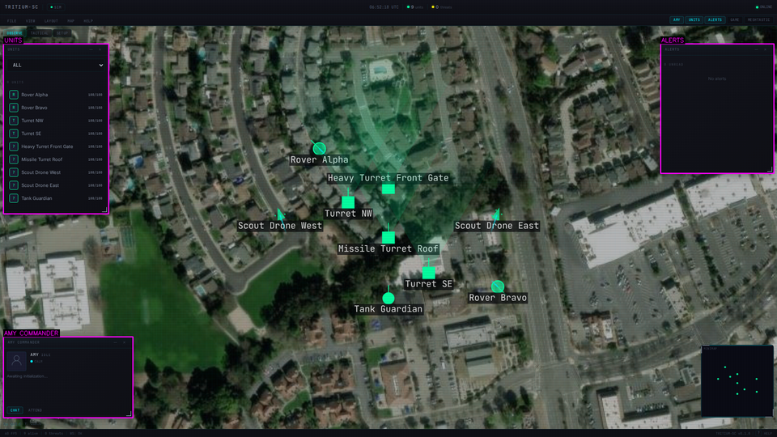

# UI Visual Regression Testing

Methodology for detecting and fixing layout bugs in TRITIUM-SC using
Playwright (headless Chromium) and OpenCV.

## Quick Start

```bash
# Requires server running on :8000
.venv/bin/python3 tests/ui/test_layout_drift.py
```

Captures 30 screenshots over 30 seconds, measures every element in the
DOM chain, and fails if anything drifts beyond 3px.

## The Discovery Workflow

When a visual bug is reported ("the image slides off screen", "panel
keeps growing", "layout is broken"), follow these steps:

### 1. Capture DOM Metrics Over Time

Use Playwright to open the page, navigate to the affected view, and
sample `getBoundingClientRect()`, `offsetWidth/Height`,
`scrollHeight/clientHeight`, and `getComputedStyle()` on the suspect
element **every 1-2 seconds for 30+ seconds**.

Key metrics to log per frame:
- Container `width x height` (bounding box)
- Image/child `offsetWidth x offsetHeight`
- `scrollTop`, `scrollHeight`, `clientHeight`
- `naturalWidth x naturalHeight` (for `` elements)

If `scrollHeight > clientHeight`, something overflows.
If `width` or `height` changes between frames, the layout is inflating.

### 2. Walk the DOM Chain

For each ancestor from the suspect element up to `<body>`, log:
- Tag, id, class
- Bounding box (`width x height`)
- Computed `overflow`, `flex`, `min-height`, `max-height`

This immediately reveals which element is unbounded.  Look for:
- `flex: 0 1 auto` (auto-sizing by content — common culprit)
- `min-height: auto` on flex children (default, allows inflation)
- Missing `overflow: hidden` on scrollable containers
- `height: 100%` that can't resolve (parent has auto height)

### 3. Use OpenCV for Pixel-Level Confirmation

Crop the suspect element from each Playwright screenshot.  Compare with
OpenCV:
- `cv2.absdiff()` between first and last frame
- `cv2.findNonZero()` to find the bounding box of changes
- `cv2.matchTemplate()` for sub-pixel shift detection

If crops have **different sizes**, the container is inflating (layout
bug).  If crops have the **same size** but content has shifted within
them, it's a scroll drift bug.

### 4. Automated PASS/FAIL

The test script captures N frames, records metrics, and asserts:
- Container width range < tolerance (3px)
- Container height range < tolerance
- Image offset top range < tolerance
- Content Y position range < tolerance

Fails with a clear message identifying which metric drifted and by how
much.

## Panel Overlap Detection



The overlap diagnostic uses solid-color panels injected via CSS to verify that no panels collide:


*Step 1: Inject solid colors — red, green, blue, yellow, magenta*


*Step 2: OpenCV detects overlap regions and outlines them in white*


*Step 3: All 5 panels open with OpenCV-generated labels*

## Common CSS Pitfalls

### Flex children with no height constraint

```css
/* BAD — .view-content has no rules, defaults to flex: 0 1 auto */
.view-area { display: flex; flex-direction: column; }

/* GOOD — constrain the child */
.view-content { flex: 1; min-height: 0; overflow: hidden; }
```

`min-height: 0` is critical.  Flex children default to `min-height:
auto`, which means they refuse to shrink below their content size.
Dynamic content (SSE streams, chat logs) will push the layout open.

### Replaced elements (``) need explicit dimensions

```css
/* BAD — img renders at natural size (640x480) */
img { position: absolute; inset: 0; object-fit: contain; }

/* GOOD — forces img to fill container */
img { position: absolute; inset: 0; width: 100%; height: 100%;
      object-fit: contain; display: block; }
```

For replaced elements, `inset: 0` alone does NOT determine size.  The
CSS spec falls back to intrinsic dimensions when `width` and `height`
are both `auto`.

### `overflow: clip` vs `overflow: hidden`

`overflow: hidden` creates a scroll container — the browser can still
change `scrollTop` internally (e.g., on MJPEG frame delivery).
`overflow: clip` does NOT create a scroll container, so no internal
scroll position exists to drift.

Use `clip` for MJPEG containers.  Use `hidden` for general content
overflow.

### `height: 100%` circular dependency

```css
/* BAD — parent has auto height, so 100% resolves to auto */
.parent { /* no height set */ }
.child  { height: 100%; }

/* GOOD — parent has definite height from flex */
.parent { flex: 1; min-height: 0; }
.child  { height: 100%; }
```

`height: 100%` only resolves when the parent has a definite height
(explicit value, or determined by flex/grid layout with proper
constraints).

## Cache Busting

Static CSS/JS can be cached by browsers.  During development:
- `app/main.py` has a no-cache middleware for `/static/` paths
- `index.html` uses `?v=N` query strings on CSS/JS links
- Bump the version when making CSS changes that must take effect
  immediately

## File Locations

| File | Purpose |
|------|---------|
| `tests/ui/test_layout_drift.py` | Automated 30s drift test |
| `frontend/css/tritium.css` | All Amy panel layout rules |
| `frontend/js/amy.js` | MJPEG feed setup |
| `docs/UI-TESTING.md` | This document |
