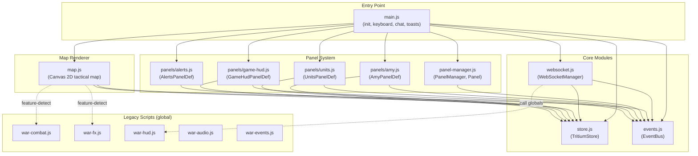
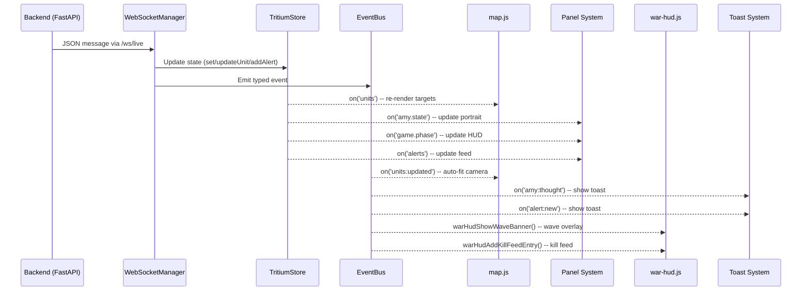

# TRITIUM-SC Unified Command Center -- Specification

**Version**: 1.0
**Date**: 2026-02-21
**Status**: IMPLEMENTED (Phase 5 complete)
**Route**: `/unified`

---

## 1. Overview

The Unified Command Center is the primary user interface for TRITIUM-SC. It
replaces the legacy tabbed dashboard (`index.html`) with a full-screen
real-time strategy (RTS) layout where the tactical map is always visible and
all information overlays the map through floating, draggable panels.

Design goals:
- **The map is the game.** The Canvas 2D tactical map fills the entire
  viewport between the header bar (36px) and status bar (20px). You never
  navigate away from it.
- **Amy is a persistent presence.** Her portrait, mood, and latest thought
  live in a floating panel (bottom-left). Her stream-of-consciousness
  appears as toast notifications. Chat slides in from the right.
- **Everything in context.** Units, alerts, and game state are shown in
  floating panels overlaid on the map, not in separate tabs.
- **No frameworks.** Vanilla JavaScript with ES6 modules, Canvas 2D
  rendering, and hand-written CSS.

The visual style matches the Valpatel homepage aesthetic: refined cyberpunk
with Inter font, thin borders, subtle glows, grid background, and scanlines.

---

## 2. Architecture

### Module Structure



### Module Roles

| Module | Type | Purpose |
|--------|------|---------|
| `main.js` | ES6 module (entry) | Initialization, keyboard shortcuts, chat panel, toast notifications, clock, game over overlay |
| `store.js` | ES6 module | `TritiumStore` -- single source of truth for all UI state with dot-path subscriptions |
| `events.js` | ES6 module | `EventBus` -- simple pub/sub for decoupled UI communication |
| `websocket.js` | ES6 module | `WebSocketManager` -- connects to `/ws/live`, routes messages to store and event bus |
| `map.js` | ES6 module | Canvas 2D tactical map renderer with satellite tiles, units, zones, combat visuals |
| `panel-manager.js` | ES6 module | `PanelManager` + `Panel` -- floating, draggable, resizable panel system with layout persistence |
| `panels/amy.js` | ES6 module | Amy Commander panel definition (portrait, state, mood, thought, CHAT/ATTEND buttons) |
| `panels/units.js` | ES6 module | Unit List panel definition (filterable list, click-to-select, alliance colors) |
| `panels/alerts.js` | ES6 module | Alert Feed panel definition (color-coded severity, unread count) |
| `panels/game-hud.js` | ES6 module | Game Status panel definition (wave, score, eliminations, BEGIN WAR/RESET buttons) |
| `war-combat.js` | Global script | Projectile trails, hit effects, elimination effects (feature-detected by map.js) |
| `war-fx.js` | Global script | FOV cones, trails, scanlines (feature-detected by map.js) |
| `war-hud.js` | Global script | Wave banners, countdown, kill feed, announcements (called by websocket.js) |
| `war-audio.js` | Global script | Sound effects playback |
| `war-events.js` | Global script | Combat event wiring |

---

## 3. Data Flow

### WebSocket to UI Pipeline



### State Management

`TritiumStore` is a plain JavaScript object with a subscriber pattern:

```javascript
TritiumStore.set('game.phase', 'active');           // Update + notify
const unsub = TritiumStore.on('game.phase', fn);    // Subscribe
TritiumStore.get('game.phase');                      // Read
TritiumStore.updateUnit('rover-01', { health: 150 }); // Merge unit data
TritiumStore.addAlert({ type: 'escalation', ... });   // Prepend alert
```

State tree:

| Path | Type | Description |
|------|------|-------------|
| `map.viewport` | `{x, y, zoom}` | Camera position |
| `map.selectedUnitId` | `string|null` | Currently selected unit |
| `map.mode` | `string` | `observe` / `tactical` / `setup` |
| `game.phase` | `string` | `idle` / `setup` / `countdown` / `active` / `wave_complete` / `victory` / `defeat` |
| `game.wave` | `number` | Current wave number |
| `game.totalWaves` | `number` | Total waves (10) |
| `game.score` | `number` | Accumulated score |
| `game.eliminations` | `number` | Total eliminations |
| `units` | `Map<id, unit>` | All tracked units (friendly + hostile) |
| `amy.state` | `string` | Amy state (idle, observing, attending, etc.) |
| `amy.mood` | `string` | Amy mood (calm, vigilant, alert, etc.) |
| `amy.lastThought` | `string` | Most recent thought text |
| `amy.speaking` | `boolean` | TTS active flag |
| `amy.nodeCount` | `number` | Connected sensor nodes |
| `connection.status` | `string` | `connected` / `disconnected` / `error` |
| `alerts` | `Array` | Alert objects (max 100, newest first) |
| `cameras` | `Array` | Camera list |

---

## 4. Render Pipeline

The tactical map renders 12 layers in order via `_draw()` in `map.js`. Each
frame is driven by `requestAnimationFrame`. Camera position smoothly
interpolates toward targets using lerp.

| Order | Layer | Function | Description |
|-------|-------|----------|-------------|
| 1 | Satellite tiles | `_drawSatelliteTiles()` | ESRI World Imagery tiles at 70% opacity, dynamically loaded based on zoom level |
| 2 | Grid | `_drawGrid()` | Adaptive spacing (500m / 100m / 20m / 5m) based on camera zoom |
| 3 | Map boundary | `_drawMapBoundary()` | 5km x 5km (-2500 to +2500) dashed cyan border |
| 4 | Zones | `_drawZones()` | Escalation zone polygons (filled + stroked) |
| 5 | Targets | `_drawTargets()` | Unit markers with health bars, heading indicators, labels |
| 5.5 | FOV cones | `warFxDrawVisionCones()` | Field-of-view visualization (feature-detected from war-fx.js) |
| 6 | Projectiles | `warCombatDrawProjectiles()` | Active projectile trails (feature-detected from war-combat.js) |
| 7 | Effects | `warCombatDrawEffects()` | Particle systems, hit rings, screen flash (feature-detected) |
| 7.5 | Trails | `warFxDrawTrails()` | Unit movement trails (feature-detected from war-fx.js) |
| 8 | Selection | `_drawSelectionIndicator()` | Animated selection ring around selected unit |
| 9 | Dispatch arrows | `_drawDispatchArrows()` | Animated arrows from unit to dispatch target (3s lifetime) |
| 10 | Scanlines | `warFxDrawScanlines()` | CRT scanline overlay effect (feature-detected from war-fx.js) |

### Coordinate System

- Game world: -2500 to +2500 on both axes (5km x 5km)
- 1 unit = 1 meter
- Screen Y is inverted: +Y world = up on screen
- Camera: `{ x, y, zoom, targetX, targetY, targetZoom }` with smooth lerp
  - `LERP_SPEED_CAM = 8`, `LERP_SPEED_ZOOM = 6`
  - Initial zoom: `15.0` (fits ~200m radius)
  - Zoom range: `0.02` to `30.0`

### Satellite Tile Levels

Tiles reload dynamically when camera zoom crosses thresholds:

| Camera Zoom | Tile Zoom | Radius | Grid Step |
|-------------|-----------|--------|-----------|
| < 0.1 | 13 | 3000m | 500m |
| < 0.5 | 15 | 1000m | 100m |
| < 2.0 | 17 | 400m | 20m |
| >= 2.0 | 19 | 200m | 5m |

---

## 5. Color Palette

CSS custom properties defined in `cybercore-v2.css`:

| Variable | Value | Usage |
|----------|-------|-------|
| `--cyan` | `#00f0ff` | Primary accent, borders, interactive elements |
| `--cyan-dim` | `#0e7490` | Dimmed accent for labels |
| `--cyan-glow` | `rgba(0, 240, 255, 0.15)` | Glow effects, hover states |
| `--green` | `#05ffa1` | Friendly units, success, active status |
| `--amber` | `#fcee0a` | Warnings, unknown alliance, caution |
| `--magenta` | `#ff2a6d` | Hostile units, errors, critical alerts |
| `--void` | `#0a0a0f` | Body background (void black) |
| `--surface-1` | `#0e0e14` | Deepest panel layer |
| `--surface-2` | `#12121a` | Standard panel background |
| `--surface-3` | `#1a1a2e` | Raised elements, badges |
| `--border` | `rgba(0, 240, 255, 0.08)` | Subtle panel borders |
| `--text-primary` | `#c8d0dc` | Body text |
| `--text-secondary` | `#8892a4` | Secondary text |
| `--text-muted` | `#5a6577` | Muted labels |
| `--text-dim` | `#4a5568` | Dim annotations |
| `--text-ghost` | `#3a4250` | Barely visible text |

### Canvas Colors (map.js)

| Constant | Value | Usage |
|----------|-------|-------|
| `BG_COLOR` | `#060609` | Canvas clear color |
| `GRID_COLOR` | `rgba(0, 240, 255, 0.04)` | Grid lines |
| `BOUNDARY_COLOR` | `rgba(0, 240, 255, 0.15)` | Map boundary |
| `ALLIANCE_COLORS.friendly` | `#05ffa1` | Friendly unit markers |
| `ALLIANCE_COLORS.hostile` | `#ff2a6d` | Hostile unit markers |
| `ALLIANCE_COLORS.neutral` | `#00a0ff` | Neutral unit markers |
| `ALLIANCE_COLORS.unknown` | `#fcee0a` | Unknown unit markers |

---

## 6. Typography

| Role | Font | Weight | Details |
|------|------|--------|---------|
| Body text | Inter | 300-700 | `var(--font-sans)` -- used for all content text |
| Data labels, status, monospace | JetBrains Mono | 400-500 | `var(--font-mono)` -- applied via `.mono` class |
| Canvas labels | JetBrains Mono | 400 | `FONT_FAMILY` constant in map.js |

Font loading: Google Fonts with `preconnect` for `fonts.googleapis.com` and
`fonts.gstatic.com`. Weights loaded: Inter 300/400/500/600/700, JetBrains
Mono 400/500.

---

## 7. Panel Definitions

All panels are floating, draggable, and resizable. They use `transform: translate()`
for GPU-accelerated positioning to avoid MJPEG scroll-inflation bugs. Layouts
persist in `localStorage` under key `tritium-panel-layout`.

### Panel Manager

- **Snap threshold**: 20px (panels snap to container edges)
- **Minimum size**: 200px wide, 120px tall
- **Header height**: 28px (collapsed state)
- **Z-index base**: 100, incremented per interaction
- **Presets**: `commander` (Amy + Units + Alerts), `observer` (Alerts only), `tactical` (Units + Alerts)
- **Default panels**: Amy, Units, Alerts open on first load

### Amy Commander (`id: 'amy'`)

| Property | Value |
|----------|-------|
| **Purpose** | Amy's portrait, state, mood, latest thought, action buttons |
| **Default position** | Bottom-left (x: 8, y: container height - 228) |
| **Default size** | 320 x 200 |
| **Data sources** | `amy.state`, `amy.mood`, `amy.lastThought`, `amy.speaking` |
| **Interactions** | CHAT button (opens chat overlay), ATTEND button (POST /api/amy/command) |
| **On mount** | Fetches `/api/amy/status` for initial state |

Portrait states: idle, observing, attending, speaking (with animated ring).

### Units (`id: 'units'`)

| Property | Value |
|----------|-------|
| **Purpose** | Filterable list of all units on the tactical map |
| **Default position** | Top-left (x: 8, y: 44) |
| **Default size** | 260 x 420 |
| **Data sources** | `units` (Map), `map.selectedUnitId` |
| **Interactions** | Filter dropdown (all/friendly/hostile/neutral/unknown), click to select unit |
| **Alliance colors** | friendly=green, hostile=magenta, neutral=cyan, unknown=amber |
| **Type icons** | R=rover, D=drone, T=turret, P=person, H=hostile_kid, C=camera, S=sensor |

Clicking a unit emits `unit:selected` on EventBus and updates `map.selectedUnitId`.

### Alerts (`id: 'alerts'`)

| Property | Value |
|----------|-------|
| **Purpose** | Real-time alert feed with color-coded severity |
| **Default position** | Top-right (x: container width - 288, y: 44) |
| **Default size** | 280 x 320 |
| **Data sources** | `alerts` array |
| **Interactions** | Read-only feed, displays up to 30 most recent alerts |
| **Severity dots** | escalation=hostile (red), warning=unknown (amber), info=neutral |
| **Unread count** | Shown in section header |

### Game HUD (`id: 'game'`)

| Property | Value |
|----------|-------|
| **Purpose** | Wave-based game status, score, and controls |
| **Default position** | Top-right (x: container width - 248, y: 8) |
| **Default size** | 240 x 180 |
| **Data sources** | `game.phase`, `game.wave`, `game.score`, `game.eliminations` |
| **Interactions** | BEGIN WAR button (visible in idle/setup), RESET button (visible in victory/defeat) |
| **API calls** | POST /api/game/begin, POST /api/game/reset |

---

## 8. Keyboard Shortcuts

All shortcuts are disabled when focus is in an `<input>` or `<textarea>`.

### General

| Key | Action | Implementation |
|-----|--------|----------------|
| `?` | Toggle help overlay | `#help-overlay` hidden toggle |
| `ESC` | Close all overlays | Closes chat, help, modal, game-over overlays |
| `C` | Toggle Amy chat panel | `toggleChat()` |
| `/` | Open chat + focus input | `toggleChat(true)`, prevents default |
| `M` | Toggle minimap | `#minimap-container` hidden toggle |

### Map

| Key | Action | Implementation |
|-----|--------|----------------|
| `O` | Observe mode | Clicks `[data-map-mode="observe"]` button |
| `T` | Tactical mode | Clicks `[data-map-mode="tactical"]` button |
| `S` | Setup mode | Clicks `[data-map-mode="setup"]` button |
| `I` | Toggle satellite imagery | `toggleSatellite()` |
| `F` | Center on action | Centers camera on nearest threat (map.js) |
| `R` | Reset camera | Resets camera to origin (map.js) |
| `[` | Zoom in | Decreases camera zoom target (map.js) |
| `]` | Zoom out | Increases camera zoom target (map.js) |

### Panels

| Key | Action | Implementation |
|-----|--------|----------------|
| `1` | Toggle Amy panel | `panelManager.toggle('amy')` |
| `2` | Toggle Units panel | `panelManager.toggle('units')` |
| `3` | Toggle Alerts panel | `panelManager.toggle('alerts')` |
| `4` | Toggle Game HUD panel | `panelManager.toggle('game')` |
| `Tab` | Cycle panel focus (unified) / Toggle sidebar (legacy) | Context-dependent |

### Game

| Key | Action | Implementation |
|-----|--------|----------------|
| `B` | Begin War | Calls `beginWar()` when phase is idle/setup |

---

## 9. API Endpoints

Every HTTP endpoint called by the Unified Command Center frontend.

### Amy

| Method | Endpoint | Caller | Purpose |
|--------|----------|--------|---------|
| GET | `/api/amy/status` | `panels/amy.js`, `main.js` | Fetch Amy state, mood, last thought, node count |
| POST | `/api/amy/chat` | `main.js` (sendChat) | Send chat message to Amy, receive response |
| POST | `/api/amy/command` | `panels/amy.js`, `main.js`, `map.js` | Send action command (attend, dispatch, etc.) |

### Game

| Method | Endpoint | Caller | Purpose |
|--------|----------|--------|---------|
| POST | `/api/game/begin` | `main.js`, `panels/game-hud.js` | Start game (wave 1) |
| POST | `/api/game/reset` | `main.js`, `panels/game-hud.js` | Reset game to idle |

### Geo / Satellite

| Method | Endpoint | Caller | Purpose |
|--------|----------|--------|---------|
| GET | `/api/geo/reference` | `map.js` | Fetch geo-reference center point (lat/lng) |
| GET | `/api/geo/tile/{z}/{x}/{y}` | `map.js` | Fetch cached ESRI satellite tile image |

### Zones

| Method | Endpoint | Caller | Purpose |
|--------|----------|--------|---------|
| GET | `/api/zones` | `map.js` | Fetch zone polygon definitions for map overlay |

### WebSocket

| Protocol | Endpoint | Caller | Purpose |
|----------|----------|--------|---------|
| WS | `/ws/live` | `websocket.js` | Real-time bidirectional communication |

---

## 10. WebSocket Messages

All messages are JSON with a `type` (or `event`) field. The `WebSocketManager`
routes each type to the appropriate store update and event bus emission.

### Amy Messages

| Type | Store Update | EventBus Event | Description |
|------|-------------|----------------|-------------|
| `amy_thought` | `amy.lastThought` | `amy:thought` | New thought from thinking thread |
| `amy_speech` | `amy.speaking = true` (auto-clears 5s) | `amy:speech` | TTS speech started |
| `amy_state` | `amy.state`, `amy.mood` | `amy:state` | State/mood change |

### Telemetry Messages

| Type | Store Update | EventBus Event | Description |
|------|-------------|----------------|-------------|
| `amy_sim_telemetry` / `sim_telemetry` | `updateUnit()` | `units:updated` | Single unit telemetry update |
| `amy_sim_telemetry_batch` | `updateUnit()` per item | `units:updated` | Batched unit telemetry (array) |

Unit fields mapped by `_updateUnit()`:
- `target_id` -> `id`
- `name`, `asset_type`/`type`, `alliance`
- `position` (or `x`/`y`), `heading`, `speed`
- `health`, `max_health`, `battery`, `status`
- `kills`/`eliminations`

### Game State Messages

| Type | Store Update | EventBus Event | Description |
|------|-------------|----------------|-------------|
| `game_state` / `amy_game_state_change` | `game.phase`, `game.wave`, `game.totalWaves`, `game.score`, `game.eliminations` | `game:state` | Game phase/state update |
| `amy_game_over` | `game.phase` (victory/defeat), `game.score`, `game.eliminations` | `game:state` | Game ended |
| `wave_start` / `amy_wave_start` | -- | `game:wave_start` | New wave beginning (triggers banner) |
| `wave_complete` / `amy_wave_complete` | -- | `game:wave_complete` | Wave cleared (triggers banner) |

### Combat Messages

| Type | Store Update | EventBus Event | Global Function | Description |
|------|-------------|----------------|-----------------|-------------|
| `projectile_fired` / `amy_projectile_fired` | -- | `combat:projectile` | `warCombatAddProjectile()` | New projectile in flight |
| `projectile_hit` / `amy_projectile_hit` | -- | `combat:hit` | `warCombatAddHitEffect()` | Projectile impact |
| `target_eliminated` / `amy_target_eliminated` | -- | `combat:elimination` | `warCombatAddEliminationEffect()`, `warHudAddKillFeedEntry()` | Unit destroyed |
| `elimination_streak` / `kill_streak` / `amy_elimination_streak` | -- | `combat:streak` | `warCombatAddEliminationStreakEffect()` | Kill streak achieved |
| `game_elimination` / `game_kill` | -- | `game:elimination` | -- | Elimination event |

### Other Messages

| Type | Store Update | EventBus Event | Description |
|------|-------------|----------------|-------------|
| `announcer` | -- | `announcer` | Amy war commentary (Smash TV style) |
| `robot_thought` | -- | `robot:thought` | Robot LLM-generated thought |
| `escalation_change` | `addAlert()` | `alert:new` | Threat level change |
| `detection` | -- | `detection` | YOLO detection from camera |
| (unknown) | -- | `ws:{type}` | Forwarded for extensibility |

---

## Appendix A: HTML Structure

```
<body class="v2 grid-bg">
  <header id="header-bar">         -- 36px: logo, mode, clock, units, threats, game score, connection
  <main id="main-layout">
    <div id="tactical-area">        -- Full viewport tactical map
      <canvas id="tactical-canvas"> -- Main Canvas 2D renderer
      <div id="map-mode">          -- O/T/S mode buttons (top-left)
      <div id="map-coords">        -- Mouse coordinate display
      <div id="map-fps">           -- FPS counter
      <div id="minimap-container">  -- 200x200 minimap (bottom-right)
      <div id="center-banner">     -- Announcer banners (center)
      <div id="war-*">             -- Combat HUD overlays (countdown, wave, kill feed, etc.)
    <div id="panel-container">      -- Floating panel container (z:100+)
    <div id="status-bar">           -- 20px: FPS, alive count, threats, version, help key
  <div id="toast-container">        -- Toast notifications (top-right, max 5)
  <div id="chat-overlay">           -- Amy chat slide-out (right edge)
  <div id="modal-overlay">          -- Generic modal layer
  <div id="help-overlay">           -- Keyboard shortcuts help
  <div id="game-over-overlay">      -- Victory/defeat screen with stats
```

## Appendix B: EventBus Events Reference

Complete list of events emitted on the frontend `EventBus`:

| Event | Payload | Source |
|-------|---------|--------|
| `amy:thought` | `{ text, timestamp }` | WebSocketManager |
| `amy:speech` | `{ text, action }` | WebSocketManager |
| `amy:state` | `{ state, mood }` | WebSocketManager |
| `unit:selected` | `{ id }` | main.js, panels/units.js |
| `unit:deselected` | `{}` | map.js |
| `unit:dispatched` | `{ id, target: {x, y} }` | map.js |
| `unit:recalled` | `{ id }` | main.js |
| `unit:dispatch-mode` | `{ id }` | main.js |
| `units:updated` | `[ ...targets ]` | WebSocketManager |
| `game:state` | `{ phase, wave, score, eliminations }` | WebSocketManager |
| `game:elimination` | `{ interceptor, target, weapon }` | WebSocketManager |
| `game:wave_start` | `{ wave, wave_name, hostile_count }` | WebSocketManager |
| `game:wave_complete` | `{ wave, eliminations, score_bonus }` | WebSocketManager |
| `alert:new` | `{ type, message, source }` | WebSocketManager |
| `announcer` | `{ text, message, sub, priority }` | WebSocketManager |
| `robot:thought` | `{ robot_id, name, text }` | WebSocketManager |
| `combat:projectile` | `{ ... }` | WebSocketManager |
| `combat:hit` | `{ ... }` | WebSocketManager |
| `combat:elimination` | `{ ... }` | WebSocketManager |
| `combat:streak` | `{ ... }` | WebSocketManager |
| `detection` | `{ cameraId, boxes, ... }` | WebSocketManager |
| `chat:open` | `{}` | main.js, panels/amy.js |
| `chat:close` | `{}` | main.js |
| `sidebar:toggle` | `{}` | main.js (legacy) |
| `map:mode` | `{ mode }` | main.js |
| `panel:opened` | `{ id }` | PanelManager |
| `panel:closed` | `{ id }` | PanelManager |
| `ws:connected` | `undefined` | WebSocketManager |
| `ws:disconnected` | `undefined` | WebSocketManager |
| `ws:{type}` | `{ ... }` | WebSocketManager (unknown types) |

## Appendix C: Toast Notifications

| Property | Value |
|----------|-------|
| Maximum visible | 5 |
| Auto-dismiss | 6000ms |
| Position | Top-right (`#toast-container`) |
| Types | `amy` (cyan border), `robot` (green border), `alert` (red border), `info` |
| Sources | `amy:thought`, `robot:thought`, `alert:new`, `game:elimination` events |
| Announcer messages | Rendered as center-screen banners, not toasts |

## Appendix D: CSS Files

| File | Purpose |
|------|---------|
| `cybercore-v2.css` | Base framework: CSS variables, reset, grid background, scanlines, panel base styles |
| `command.css` | Command Center layout: header, main, status bar, tactical area, map overlays |
| `panels.css` | Floating panel styles: panel chrome, drag/resize, panel-specific inner styles |

---

## Appendix E: Quality Gate Tests

| Test | What It Verifies | Assertion |
|------|-----------------|-----------|
| test_01_zero_console_errors | No JS exceptions on load | `len(errors) == 0` |
| test_02_canvas_visible_and_sized | Canvas in DOM with dimensions | `width > 100, height > 100` |
| test_03_canvas_has_content | Non-black pixels on canvas | Pixel sampling |
| test_04_units_in_store | WebSocket to Store data flow | `TritiumStore.units.size >= 5` |
| test_05_units_render_as_colored_shapes | Units drawn with correct colors | Green pixel count >= 30 |
| test_06_header_live_data | Header shows live system state | Connection=ONLINE, UTC clock |
| test_07_panels_have_content | Floating panels rendered | >=2 visible panels |
| test_08_frame_rate_acceptable | Render loop performant | FPS >= 10 |

---

## Appendix F: Data Flow (Proven by Audit)

```
SimulationEngine (10Hz tick)
  -> EventBus("sim_telemetry")
  -> TelemetryBatcher (100ms batching)
  -> WebSocket("amy_sim_telemetry_batch")
  -> websocket.js._handleMessage()
  -> TritiumStore.updateUnit() per target
  -> EventBus.emit("units:updated")
  -> map.js _renderLoop() reads TritiumStore.units
  -> Canvas 2D draws units with shapes/colors/health bars
```

This pipeline was verified end-to-end during the Session 14 audit. Each stage was instrumented and confirmed to produce output. The smoke tests (Appendix E) verify this pipeline is intact on every test run.

---

## Appendix G: Known Deferred Work

- **map3d.js (Three.js 3D renderer)**: Has the right architecture but needs WebGL fallback, animateModel signature fix, and CSS rules for `#tactical-3d-canvas`. Deferred to a future 3D upgrade pass. `map.js` (Canvas 2D) is the active renderer.
- **SSIM regression baselines**: Infrastructure is in place (`quality_sweep.py --baseline`), needs initial baseline capture after UI stabilizes.
