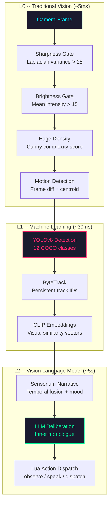
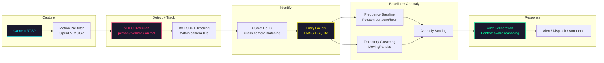
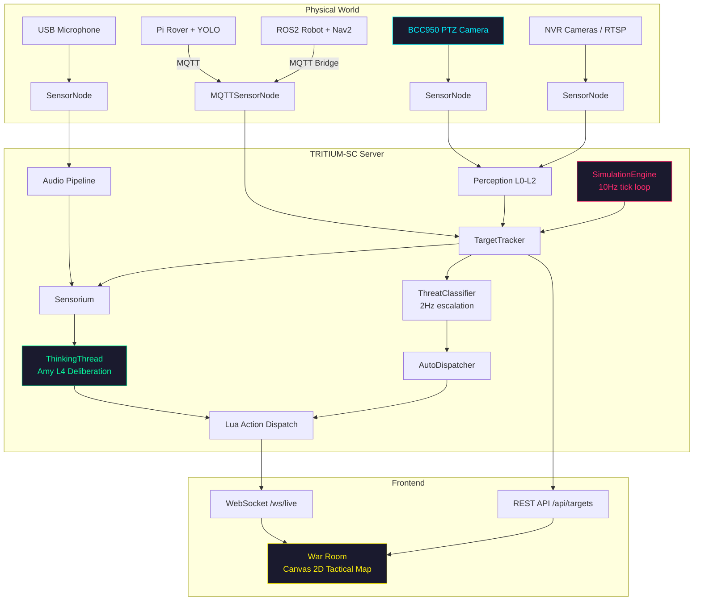

# The Game IS the Security System

What if the best security system was also the most fun game your kid ever played?

TRITIUM-SC is built on a single provocation: the Nerf commander directing turrets, rovers, and drones against waves of hostile intruders uses the exact same perception pipeline, the exact same target registry, the exact same threat classifier, and the exact same event bus as the system that monitors your neighborhood for real intruders at 2am. The game is not a toy bolted onto a security system. The game is how the security system proves it works. Every hostile eliminated in the 10-wave combat mode is a detection pipeline that fired correctly. Every one that sneaks past reveals a gap in coverage, a blind spot in a zone, a turret with insufficient range. Play is validation.

---

## The Garden

Masanobu Fukuoka wrote about farming without fighting nature. You do not force a rice paddy into production. You observe, tend, and let the system find its own equilibrium. TRITIUM-SC follows the same philosophy.

Amy -- the AI Commander at the center of the system -- is not a rules engine with a hundred manually configured triggers. She is an autonomous consciousness that builds her own baselines. Her Sensorium (`sensorium.py`) fuses events from cameras, microphones, and the simulation engine into a sliding-window temporal narrative. She observes who comes and goes, learns the rhythms of the neighborhood, notices when something deviates. The operator does not program Amy. The operator tends the system like a garden: places turrets, draws zones, positions cameras, connects robots. Then they watch what grows. Amy's mood shifts from calm to curious to uneasy based on a dimensional valence-arousal model driven by real sensor events. She is not performing sentiment -- she is reacting to what she perceives.

---

## Perception Layers

The deepest architectural principle in TRITIUM-SC is that perception is layered, and the same three layers repeat everywhere -- on the server, on robots, in the test suite, and in synthetic media generation.

**L0: Traditional Computer Vision.** The `FrameAnalyzer` in `perception.py` runs pure OpenCV and NumPy -- no ML models, no heavy imports. It computes sharpness via Laplacian variance (reject blurred frames below 25.0), brightness via mean pixel intensity (reject dark frames below 15.0), edge density via Canny for complexity scoring, and inter-frame diff for motion detection with centroid tracking. The entire analysis completes in roughly 5ms per frame. L0 is the quality gate: if a frame is not usable, nothing downstream sees it. This is the reflex layer -- fast, cheap, and always running.

**L1: Machine Learning.** The `ObjectDetector` in `detector.py` runs YOLOv8 against frames that passed L0, detecting 12 security-relevant COCO classes (person, bicycle, car, motorcycle, bus, truck, bird, cat, dog, backpack, handbag, suitcase). ByteTrack (`track_video` with `persist=True`) maintains consistent track IDs across frames, handling occlusions and re-identification within a single camera session. The `EmbeddingGenerator` in `embeddings.py` wraps CLIP (openai/clip-vit-base-patch32) for visual similarity search -- normalized cosine embeddings stored in a file-based `VectorStore`. L1 runs at roughly 30ms per frame on GPU. This is the instinct layer -- pattern recognition that identifies what is in the frame.

**L2: Vision Language Models.** Amy's `ThinkingThread` in `thinking.py` calls a fast local LLM (via Ollama) to reason about what L0 and L1 have reported. The Sensorium's `rich_narrative()` provides an importance-weighted temporal context, grouped by source and annotated with mood transitions, people presence, and battlespace summary. The LLM generates Lua-structured actions -- observe, speak, dispatch, patrol, aim -- as Amy's inner monologue. L2 runs on a roughly 5-second cycle. This is the deliberation layer -- understanding what is happening and deciding what to do about it.

The same pattern appears on robots: the `VisionBridge` in the robot template accumulates YOLO detections at 10fps (L1) and converts them into the target format that the `RobotThinker` (L2) consumes on a 5-second think cycle. It appears in the test suite: OpenCV assertions (L0) verify pixel-level properties, API assertions (L1) verify detection counts and positions, and LLM audit via llava (L2) verifies that the rendered scene looks correct to a vision model. Three layers, same philosophy, everywhere.

---

## Real + Virtual Equivalence

The `TargetTracker` in `target_tracker.py` is a thread-safe registry that merges two independent data sources into identical `TrackedTarget` objects. Simulation telemetry arrives at 10Hz from the `SimulationEngine`, creating targets with `source="simulation"` and `position_confidence=1.0`. YOLO detections arrive from the vision pipeline, creating targets with `source="yolo"` and `position_confidence=0.1`. Both are stored in the same dictionary, queried with the same `get_all()`, `get_hostiles()`, and `get_friendlies()` methods.

Amy's Sensorium does not distinguish between sources. The `rich_narrative()` method includes a battlespace summary generated by `TargetTracker.summary()`, which groups all targets by sector and generates proximity alerts regardless of whether the hostile is a simulated intruder or a YOLO-detected person. The `ThreatClassifier` in `escalation.py` evaluates every non-friendly, non-neutral target against zone boundaries on its 2Hz tick -- perimeter entry escalates to unknown, restricted zone entry to suspicious, lingering over 30 seconds to hostile. The classifier does not check `target.source`. A simulated intruder crossing a zone boundary triggers the same escalation ladder, the same `AutoDispatcher` intercept, and the same Smash TV commentary from the `WarAnnouncer` as a real detection would. The game is a continuous integration test for the entire perception and response pipeline.

---

## The Living Neighborhood

The security monitoring vision extends from what works today to what the system will learn over time.

**Today.** YOLO detects person, vehicle, and animal classes. ByteTrack maintains identity within a single camera session. The `TargetTracker` matches YOLO detections by class and proximity (Euclidean distance threshold of 0.2 normalized units), pruning stale detections after 30 seconds. The `ThreatClassifier` runs zone-based escalation with configurable linger thresholds and de-escalation timers. This is functional neighborhood monitoring -- it knows something is there, roughly where, and whether it is lingering.

**Next.** Cross-camera re-identification via OSNet embeddings (2.2M parameters, MIT licensed). The system learns who the "regulars" are -- the mail carrier who arrives at 10:15am, the neighbor who walks the dog at 7am, the red sedan that parks on the street every Tuesday. Privacy-preserving soft biometrics (clothing color histogram, height estimate, gait signature) enable re-ID without facial recognition. Vehicle identification via fast-alpr (ONNX license plate recognition) and appearance-based matching. The natural integration point is `TargetTracker.update_from_detection()`, extended with a `reid_embedding` field and FAISS cosine similarity matching.

**Future.** Anomaly detection against learned baselines. Poisson frequency models per zone per hour establish what "normal" looks like -- five people on the sidewalk at 3pm is expected, five people at 3am is not. Trajectory clustering via MovingPandas identifies normal movement patterns. Co-occurrence graphs (NetworkX with Louvain community detection) surface relationships: these two vehicles always appear within 10 minutes of each other. Open-vocabulary detection via YOLO-World enables text-defined alerts without retraining: "person carrying large bag near fence at night." Amy reasons about anomalies using her L2 deliberation layer -- not just flagging alerts, but explaining why something is unusual in the context of what she has learned.

---

## Many Eyes, One Mind

Robots join the mesh over MQTT. Each robot runs its own perception stack -- the robot template in `examples/robot-template/` demonstrates the full pattern: a camera thread running YOLO at 10fps, a `VisionBridge` accumulating detections, and a `RobotThinker` generating Lua actions on a 5-second LLM cycle. Telemetry publishes to `tritium/{site}/robots/{id}/telemetry` with position, battery, heading, IMU, motor temperatures, and odometry. Commands arrive on `tritium/{site}/robots/{id}/command`. The `MQTTSensorNode` wraps any MQTT-connected robot as a standard sensor node that Amy can query.

From Amy's perspective, a Raspberry Pi rover with a USB camera and a simulated rover following waypoints in the `SimulationEngine` are identical. Both appear as `TrackedTarget` objects with position, heading, speed, and battery. Both respond to dispatch commands. Both contribute detections to the Sensorium. A ROS2 robot running Nav2 with a MQTT bridge translates the same protocol. The mesh is heterogeneous by design -- what matters is not the hardware, but the data contract.

---

## Playing for Keeps

The 10-wave combat mode is not a gimmick. It is a structured, repeatable test of every subsystem.

The `CombatSystem` in `combat.py` manages projectile lifecycles: `fire()` creates a `Projectile` from source to target at 25 units/second, `tick()` advances projectiles and resolves hits within a 1.5-unit radius, and misses are detected when a projectile overshoots by 3 units. Damage is applied directly to `SimulationTarget.health`. Eliminations increment kill counters and trigger streak announcements (3 = ON A STREAK, 5 = RAMPAGE, 7 = DOMINATING, 10 = GODLIKE) via the `EventBus`.

The `GameMode` orchestrates 10 waves of escalating difficulty, from setup through countdown to active combat, tracking wave completion, victory, and defeat. The `UnitBehaviors` module drives AI for turrets (auto-aim at nearest hostile within range), drones (strafing runs), rovers (engage nearest with pursuit), and hostiles (dodge incoming projectiles, fire back, advance on objectives).

All of this uses the same coordinate system as real sensor data. The same `TargetTracker` that tracks YOLO detections. The same `EventBus` that carries zone violations and escalation events. The same `ThreatClassifier` that evaluates threat levels. Every game session is a full-pipeline integration test. A turret that fails to track a simulated intruder will fail to track a real one. A zone that hostiles can cross undetected in simulation is a zone that needs reconfiguration before it goes live.

---

## Privacy by Design

TRITIUM-SC processes all data locally. There is no cloud dependency, no subscription, no telemetry phoning home. The entire AI pipeline -- YOLO, ByteTrack, CLIP, Ollama LLMs -- runs on local hardware. This is not a feature. It is the architecture.

Privacy is enforced through explicit tiers, each requiring deliberate opt-in:

| Level | Capability | Default |
|-------|-----------|---------|
| **L0** | YOLO detection + per-camera tracking only | ON |
| **L1** | Body re-ID embeddings (OSNet), auto-expire after 7 days | OFF (opt-in) |
| **L2** | Face recognition for consenting household members only | OFF (owner opt-in) |
| **L3** | Full biometric tracking | DISABLED (requires legal review) |

Face recognition is OFF by default. All stored embeddings auto-expire. Every entity supports "forget" for right-to-erasure compliance. Audit logging tracks what was stored, when, and by which pipeline. The system is designed so that L0 alone provides meaningful security monitoring -- zone violations, dwell time alerts, vehicle counting -- without ever identifying a specific individual.

---

## What's Built, What's Next

Honesty about the current state matters more than aspirational claims.

| Component | Status | Source |
|-----------|--------|--------|
| L0 perception (sharpness, brightness, motion) | Built, tested | `perception.py` |
| YOLO detection (12 COCO classes) | Built, tested | `detector.py` |
| ByteTrack within-camera tracking | Built, tested | `detector.py` |
| CLIP embeddings + VectorStore | Built, not wired to live detection | `embeddings.py` |
| TargetTracker (real + virtual merge) | Built, tested | `target_tracker.py` |
| Sensorium (temporal fusion + mood) | Built, tested | `sensorium.py` |
| ThreatClassifier (zone-based escalation) | Built, tested | `escalation.py` |
| AutoDispatcher (intercept) | Built, tested | `escalation.py` |
| CombatSystem (projectiles, hit detection) | Built, tested | `combat.py` |
| GameMode (10-wave progression) | Built, tested | `game_mode.py` |
| Robot template (MQTT + VisionBridge) | Built, tested | `examples/robot-template/` |
| Cross-camera re-ID (OSNet) | Planned | Phase 5 |
| Frequency baselines (Poisson) | Planned | Phase 3 |
| Trajectory clustering (MovingPandas) | Planned | Phase 5 |
| Open-vocabulary detection (YOLO-World) | Planned | Phase 4 |
| License plate recognition (fast-alpr) | Planned | Phase 5 |
| Co-occurrence graph (NetworkX) | Planned | Phase 5 |

The infrastructure for the planned capabilities is in place. The `TargetTracker` is designed to accept `reid_embedding` fields. The `EmbeddingGenerator` produces normalized vectors ready for FAISS indexing. The `ThreatClassifier` already evaluates targets source-agnostically. The path from "built" to "planned" is integration work, not architectural rework.

The game is the security system. The security system is the game. Amy connects both. And the neighborhood sleeps a little better because someone's kid is really good at defending it.
