# Screenshots

**4243 screenshots** across 23 top-level, 4216 demo captures, and 4 engine extraction frames.

*Last updated: 2026-03-04 01:30*

---

## Hero Images (README)

These are referenced directly in the top-level README.md. Regenerate with `scripts/capture_hero_screenshots.py`.

**command-center.png**
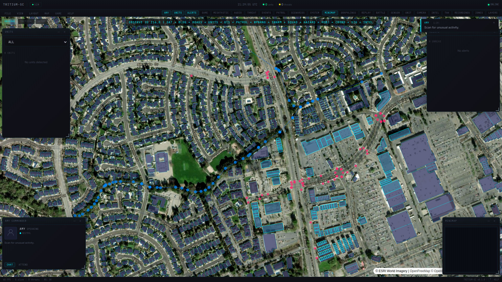
*Command Center — real satellite imagery, AI-controlled units, live tactical panels*

**game-combat.png**
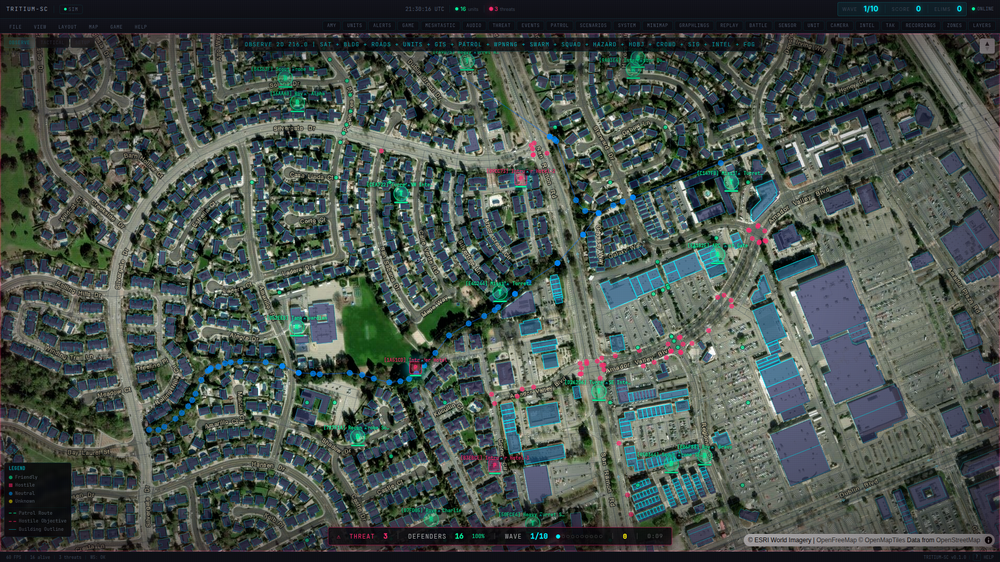
*Wave-based Nerf combat — turrets engage hostile intruders with projectile physics and kill streaks*

**neighborhood-wide.png**

*Your neighborhood becomes the battlefield — same pipeline monitors real security*

**tactical-mode.png**
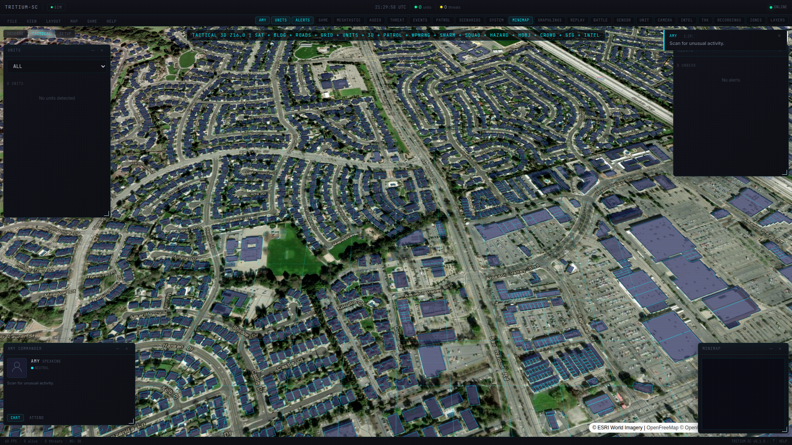
*Tactical mode — tilted 3D perspective with building outlines and unit positions*

**layer-browser.png**
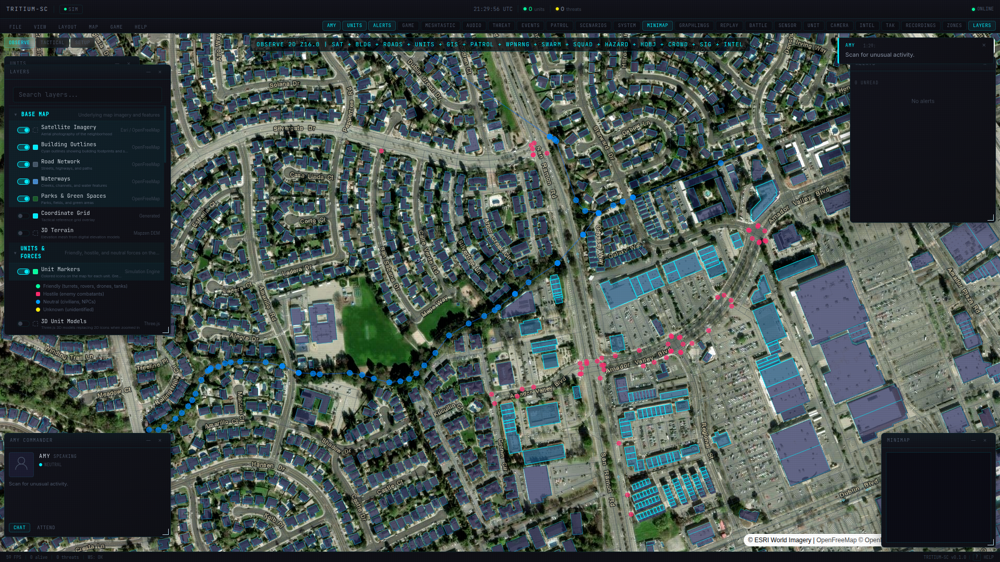
*Layer Browser — Google Earth-style panel with 37 toggleable map layers*

**layers-all-off.png**
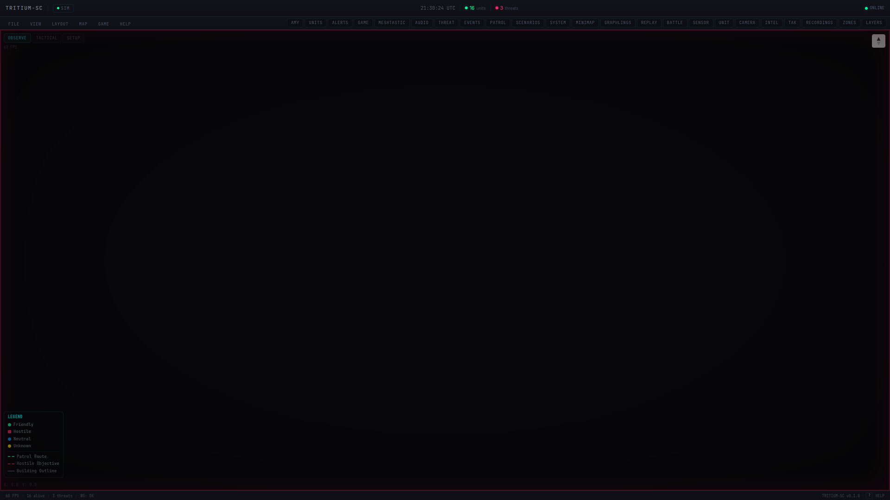
*All layers off — complete blackout demonstrates full layer control*

---

## Mission Generator

**mission-modal.png**
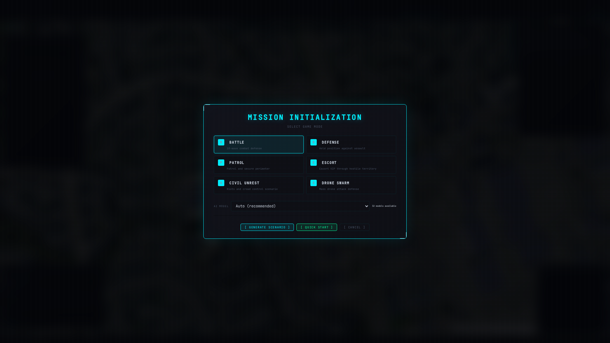
*Mission Initialization — 6 game modes, local model selection, AI or scripted generation*

**mission-deployment.jpg**

*Defenders deployed at real buildings — turrets guarding structures, rovers on street patrols*

**mission-combat.jpg**

*Mid-battle — green friendlies engage red hostiles across the neighborhood*

---

## Combat Detail (from `./test.sh docs`)

**combat-close.jpg**
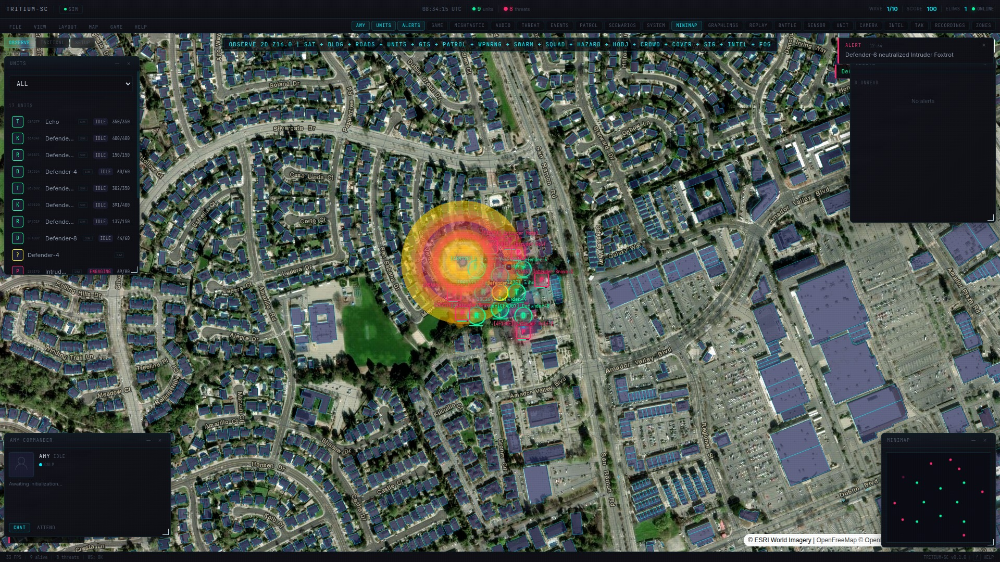
*Close-up combat — combined arms engagement at tight zoom*

**combat-satellite.jpg**
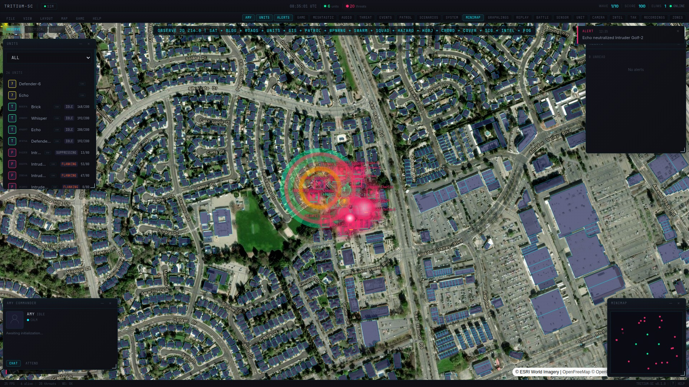
*Satellite combat — turret defense on satellite imagery with roads*

**combat-air.jpg**
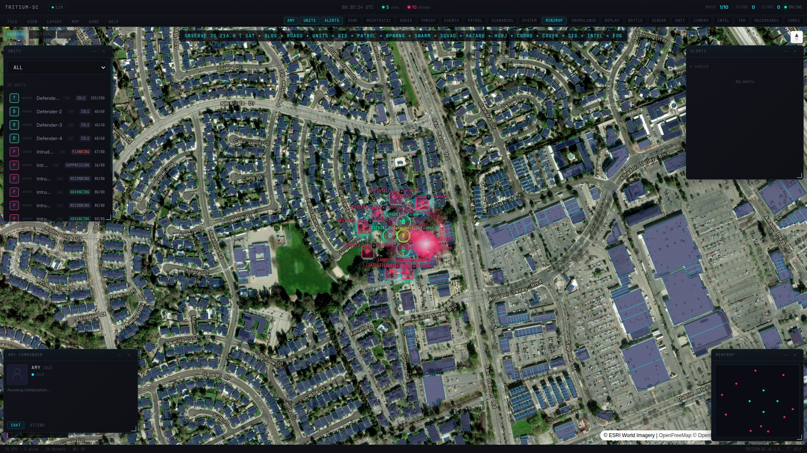
*Air support — drones and turrets engaging hostiles*

---

## UI Reference

**help-overlay.jpg**

*Keyboard shortcuts modal*

**help-overlay.png**
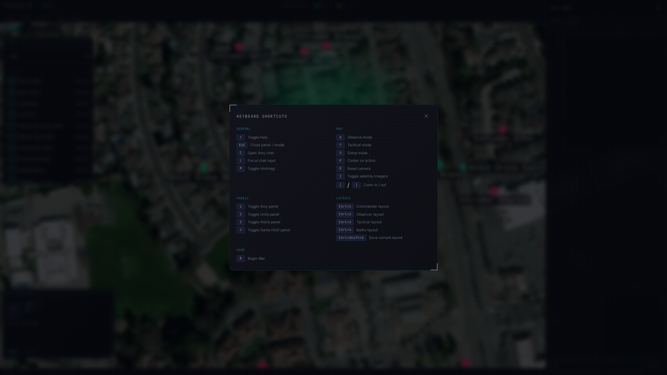
*Keyboard shortcuts modal (PNG)*

**panels-annotated.png**
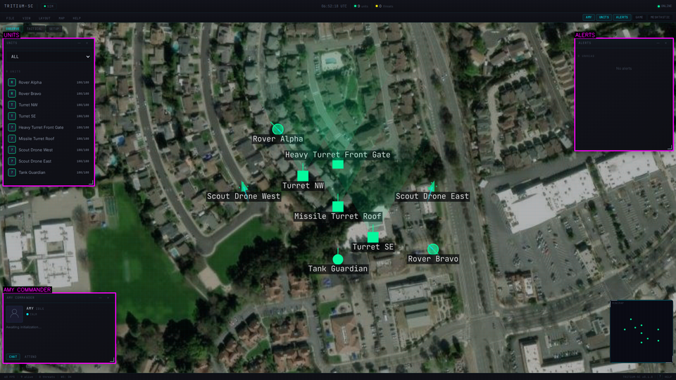
*Command Center panels annotated*

**dom-audit-annotated.png**
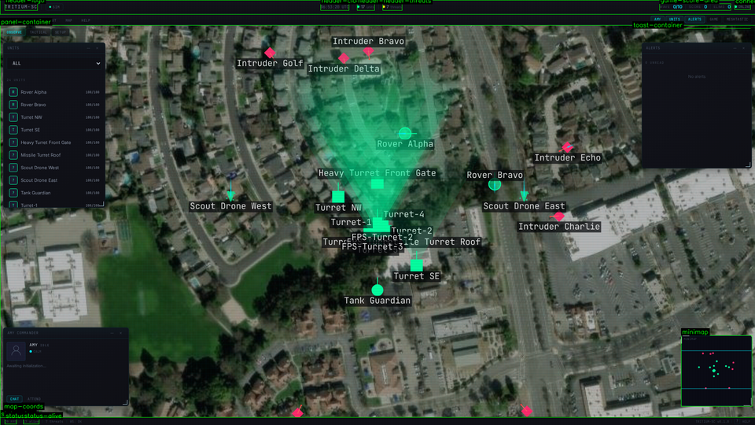
*DOM audit annotated*

**green-blobs-annotated.png**
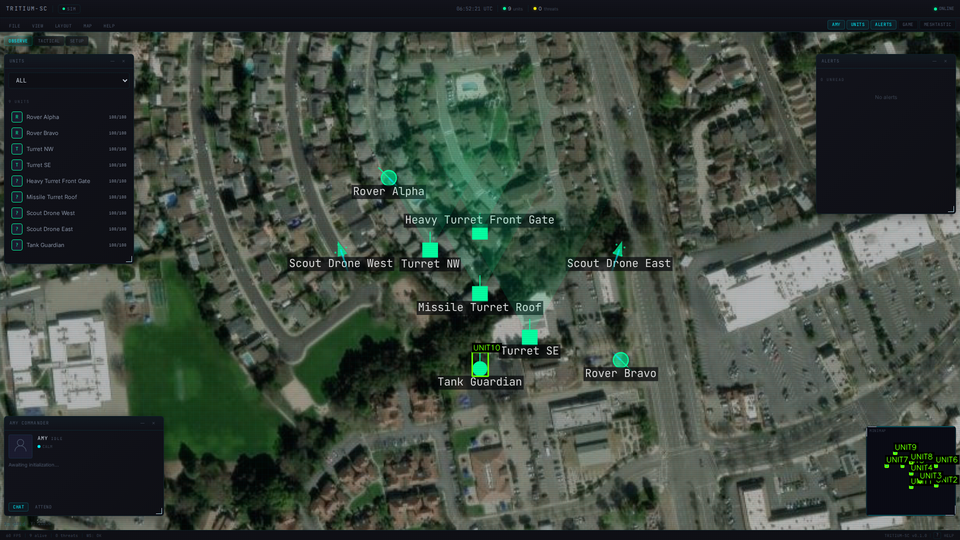
*Green blobs diagnostic*

**overlap-annotated.png**
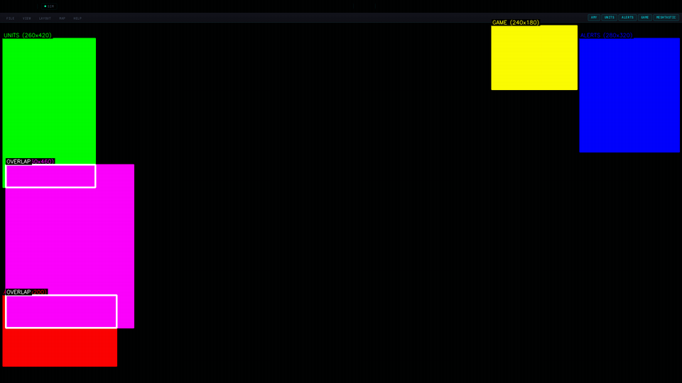
*Overlap diagnostic annotated*

**overlap-diagnostic.png**
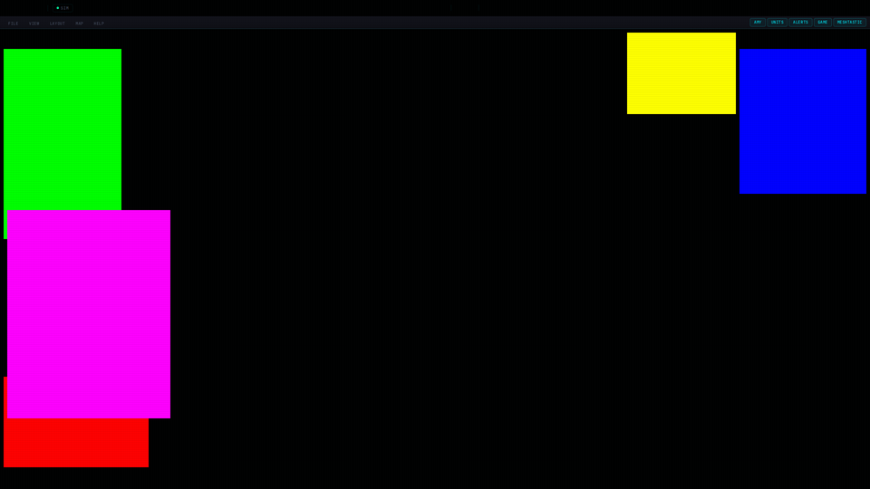
*Overlap diagnostic*

---

## Amy Thought Closeups

**thought-closeup-0.png**
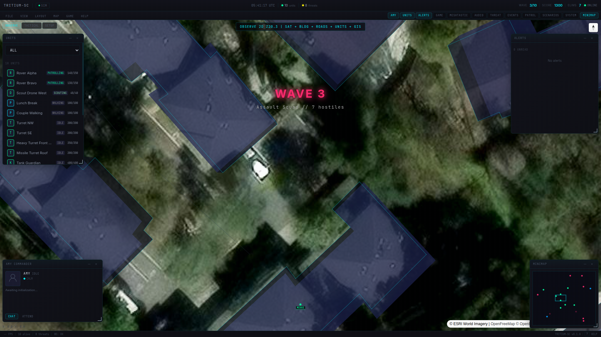
*Amy thought panel closeup*

**thought-closeup-1.png**

*Amy thought panel closeup*

**thought-closeup-2.png**

*Amy thought panel closeup*

---

## Visual Audit

**audit-04-help.png**

*Audit: Help overlay*

**audit-08-setup.png**

*Audit: Setup mode*

**audit-09-combat.png**

*Audit: Combat*

**audit-10-combat-later.png**

*Audit: Combat (later)*

---

## Engine Extraction

**01-command-center.png**


**02-battle-countdown.png**


**03-battle-active.png**


**04-combat-progress.png**


---

## Demo Captures

**4216 screenshots** in [`demo/`](demo/) from automated demo runs.

Demo captures are organized by timestamp and act:

| Act | Content |
|-----|---------|
| Act 1 | Command Center panels, map modes, satellite view |
| Act 2 | Unit selection, tactical overview, deployment |
| Act 3 | Battle: countdown, waves, combat bursts, leaderboard |
| Act 4 | TAK integration: status, clients, geochat, alerts |
| Act 5 | Escalation: threat detection, alerts, multi-threat |
| Act 6 | Panels: mesh, audio, events, search, system, scenarios |
| Act 7 | Camera: neighborhood wide, zoom levels, cinematic |

---

## Regenerating

```bash
# Regenerate hero + combat detail screenshots
./test.sh docs

# Regenerate this README from current inventory
python3 scripts/generate_screenshot_readme.py
```
